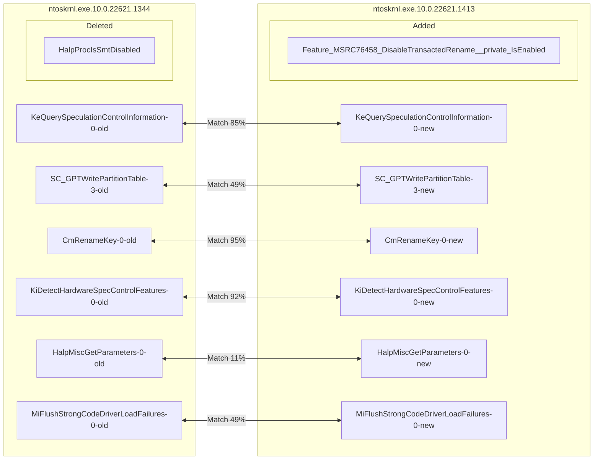
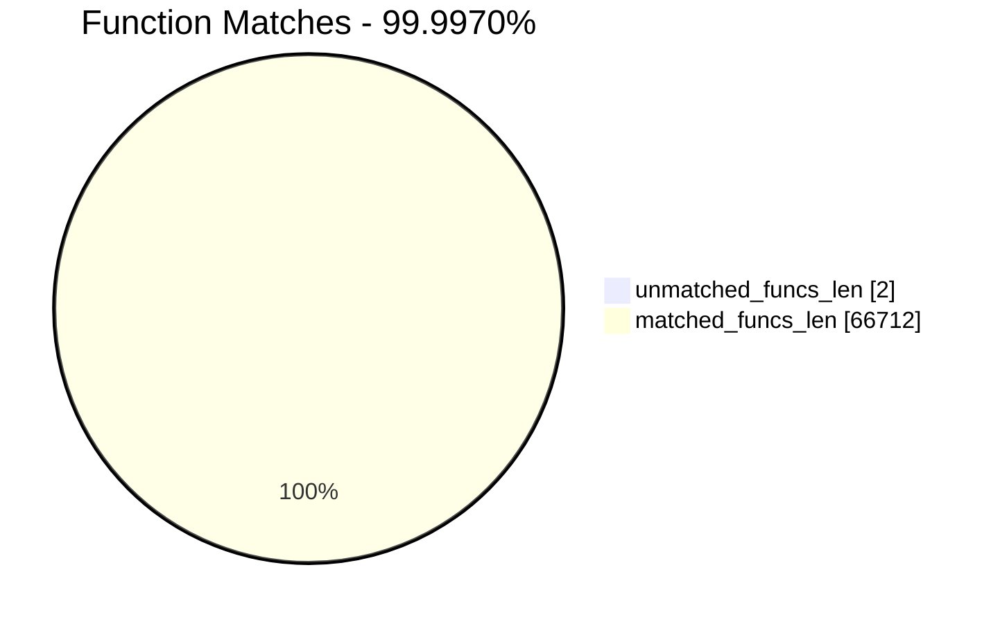
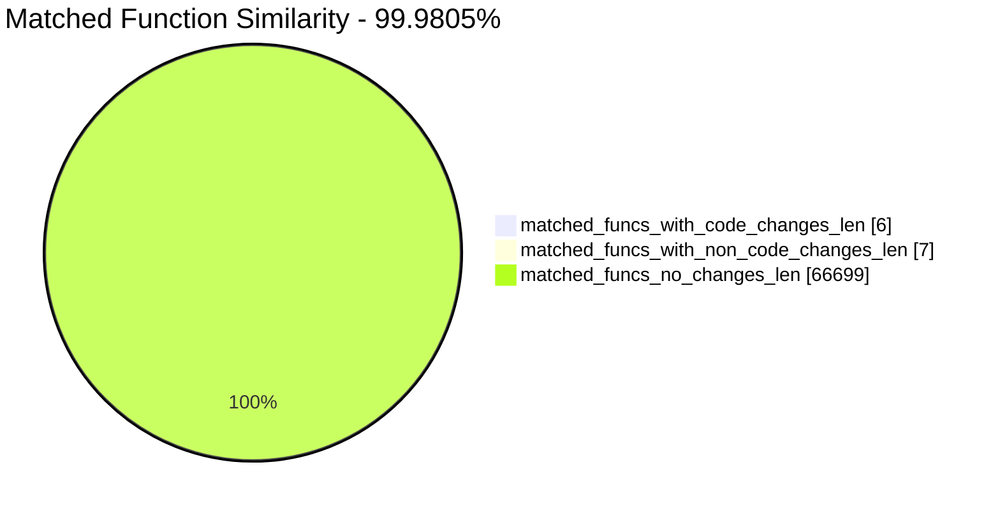
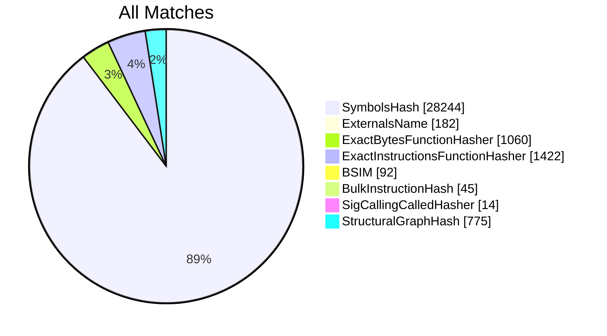
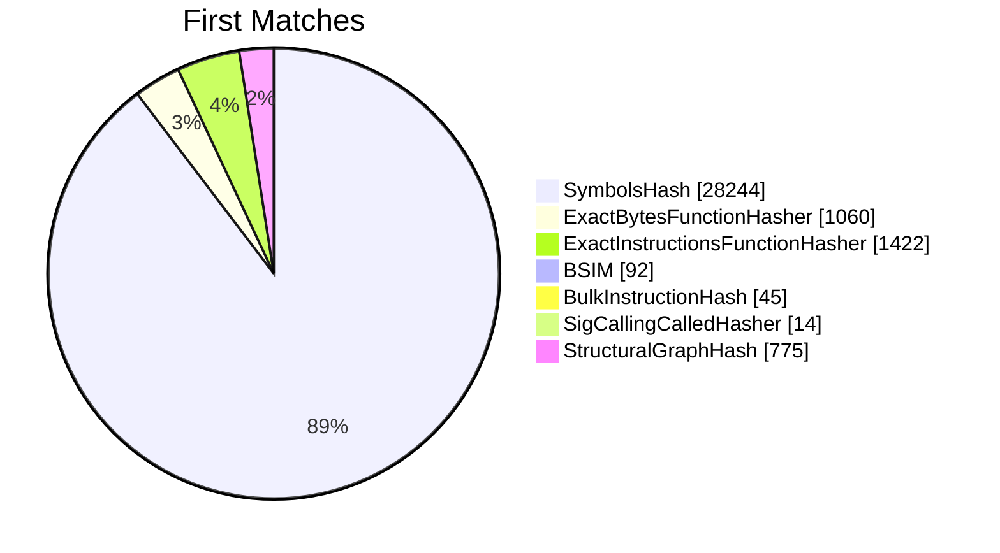
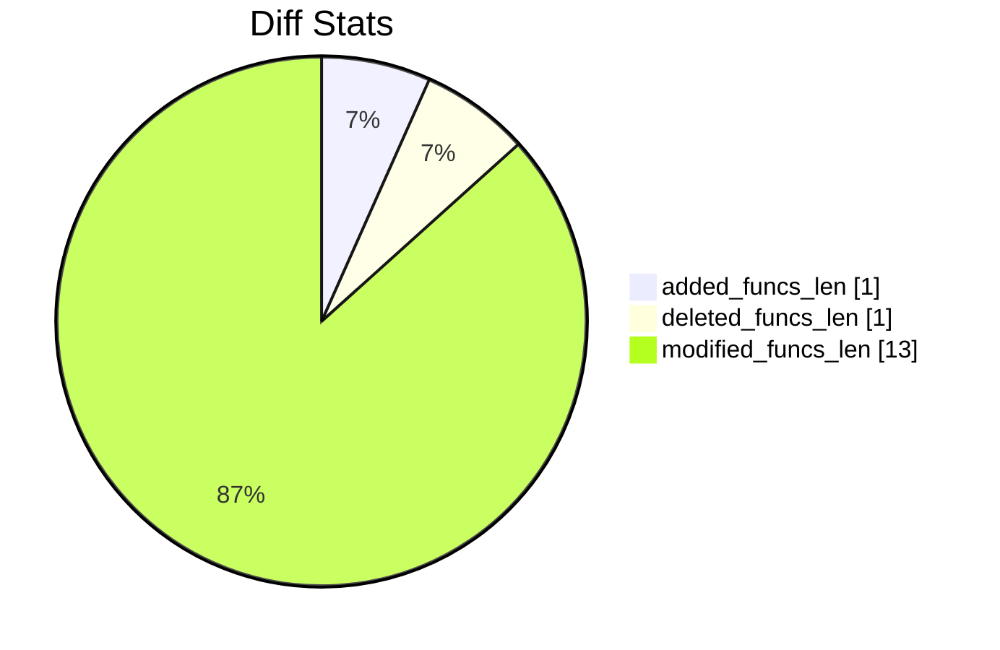
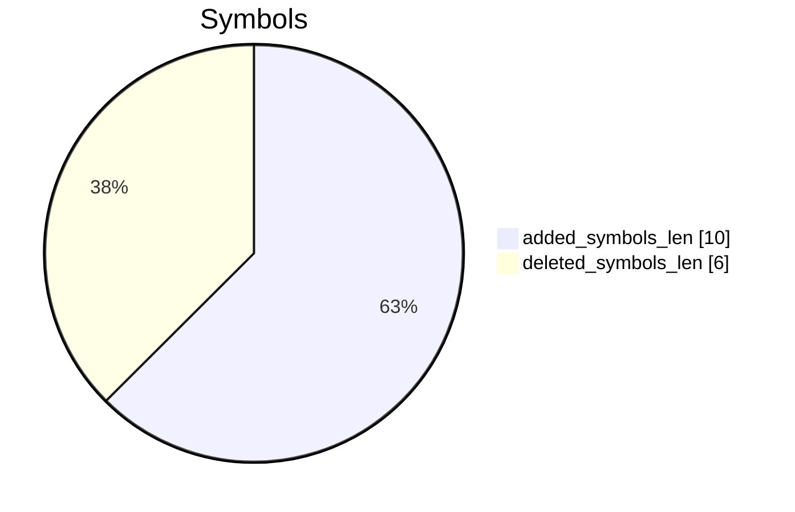
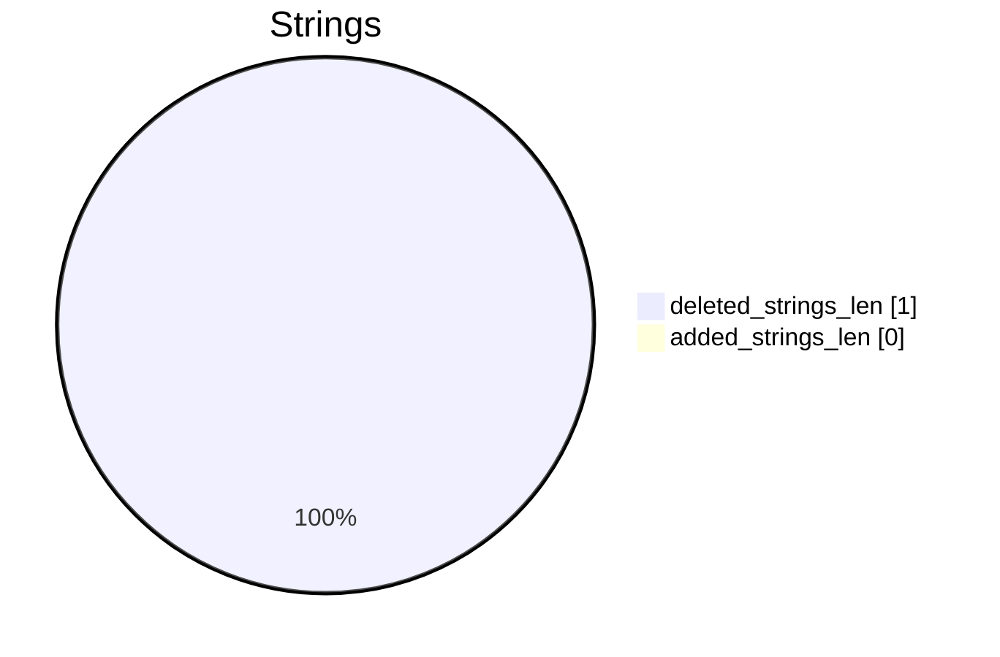

# ntoskrnl.exe.10.0.22621.1344-ntoskrnl.exe.10.0.22621.1413 Diff

# TOC

* [Visual Chart Diff](#visual-chart-diff)
* [Metadata](#metadata)
	* [Ghidra Diff Engine](#ghidra-diff-engine)
		* [Command Line](#command-line)
	* [Binary Metadata Diff](#binary-metadata-diff)
	* [Program Options](#program-options)
	* [Diff Stats](#diff-stats)
	* [Strings](#strings)
* [Deleted](#deleted)
	* [HalpProcIsSmtDisabled](#halpprocissmtdisabled)
* [Added](#added)
	* [Feature_MSRC76458_DisableTransactedRename__private_IsEnabled](#feature_msrc76458_disabletransactedrename__private_isenabled)
* [Modified](#modified)
	* [KeQuerySpeculationControlInformation](#kequeryspeculationcontrolinformation)
	* [SC_GPT::WritePartitionTable](#sc_gptwritepartitiontable)
	* [CmRenameKey](#cmrenamekey)
	* [KiDetectHardwareSpecControlFeatures](#kidetecthardwarespeccontrolfeatures)
	* [HalpMiscGetParameters](#halpmiscgetparameters)
	* [MiFlushStrongCodeDriverLoadFailures](#miflushstrongcodedriverloadfailures)
* [Modified (No Code Changes)](#modified-no-code-changes)
	* [wil_details_FeatureStateCache_GetCachedFeatureEnabledState](#wil_details_featurestatecache_getcachedfeatureenabledstate)
	* [KiProcessDisconnectList](#kiprocessdisconnectlist)
	* [KiIsBranchConfusionPresent](#kiisbranchconfusionpresent)
	* [HvpGetBinContextInitialize](#hvpgetbincontextinitialize)
	* [HalpGetCpuInfo](#halpgetcpuinfo)
	* [HvpGetCellContextReinitialize](#hvpgetcellcontextreinitialize)

# Visual Chart Diff










# Metadata

## Ghidra Diff Engine

### Command Line

#### Captured Command Line


```
ghidriff --project-location ghidra_projects --project-name ghidriff --symbols-path symbols --gzfs-path gzfs --threaded --log-level INFO --file-log-level INFO --log-path ghidriff.log --min-func-len 10 --gdt [] --bsim --max-ram-percent 60.0 --max-section-funcs 200 ntoskrnl.exe.10.0.22621.1344 ntoskrnl.exe.10.0.22621.1413
```


#### Verbose Args


<details>

```
--old ['.\\ntoskrnl.exe.10.0.22621.1344'] --new [['.\\ntoskrnl.exe.10.0.22621.1413']] --engine VersionTrackingDiff --output-path ghidriffs --summary False --project-location ghidra_projects --project-name ghidriff --symbols-path symbols --gzfs-path gzfs --base-address None --program-options None --threaded True --force-analysis False --force-diff False --no-symbols False --log-level INFO --file-log-level INFO --log-path ghidriff.log --va False --min-func-len 10 --use-calling-counts False --gdt [] --bsim True --bsim-full False --max-ram-percent 60.0 --print-flags False --jvm-args None --side-by-side False --max-section-funcs 200 --md-title None
```


</details>

#### Download Original PEs


```
wget https://msdl.microsoft.com/download/symbols/ntkrnlmp.exe/F7E31BA91047000/ntkrnlmp.exe -O ntkrnlmp.exe.x64.10.0.22621.1344
wget https://msdl.microsoft.com/download/symbols/ntkrnlmp.exe/17B6B7221047000/ntkrnlmp.exe -O ntkrnlmp.exe.x64.10.0.22621.1413
```


## Binary Metadata Diff


```diff
--- ntoskrnl.exe.10.0.22621.1344 Meta
+++ ntoskrnl.exe.10.0.22621.1413 Meta
@@ -1,44 +1,44 @@
-Program Name: ntoskrnl.exe.10.0.22621.1344
+Program Name: ntoskrnl.exe.10.0.22621.1413
 Language ID: x86:LE:64:default (4.6)
 Compiler ID: windows
 Processor: x86
 Endian: Little
 Address Size: 64
 Minimum Address: 140000000
 Maximum Address: ff0000184f
 # of Bytes: 17064868
 # of Memory Blocks: 36
-# of Instructions: 2389560
-# of Defined Data: 76137
+# of Instructions: 2389579
+# of Defined Data: 76142
 # of Functions: 33357
-# of Symbols: 220314
+# of Symbols: 220338
 # of Data Types: 6982
 # of Data Type Categories: 580
 Analyzed: true
 Compiler: visualstudio:unknown
 Created With Ghidra Version: 12.0.1
-Date Created: Fri Jan 30 11:17:58 IST 2026
+Date Created: Fri Jan 30 11:18:20 IST 2026
 Executable Format: Portable Executable (PE)
-Executable Location: /E:/ntoskrnl.exe.10.0.22621.1344
-Executable MD5: 1984a75b49db81a4133679eca2badc11
-Executable SHA256: 1b30d5f89790f8ee0d80d2ed29d1177dd3f58042a89e9efee9be17a4660c7d58
-FSRL: file:///E:/ntoskrnl.exe.10.0.22621.1344?MD5=1984a75b49db81a4133679eca2badc11
+Executable Location: /E:/ntoskrnl.exe.10.0.22621.1413
+Executable MD5: d36bbf54a97597dad12dc13590601783
+Executable SHA256: 140ae8fda7efff8039514b89f571e6ae27e2c634881e3d3e1dc4b4e37ddbd6c8
+FSRL: file:///E:/ntoskrnl.exe.10.0.22621.1413?MD5=d36bbf54a97597dad12dc13590601783
 PDB Age: 1
 PDB File: ntkrnlmp.pdb
-PDB GUID: fb0913af-0585-f234-bd64-a64a87c62db1
+PDB GUID: 797e613d-b16d-b6c0-e577-95a0cb03f471
 PDB Loaded: true
 PDB Version: RSDS
 PE Property[CompanyName]: Microsoft Corporation
 PE Property[FileDescription]: NT Kernel & System
-PE Property[FileVersion]: 10.0.22621.1344 (WinBuild.160101.0800)
+PE Property[FileVersion]: 10.0.22621.1413 (WinBuild.160101.0800)
 PE Property[InternalName]: ntkrnlmp.exe
 PE Property[LegalCopyright]: © Microsoft Corporation. All rights reserved.
 PE Property[OriginalFilename]: ntkrnlmp.exe
 PE Property[ProductName]: Microsoft® Windows® Operating System
-PE Property[ProductVersion]: 10.0.22621.1344
+PE Property[ProductVersion]: 10.0.22621.1413
 PE Property[Translation]: 4b00409
 Preferred Root Namespace Category: 
 RTTI Found: false
 Relocatable: true
 SectionAlignment: 4096
 Should Ask To Analyze: false

```


## Program Options


<details>
<summary>Ghidra ntoskrnl.exe.10.0.22621.1344 Decompiler Options</summary>


|Decompiler Option|Value|
| :---: | :---: |
|Prototype Evaluation|__fastcall|

</details>


<details>
<summary>Ghidra ntoskrnl.exe.10.0.22621.1344 Specification extensions Options</summary>


|Specification extensions Option|Value|
| :---: | :---: |
|FormatVersion|0|
|VersionCounter|0|

</details>


<details>
<summary>Ghidra ntoskrnl.exe.10.0.22621.1344 Analyzers Options</summary>


|Analyzers Option|Value|
| :---: | :---: |
|ASCII Strings|true|
|ASCII Strings.Create Strings Containing Existing Strings|true|
|ASCII Strings.Create Strings Containing References|true|
|ASCII Strings.Force Model Reload|false|
|ASCII Strings.Minimum String Length|LEN_5|
|ASCII Strings.Model File|StringModel.sng|
|ASCII Strings.Require Null Termination for String|true|
|ASCII Strings.Search Only in Accessible Memory Blocks|true|
|ASCII Strings.String Start Alignment|ALIGN_1|
|ASCII Strings.String end alignment|4|
|Aggressive Instruction Finder|false|
|Aggressive Instruction Finder.Create Analysis Bookmarks|true|
|Apply Data Archives|true|
|Apply Data Archives.Archive Chooser|[Auto-Detect]|
|Apply Data Archives.Create Analysis Bookmarks|true|
|Apply Data Archives.GDT User File Archive Path|None|
|Apply Data Archives.User Project Archive Path|None|
|Call Convention ID|true|
|Call Convention ID.Analysis Decompiler Timeout (sec)|60|
|Call-Fixup Installer|true|
|Condense Filler Bytes|false|
|Condense Filler Bytes.Filler Value|Auto|
|Condense Filler Bytes.Minimum number of sequential bytes|1|
|Create Address Tables|true|
|Create Address Tables.Allow Offcut References|false|
|Create Address Tables.Auto Label Table|false|
|Create Address Tables.Create Analysis Bookmarks|true|
|Create Address Tables.Maxmimum Pointer Distance|16777215|
|Create Address Tables.Minimum Pointer Address|4132|
|Create Address Tables.Minimum Table Size|2|
|Create Address Tables.Pointer Alignment|1|
|Create Address Tables.Relocation Table Guide|true|
|Create Address Tables.Table Alignment|4|
|Data Reference|true|
|Data Reference.Address Table Alignment|1|
|Data Reference.Address Table Minimum Size|2|
|Data Reference.Align End of Strings|false|
|Data Reference.Ascii String References|true|
|Data Reference.Create Address Tables|true|
|Data Reference.Minimum String Length|5|
|Data Reference.References to Pointers|true|
|Data Reference.Relocation Table Guide|true|
|Data Reference.Respect Execute Flag|true|
|Data Reference.Subroutine References|true|
|Data Reference.Switch Table References|false|
|Data Reference.Unicode String References|true|
|Decompiler Parameter ID|false|
|Decompiler Parameter ID.Analysis Clear Level|ANALYSIS|
|Decompiler Parameter ID.Analysis Decompiler Timeout (sec)|60|
|Decompiler Parameter ID.Commit Data Types|true|
|Decompiler Parameter ID.Commit Void Return Values|false|
|Decompiler Parameter ID.Prototype Evaluation|__fastcall|
|Decompiler Switch Analysis|true|
|Decompiler Switch Analysis.Analysis Decompiler Timeout (sec)|60|
|Demangler Microsoft|true|
|Demangler Microsoft.Apply Function Calling Conventions|true|
|Demangler Microsoft.Apply Function Signatures|true|
|Demangler Microsoft.C-Style Symbol Interpretation|FUNCTION_IF_EXISTS|
|Demangler Microsoft.Demangle Only Known Mangled Symbols|false|
|Disassemble Entry Points|true|
|Disassemble Entry Points.Respect Execute Flag|true|
|Embedded Media|true|
|Embedded Media.Create Analysis Bookmarks|true|
|External Entry References|true|
|Function ID|true|
|Function ID.Always Apply FID Labels|false|
|Function ID.Create Analysis Bookmarks|true|
|Function ID.Instruction Count Threshold|14.6|
|Function ID.Multiple Match Threshold|30.0|
|Function Start Search|true|
|Function Start Search.Bookmark Functions|false|
|Function Start Search.Search Data Blocks|false|
|Non-Returning Functions - Discovered|true|
|Non-Returning Functions - Discovered.Create Analysis Bookmarks|true|
|Non-Returning Functions - Discovered.Function Non-return Threshold|3|
|Non-Returning Functions - Discovered.Repair Flow Damage|true|
|Non-Returning Functions - Known|true|
|Non-Returning Functions - Known.Create Analysis Bookmarks|true|
|PDB MSDIA|false|
|PDB MSDIA.Search untrusted symbol servers|false|
|PDB Universal|true|
|PDB Universal.Import Source Line Info|true|
|PDB Universal.Search untrusted symbol servers|false|
|Reference|true|
|Reference.Address Table Alignment|1|
|Reference.Address Table Minimum Size|2|
|Reference.Align End of Strings|false|
|Reference.Ascii String References|true|
|Reference.Create Address Tables|true|
|Reference.Minimum String Length|5|
|Reference.References to Pointers|true|
|Reference.Relocation Table Guide|true|
|Reference.Respect Execute Flag|true|
|Reference.Subroutine References|true|
|Reference.Switch Table References|false|
|Reference.Unicode String References|true|
|Scalar Operand References|true|
|Scalar Operand References.Relocation Table Guide|true|
|Shared Return Calls|true|
|Shared Return Calls.Allow Conditional Jumps|false|
|Shared Return Calls.Assume Contiguous Functions Only|true|
|Stack|true|
|Stack.Create Local Variables|true|
|Stack.Create Param Variables|false|
|Stack.Max Threads|2|
|Subroutine References|true|
|Subroutine References.Create Thunks Early|true|
|Variadic Function Signature Override|false|
|Variadic Function Signature Override.Create Analysis Bookmarks|false|
|Windows x86 PE Exception Handling|true|
|Windows x86 PE RTTI Analyzer|true|
|Windows x86 Thread Environment Block (TEB) Analyzer|true|
|Windows x86 Thread Environment Block (TEB) Analyzer.Starting Address of the TEB||
|Windows x86 Thread Environment Block (TEB) Analyzer.Windows OS Version|Windows 7|
|WindowsPE x86 Propagate External Parameters|false|
|WindowsResourceReference|true|
|WindowsResourceReference.Create Analysis Bookmarks|true|
|x86 Constant Reference Analyzer|true|
|x86 Constant Reference Analyzer.Create Data from pointer|false|
|x86 Constant Reference Analyzer.Function parameter/return Pointer analysis|true|
|x86 Constant Reference Analyzer.Max Threads|2|
|x86 Constant Reference Analyzer.Min absolute reference|4|
|x86 Constant Reference Analyzer.Require pointer param data type|false|
|x86 Constant Reference Analyzer.Speculative reference max|256|
|x86 Constant Reference Analyzer.Speculative reference min|1024|
|x86 Constant Reference Analyzer.Stored Value Pointer analysis|true|
|x86 Constant Reference Analyzer.Trust values read from writable memory|true|

</details>


<details>
<summary>Ghidra ntoskrnl.exe.10.0.22621.1413 Decompiler Options</summary>


|Decompiler Option|Value|
| :---: | :---: |
|Prototype Evaluation|__fastcall|

</details>


<details>
<summary>Ghidra ntoskrnl.exe.10.0.22621.1413 Specification extensions Options</summary>


|Specification extensions Option|Value|
| :---: | :---: |
|FormatVersion|0|
|VersionCounter|0|

</details>


<details>
<summary>Ghidra ntoskrnl.exe.10.0.22621.1413 Analyzers Options</summary>


|Analyzers Option|Value|
| :---: | :---: |
|ASCII Strings|true|
|ASCII Strings.Create Strings Containing Existing Strings|true|
|ASCII Strings.Create Strings Containing References|true|
|ASCII Strings.Force Model Reload|false|
|ASCII Strings.Minimum String Length|LEN_5|
|ASCII Strings.Model File|StringModel.sng|
|ASCII Strings.Require Null Termination for String|true|
|ASCII Strings.Search Only in Accessible Memory Blocks|true|
|ASCII Strings.String Start Alignment|ALIGN_1|
|ASCII Strings.String end alignment|4|
|Aggressive Instruction Finder|false|
|Aggressive Instruction Finder.Create Analysis Bookmarks|true|
|Apply Data Archives|true|
|Apply Data Archives.Archive Chooser|[Auto-Detect]|
|Apply Data Archives.Create Analysis Bookmarks|true|
|Apply Data Archives.GDT User File Archive Path|None|
|Apply Data Archives.User Project Archive Path|None|
|Call Convention ID|true|
|Call Convention ID.Analysis Decompiler Timeout (sec)|60|
|Call-Fixup Installer|true|
|Condense Filler Bytes|false|
|Condense Filler Bytes.Filler Value|Auto|
|Condense Filler Bytes.Minimum number of sequential bytes|1|
|Create Address Tables|true|
|Create Address Tables.Allow Offcut References|false|
|Create Address Tables.Auto Label Table|false|
|Create Address Tables.Create Analysis Bookmarks|true|
|Create Address Tables.Maxmimum Pointer Distance|16777215|
|Create Address Tables.Minimum Pointer Address|4132|
|Create Address Tables.Minimum Table Size|2|
|Create Address Tables.Pointer Alignment|1|
|Create Address Tables.Relocation Table Guide|true|
|Create Address Tables.Table Alignment|4|
|Data Reference|true|
|Data Reference.Address Table Alignment|1|
|Data Reference.Address Table Minimum Size|2|
|Data Reference.Align End of Strings|false|
|Data Reference.Ascii String References|true|
|Data Reference.Create Address Tables|true|
|Data Reference.Minimum String Length|5|
|Data Reference.References to Pointers|true|
|Data Reference.Relocation Table Guide|true|
|Data Reference.Respect Execute Flag|true|
|Data Reference.Subroutine References|true|
|Data Reference.Switch Table References|false|
|Data Reference.Unicode String References|true|
|Decompiler Parameter ID|false|
|Decompiler Parameter ID.Analysis Clear Level|ANALYSIS|
|Decompiler Parameter ID.Analysis Decompiler Timeout (sec)|60|
|Decompiler Parameter ID.Commit Data Types|true|
|Decompiler Parameter ID.Commit Void Return Values|false|
|Decompiler Parameter ID.Prototype Evaluation|__fastcall|
|Decompiler Switch Analysis|true|
|Decompiler Switch Analysis.Analysis Decompiler Timeout (sec)|60|
|Demangler Microsoft|true|
|Demangler Microsoft.Apply Function Calling Conventions|true|
|Demangler Microsoft.Apply Function Signatures|true|
|Demangler Microsoft.C-Style Symbol Interpretation|FUNCTION_IF_EXISTS|
|Demangler Microsoft.Demangle Only Known Mangled Symbols|false|
|Disassemble Entry Points|true|
|Disassemble Entry Points.Respect Execute Flag|true|
|Embedded Media|true|
|Embedded Media.Create Analysis Bookmarks|true|
|External Entry References|true|
|Function ID|true|
|Function ID.Always Apply FID Labels|false|
|Function ID.Create Analysis Bookmarks|true|
|Function ID.Instruction Count Threshold|14.6|
|Function ID.Multiple Match Threshold|30.0|
|Function Start Search|true|
|Function Start Search.Bookmark Functions|false|
|Function Start Search.Search Data Blocks|false|
|Non-Returning Functions - Discovered|true|
|Non-Returning Functions - Discovered.Create Analysis Bookmarks|true|
|Non-Returning Functions - Discovered.Function Non-return Threshold|3|
|Non-Returning Functions - Discovered.Repair Flow Damage|true|
|Non-Returning Functions - Known|true|
|Non-Returning Functions - Known.Create Analysis Bookmarks|true|
|PDB MSDIA|false|
|PDB MSDIA.Search untrusted symbol servers|false|
|PDB Universal|true|
|PDB Universal.Import Source Line Info|true|
|PDB Universal.Search untrusted symbol servers|false|
|Reference|true|
|Reference.Address Table Alignment|1|
|Reference.Address Table Minimum Size|2|
|Reference.Align End of Strings|false|
|Reference.Ascii String References|true|
|Reference.Create Address Tables|true|
|Reference.Minimum String Length|5|
|Reference.References to Pointers|true|
|Reference.Relocation Table Guide|true|
|Reference.Respect Execute Flag|true|
|Reference.Subroutine References|true|
|Reference.Switch Table References|false|
|Reference.Unicode String References|true|
|Scalar Operand References|true|
|Scalar Operand References.Relocation Table Guide|true|
|Shared Return Calls|true|
|Shared Return Calls.Allow Conditional Jumps|false|
|Shared Return Calls.Assume Contiguous Functions Only|true|
|Stack|true|
|Stack.Create Local Variables|true|
|Stack.Create Param Variables|false|
|Stack.Max Threads|2|
|Subroutine References|true|
|Subroutine References.Create Thunks Early|true|
|Variadic Function Signature Override|false|
|Variadic Function Signature Override.Create Analysis Bookmarks|false|
|Windows x86 PE Exception Handling|true|
|Windows x86 PE RTTI Analyzer|true|
|Windows x86 Thread Environment Block (TEB) Analyzer|true|
|Windows x86 Thread Environment Block (TEB) Analyzer.Starting Address of the TEB||
|Windows x86 Thread Environment Block (TEB) Analyzer.Windows OS Version|Windows 7|
|WindowsPE x86 Propagate External Parameters|false|
|WindowsResourceReference|true|
|WindowsResourceReference.Create Analysis Bookmarks|true|
|x86 Constant Reference Analyzer|true|
|x86 Constant Reference Analyzer.Create Data from pointer|false|
|x86 Constant Reference Analyzer.Function parameter/return Pointer analysis|true|
|x86 Constant Reference Analyzer.Max Threads|2|
|x86 Constant Reference Analyzer.Min absolute reference|4|
|x86 Constant Reference Analyzer.Require pointer param data type|false|
|x86 Constant Reference Analyzer.Speculative reference max|256|
|x86 Constant Reference Analyzer.Speculative reference min|1024|
|x86 Constant Reference Analyzer.Stored Value Pointer analysis|true|
|x86 Constant Reference Analyzer.Trust values read from writable memory|true|

</details>

## Diff Stats


|Stat|Value|
| :---: | :---: |
|added_funcs_len|1|
|deleted_funcs_len|1|
|modified_funcs_len|13|
|added_symbols_len|10|
|deleted_symbols_len|6|
|diff_time|666.0581753253937|
|deleted_strings_len|1|
|added_strings_len|0|
|match_types|Counter({'SymbolsHash': 28244, 'ExactInstructionsFunctionHasher': 1422, 'ExactBytesFunctionHasher': 1060, 'StructuralGraphHash': 775, 'ExternalsName': 182, 'BSIM': 92, 'BulkInstructionHash': 45, 'SigCallingCalledHasher': 14})|
|items_to_process|31|
|diff_types|Counter({'address': 8, 'length': 7, 'refcount': 7, 'code': 6, 'calling': 6, 'called': 6})|
|unmatched_funcs_len|2|
|total_funcs_len|66714|
|matched_funcs_len|66712|
|matched_funcs_with_code_changes_len|6|
|matched_funcs_with_non_code_changes_len|7|
|matched_funcs_no_changes_len|66699|
|match_func_similarity_percent|99.9805%|
|func_match_overall_percent|99.9970%|
|first_matches|Counter({'SymbolsHash': 28244, 'ExactInstructionsFunctionHasher': 1422, 'ExactBytesFunctionHasher': 1060, 'StructuralGraphHash': 775, 'BSIM': 92, 'BulkInstructionHash': 45, 'SigCallingCalledHasher': 14})|













## Strings




### Strings Diff


```diff
--- deleted strings
+++ added strings
@@ -1 +0,0 @@
-u_.TM

```


### String References

#### Old


|String|Ref Count|Ref Func|
| :---: | :---: | :---: |
|u_.TM|3|WmipRegistrationWorker|

#### New


|String|Ref Count|Ref Func|
| :---: | :---: | :---: |

# Deleted

## HalpProcIsSmtDisabled

### Function Meta


|Key|ntoskrnl.exe.10.0.22621.1344|
| :---: | :---: |
|name|HalpProcIsSmtDisabled|
|fullname|HalpProcIsSmtDisabled|
|refcount|3|
|length|174|
|called|HalpGetCpuInfo<br>HalpIsPartitionCpuManager<br>strstr|
|calling|HalpMiscGetParameters|
|paramcount|0|
|address|140b3f010|
|sig|undefined HalpProcIsSmtDisabled(void)|
|sym_type|Function|
|sym_source|IMPORTED|
|external|False|


```diff
--- HalpProcIsSmtDisabled
+++ HalpProcIsSmtDisabled
@@ -1,34 +0,0 @@
-

-bool HalpProcIsSmtDisabled(longlong param_1)

-

-{

-  char cVar1;

-  char *pcVar2;

-  bool bVar3;

-  char local_res10 [24];

-  

-  bVar3 = false;

-  local_res10[0] = '\0';

-  cVar1 = HalpGetCpuInfo(0,0,0,local_res10);

-  if ((cVar1 == '\0') || (local_res10[0] != '\x02')) {

-    if (param_1 == 0) {

-      return false;

-    }

-  }

-  else {

-    if (param_1 == 0) {

-      return false;

-    }

-    if (((*(uint *)(*(longlong *)(param_1 + 0xf0) + 0xda4) & 0x2000) != 0) &&

-       (cVar1 = HalpIsPartitionCpuManager(), cVar1 == '\0')) {

-      return true;

-    }

-  }

-  if ((*(char **)(param_1 + 0xd8) != (char *)0x0) &&

-     (pcVar2 = strstr(*(char **)(param_1 + 0xd8),"SMT=BLOCKED"), pcVar2 != (char *)0x0)) {

-    cVar1 = HalpIsPartitionCpuManager();

-    bVar3 = cVar1 == '\0';

-  }

-  return bVar3;

-}

-


```


# Added

## Feature_MSRC76458_DisableTransactedRename__private_IsEnabled

### Function Meta


|Key|ntoskrnl.exe.10.0.22621.1413|
| :---: | :---: |
|name|Feature_MSRC76458_DisableTransactedRename__private_IsEnabled|
|fullname|Feature_MSRC76458_DisableTransactedRename__private_IsEnabled|
|refcount|2|
|length|94|
|called|wil_details_FeatureReporting_ReportUsageToService<br>wil_details_FeatureStateCache_GetCachedFeatureEnabledState|
|calling|CmRenameKey|
|paramcount|0|
|address|140424970|
|sig|undefined Feature_MSRC76458_DisableTransactedRename__private_IsEnabled(void)|
|sym_type|Function|
|sym_source|IMPORTED|
|external|False|


```diff
--- Feature_MSRC76458_DisableTransactedRename__private_IsEnabled
+++ Feature_MSRC76458_DisableTransactedRename__private_IsEnabled
@@ -0,0 +1,17 @@
+

+uint Feature_MSRC76458_DisableTransactedRename__private_IsEnabled(void)

+

+{

+  uint uVar1;

+  uint uVar2;

+  

+  uVar1 = wil_details_FeatureStateCache_GetCachedFeatureEnabledState

+                    (&Feature_MSRC76458_DisableTransactedRename__private_featureState,

+                     &Feature_MSRC76458_DisableTransactedRename__private_descriptor);

+  uVar2 = uVar1 >> 3 & 1;

+  wil_details_FeatureReporting_ReportUsageToService

+            (&Feature_MSRC76458_DisableTransactedRename__private_reporting,0x28a59bb,uVar1 >> 8 & 1,

+             uVar1 >> 9 & 1,&Feature_Servicing_CcUninitAsyncRead_39895518_logged_traits,uVar2);

+  return uVar2;

+}

+


```


# Modified


*Modified functions contain code changes*
## KeQuerySpeculationControlInformation

### Match Info


|Key|ntoskrnl.exe.10.0.22621.1344 - ntoskrnl.exe.10.0.22621.1413|
| :---: | :---: |
|diff_type|code,length|
|ratio|0.18|
|i_ratio|0.63|
|m_ratio|0.94|
|b_ratio|0.85|
|match_types|SymbolsHash|

### Function Meta Diff


|Key|ntoskrnl.exe.10.0.22621.1344|ntoskrnl.exe.10.0.22621.1413|
| :---: | :---: | :---: |
|name|KeQuerySpeculationControlInformation|KeQuerySpeculationControlInformation|
|fullname|KeQuerySpeculationControlInformation|KeQuerySpeculationControlInformation|
|refcount|2|2|
|`length`|775|891|
|called|HvlQueryL1tfMitigationInformation<br>KeKvaShadowingActive<br>KiIsFbClearSupported<br>RtlCopyMemory<br>memset|HvlQueryL1tfMitigationInformation<br>KeKvaShadowingActive<br>KiIsFbClearSupported<br>RtlCopyMemory<br>memset|
|calling|ExpQuerySystemInformation|ExpQuerySystemInformation|
|paramcount|0|0|
|address|14096a7ac|14096a7ac|
|sig|undefined KeQuerySpeculationControlInformation(void)|undefined KeQuerySpeculationControlInformation(void)|
|sym_type|Function|Function|
|sym_source|IMPORTED|IMPORTED|
|external|False|False|

### KeQuerySpeculationControlInformation Diff


```diff
--- KeQuerySpeculationControlInformation
+++ KeQuerySpeculationControlInformation
@@ -1,85 +1,109 @@
 

 undefined8 KeQuerySpeculationControlInformation(void *param_1,uint param_2,uint *param_3)

 

 {

   ulonglong uVar1;

   char cVar2;

-  uint uVar3;

-  int iVar4;

+  int iVar3;

+  uint uVar4;

   uint uVar5;

-  uint uVar6;

   ulonglong _Size;

-  ulonglong uVar7;

-  uint local_res20;

-  uint uStackX_24;

+  ulonglong uVar6;

+  undefined8 local_res20;

   

   _Size = (ulonglong)param_2;

-  if (3 < param_2) {

-    if (7 < param_2) {

-      param_2 = 8;

-    }

-    *param_3 = param_2;

-    cVar2 = KiKvaShadow;

-    uVar1 = KeFeatureBits2;

-    uStackX_24 = 0;

-    local_res20 = KiSpeculationFeatures >> 0x14 & 1 ^ KiSpeculationFeatures >> 0x11 & 2 ^

-                  KiSpeculationFeatures >> 0x11 & 4;

-    uVar6 = 0x10;

-    if (((KiSpeculationFeatures & 0x10) != 0) || ((KiSpeculationFeatures & 0x40) != 0)) {

-      local_res20 = local_res20 | 8;

-    }

-    if ((KiSpeculationFeatures & 4) != 0) {

-      local_res20 = local_res20 | 0x10;

-    }

-    if (((KiSpeculationFeatures >> 0x14 & 1) != 0) && ((KiSpeculationFeatures >> 0x15 & 1) != 0)) {

-      local_res20 = local_res20 | 0x2000;

-    }

-    local_res20 = ((KiSpeculationFeatures & 0x20 | 0x40) << 2 |

-                  local_res20 ^ KiSpeculationFeatures * 2 & 0x20 ^ KiSpeculationFeatures & 0x40) ^

-                  KiSpeculationFeatures * 4 & 0x200 ^ KiSpeculationFeatures >> 0xc & 0x400 ^

-                  KiSpeculationFeatures >> 0xc & 0x800 ^ ~(KiSpeculationFeatures << 4) & 0x1000 ^

-                  KiSpeculationFeatures >> 0xb & 0x4000 ^ KiSpeculationFeatures >> 0xb & 0x8000;

-    uVar5 = (KiSpeculationFeatures & 1 | 0x80) << 0x10 | (uint)(KeFeatureBits2 << 0x13) & 0x1000000

-            | local_res20;

-    if ((KiKvaShadow == '\0') || (uVar3 = 0x26000000, (KeFeatureBits2 & 8) == 0)) {

-      uVar3 = 0x24000000;

-    }

-    uVar7 = KeFeatureBits2 & 0x8000;

-    if (((uVar7 == 0) || (KiDisableTsx == 0)) && (KiTsxSupported != 0)) {

-      if (((KeFeatureBits2 >> 0x10 & 1) == 0) &&

-         ((((byte)KeFeatureBits2 & 0x28) != 8 || (iVar4 = KeKvaShadowingActive(), iVar4 == 0)))) {

-        if (uVar7 == 0) {

-          local_res20 = uVar5 | uVar3;

-        }

-        else {

-          local_res20 = uVar5 | uVar3 | 0x8000000;

-        }

+  if (param_2 < 4) {

+    *param_3 = 8;

+    return 0xc0000004;

+  }

+  if (7 < param_2) {

+    param_2 = 8;

+  }

+  *param_3 = param_2;

+  cVar2 = KiKvaShadow;

+  uVar1 = KeFeatureBits2;

+  local_res20._4_4_ = 0;

+  local_res20._0_4_ =

+       KiSpeculationFeatures >> 0x14 & 1 ^ KiSpeculationFeatures >> 0x11 & 2 ^

+       KiSpeculationFeatures >> 0x11 & 4;

+  if (((KiSpeculationFeatures & 0x10) != 0) || ((KiSpeculationFeatures & 0x40) != 0)) {

+    local_res20._0_4_ = (uint)local_res20 | 8;

+  }

+  if ((KiSpeculationFeatures & 4) != 0) {

+    local_res20._0_4_ = (uint)local_res20 | 0x10;

+  }

+  if (((KiSpeculationFeatures >> 0x14 & 1) != 0) && ((KiSpeculationFeatures >> 0x15 & 1) != 0)) {

+    local_res20._0_4_ = (uint)local_res20 | 0x2000;

+  }

+  local_res20._0_4_ =

+       ((KiSpeculationFeatures & 0x20 | 0x40) << 2 |

+       (uint)local_res20 ^ KiSpeculationFeatures * 2 & 0x20 ^ KiSpeculationFeatures & 0x40) ^

+       KiSpeculationFeatures * 4 & 0x200 ^ KiSpeculationFeatures >> 0xc & 0x400 ^

+       KiSpeculationFeatures >> 0xc & 0x800 ^ ~(KiSpeculationFeatures << 4) & 0x1000 ^

+       KiSpeculationFeatures >> 0xb & 0x4000 ^ KiSpeculationFeatures >> 0xb & 0x8000;

+  uVar5 = (KiSpeculationFeatures & 1 | 0x80) << 0x10 | (uint)(KeFeatureBits2 << 0x13) & 0x1000000 |

+          (uint)local_res20;

+  if ((KiKvaShadow == '\0') || (uVar4 = 0x26000000, (KeFeatureBits2 & 8) == 0)) {

+    uVar4 = 0x24000000;

+  }

+  uVar6 = KeFeatureBits2 & 0x8000;

+  if (((uVar6 == 0) || (KiDisableTsx == 0)) && (KiTsxSupported != 0)) {

+    if (((KeFeatureBits2 >> 0x10 & 1) == 0) &&

+       ((((byte)KeFeatureBits2 & 0x28) != 8 || (iVar3 = KeKvaShadowingActive(), iVar3 == 0)))) {

+      if (uVar6 == 0) {

+        local_res20._0_4_ = uVar5 | uVar4;

       }

       else {

-        local_res20 = uVar5 | uVar3 | 0x10000000;

+        local_res20._0_4_ = uVar5 | uVar4 | 0x8000000;

       }

     }

     else {

-      local_res20 = uVar5 | uVar3 | 0x18000000;

+      local_res20._0_4_ = uVar5 | uVar4 | 0x10000000;

     }

-    if (((uVar1 >> 0x10 & 1) == 0) && (KiTsxSupportedAtBoot != 0)) {

-      uVar5 = 0;

+  }

+  else {

+    local_res20._0_4_ = uVar5 | uVar4 | 0x18000000;

+  }

+  if (((uVar1 >> 0x10 & 1) == 0) && (KiTsxSupportedAtBoot != 0)) {

+    uVar5 = 0;

+  }

+  else {

+    uVar5 = 0x40000000;

+  }

+  local_res20._0_4_ = (uint)local_res20 | uVar5;

+  HvlQueryL1tfMitigationInformation(&local_res20);

+  uVar5 = ((uint)(uVar1 >> 0x13) ^ local_res20._4_4_) & 7 ^ local_res20._4_4_;

+  if (cVar2 == '\0') {

+LAB_0:

+    uVar4 = 0x410;

+  }

+  else {

+    iVar3 = KiIsFbClearSupported();

+    uVar4 = 0x418;

+    if (iVar3 == 0) goto LAB_0;

+  }

+  local_res20 = CONCAT44(uVar5 & 0xfffffff7 | uVar4,(uint)local_res20);

+  if ((KiSpeculationFeatures >> 0xf & 1) == 0) {

+    uVar5 = uVar5 & 0xfffffef7 | uVar4 | 0x200;

+  }

+  else {

+    if ((((KiSpeculationFeatures >> 0x12 & 1) == 0) && ((KiSpeculationFeatures >> 0x15 & 1) == 0))

+       && ((KiSpeculationFeatures >> 0x1c & 1) == 0)) {

+      if (((KiSpeculationFeatures >> 0x13 & 1) == 0) && ((KiSpeculationFeatures >> 0x1d & 1) == 0))

+      {

+        local_res20 = local_res20 | 0x30000000000;

+      }

+      else {

+        local_res20 = local_res20 & 0xfffffcffffffffff;

+      }

+      goto LAB_1;

     }

-    else {

-      uVar5 = 0x40000000;

-    }

-    local_res20 = local_res20 | uVar5;

-    HvlQueryL1tfMitigationInformation(&local_res20);

-    uVar5 = ((uint)(uVar1 >> 0x13) ^ uStackX_24) & 7 ^ uStackX_24;

-    if ((cVar2 != '\0') && (iVar4 = KiIsFbClearSupported(), iVar4 != 0)) {

-      uVar6 = 0x18;

-    }

-    _local_res20 = CONCAT44(uVar5 & 0xfffffff7 | uVar6,local_res20);

-    memset(param_1,0,_Size);

-    RtlCopyMemory(param_1,&local_res20,(ulonglong)param_2);

-    return 0;

+    uVar5 = uVar5 & 0xfffffdf7 | uVar4 | 0x100;

   }

-  *param_3 = 8;

-  return 0xc0000004;

+  local_res20 = CONCAT44(uVar5,(uint)local_res20);

+LAB_1:

+  memset(param_1,0,_Size);

+  RtlCopyMemory(param_1,&local_res20,(ulonglong)param_2);

+  return 0;

 }

 


```


## SC_GPT::WritePartitionTable

### Match Info


|Key|ntoskrnl.exe.10.0.22621.1344 - ntoskrnl.exe.10.0.22621.1413|
| :---: | :---: |
|diff_type|code,length,address|
|ratio|0.26|
|i_ratio|0.66|
|m_ratio|0.99|
|b_ratio|0.49|
|match_types|SymbolsHash|

### Function Meta Diff


|Key|ntoskrnl.exe.10.0.22621.1344|ntoskrnl.exe.10.0.22621.1413|
| :---: | :---: | :---: |
|name|WritePartitionTable|WritePartitionTable|
|fullname|SC_GPT::WritePartitionTable|SC_GPT::WritePartitionTable|
|refcount|4|4|
|`length`|1583|1569|
|called|MBR_ENTRY::ComputeChs<br>RtlComputeCrc32<br>SC_DISK::WriteSectors<br>SC_ENV::Allocate<br>SC_ENV::CreateGuid<br>SC_ENV::Free<br>SC_GPT::ReadHeader<br>memset|MBR_ENTRY::ComputeChs<br>RtlComputeCrc32<br>SC_DISK::WriteSectors<br>SC_ENV::Allocate<br>SC_ENV::CreateGuid<br>SC_ENV::Free<br>SC_GPT::ReadHeader<br>memset|
|calling|SC_DISK::WritePartitionTable<br>SC_GPT::CreatePartitionTable<br>SC_GPT::SetPartition|SC_DISK::WritePartitionTable<br>SC_GPT::CreatePartitionTable<br>SC_GPT::SetPartition|
|paramcount|3|3|
|`address`|140660efc|140660ffc|
|sig|long __thiscall WritePartitionTable(SC_GPT * this, SC_DISK_LAYOUT * param_1, uchar param_2)|long __thiscall WritePartitionTable(SC_GPT * this, SC_DISK_LAYOUT * param_1, uchar param_2)|
|sym_type|Function|Function|
|sym_source|ANALYSIS|ANALYSIS|
|external|False|False|

### SC_GPT::WritePartitionTable Diff


```diff
--- SC_GPT::WritePartitionTable
+++ SC_GPT::WritePartitionTable
@@ -1,299 +1,287 @@
 

 /* public: long __cdecl SC_GPT::WritePartitionTable(class SC_DISK_LAYOUT * __ptr64,unsigned char)

    __ptr64 */

 

 long __thiscall SC_GPT::WritePartitionTable(SC_GPT *this,SC_DISK_LAYOUT *param_1,uchar param_2)

 

 {

   undefined8 *puVar1;

   byte bVar2;

   int iVar3;

   GPT_HEADER *_Dst;

-  undefined8 uVar4;

-  undefined4 uVar5;

+  longlong lVar4;

+  undefined8 uVar5;

   undefined4 uVar6;

-  ulonglong uVar7;

+  undefined4 uVar7;

   undefined4 uVar8;

-  long lVar9;

-  longlong lVar10;

-  ulonglong uVar11;

+  ulonglong uVar9;

+  uint uVar10;

+  undefined4 uVar11;

+  long lVar12;

+  ulonglong uVar13;

   undefined8 *_Dst_00;

-  longlong lVar12;

-  ulonglong uVar13;

-  uint uVar14;

-  _GUID *p_Var15;

+  ulonglong uVar14;

+  uint uVar15;

+  longlong lVar16;

+  _GUID *p_Var17;

   SC_DISK *this_00;

-  uint uVar16;

-  ulonglong uVar17;

   ulonglong uVar18;

-  uint uVar19;

+  ulonglong uVar19;

   __uint64 _Var20;

-  undefined8 *puVar21;

-  uint uVar22;

-  ulonglong *puVar23;

-  undefined8 *puVar24;

-  ulong uVar25;

-  uint uVar26;

+  uint uVar21;

+  undefined8 *puVar22;

+  uint uVar23;

+  ulonglong *puVar24;

+  undefined8 *puVar25;

+  ulong uVar26;

+  uint uVar27;

   ulonglong local_res8;

   int local_68;

   undefined4 local_64;

-  ulonglong local_60;

+  ulonglong local_58;

   

   local_64 = 0;

-  lVar10 = *(longlong *)this;

-  _Dst = *(GPT_HEADER **)(lVar10 + 0x108);

+  uVar13 = *(ulonglong *)this;

+  _Dst = *(GPT_HEADER **)(uVar13 + 0x108);

   if (param_2 == '\0') {

-    bVar2 = *(byte *)(lVar10 + 200);

-    uVar25 = 0;

-    while (lVar9 = ReadHeader(this,uVar25,_Dst), lVar9 < 0) {

-      uVar25 = uVar25 + 1;

-      if (2 - ((bVar2 & 1) != 0) <= uVar25) {

-        return lVar9;

+    bVar2 = *(byte *)(uVar13 + 200);

+    uVar26 = 0;

+    while (lVar12 = ReadHeader(this,uVar26,_Dst), lVar12 < 0) {

+      uVar26 = uVar26 + 1;

+      if (2 - ((bVar2 & 1) != 0) <= uVar26) {

+        return lVar12;

       }

     }

     local_68 = *(int *)(_Dst + 0x54);

-    uVar22 = *(uint *)(_Dst + 0x50);

-    local_60 = *(ulonglong *)(_Dst + 0x28);

+    uVar23 = *(uint *)(_Dst + 0x50);

+    local_58 = *(ulonglong *)(_Dst + 0x28);

     iVar3 = *(int *)(*(longlong *)this + 0xec);

-    uVar16 = -iVar3;

-    uVar19 = iVar3 + -1 + uVar22 * local_68 & uVar16;

-    uVar26 = uVar19 >> ((byte)*(undefined4 *)(*(longlong *)this + 0xf0) & 0x1f);

+    uVar21 = -iVar3;

+    uVar13 = (ulonglong)uVar21;

+    uVar21 = iVar3 + -1 + uVar23 * local_68 & uVar21;

+    uVar27 = uVar21 >> ((byte)*(undefined4 *)(*(longlong *)this + 0xf0) & 0x1f);

   }

   else {

     if (*(short *)(_Dst + 0x1fe) == -0x55ab) {

       local_64 = *(undefined4 *)(_Dst + 0x1b8);

     }

+    uVar23 = *(uint *)(param_1 + 0x28);

+    if (uVar23 < 0x81) {

+      uVar23 = 0x80;

+    }

+    else if (0x400 < uVar23) {

+      return -0x3ffffff3;

+    }

     local_68 = 0x80;

-    uVar16 = 0x80;

-    if (0x80 < *(uint *)(param_1 + 0x28)) {

-      uVar16 = *(uint *)(param_1 + 0x28);

-    }

-    uVar16 = uVar16 * 0x80;

-    uVar19 = *(int *)(lVar10 + 0xec) + -1 + uVar16 & -*(int *)(lVar10 + 0xec);

-    uVar26 = uVar19 >> ((byte)*(undefined4 *)(lVar10 + 0xf0) & 0x1f);

-    uVar22 = uVar19 >> 7;

-    local_60 = (ulonglong)(uVar26 + 2);

-  }

-  uVar11 = (ulonglong)uVar16;

-  uVar16 = *(uint *)(param_1 + 4);

-  if (uVar22 < uVar16) {

+    uVar21 = *(int *)(uVar13 + 0xec) + -1 + uVar23 * 0x80 & -*(int *)(uVar13 + 0xec);

+    uVar27 = uVar21 >> ((byte)*(undefined4 *)(uVar13 + 0xf0) & 0x1f);

+    uVar23 = uVar21 >> 7;

+    local_58 = (ulonglong)(uVar27 + 2);

+  }

+  uVar10 = *(uint *)(param_1 + 4);

+  if (uVar23 < uVar10) {

     return -0x3ffffff3;

   }

-  uVar18 = 0;

-  if (uVar16 != 0) {

+  uVar19 = 0;

+  if (uVar10 != 0) {

     do {

-      uVar11 = uVar18 * 0x12;

-      lVar10 = *(longlong *)(param_1 + uVar18 * 0x90 + 0x50) + -0x4fb97cb2424ca0e2;

-      if (lVar10 == 0) {

-        lVar10 = *(longlong *)(param_1 + uVar18 * 0x90 + 0x58) + 0x3974c666d53abc7f;

-      }

-      if (lVar10 == 0) {

-        if ((int)uVar18 != -1) {

-          uVar11 = *(ulonglong *)(param_1 + uVar18 * 0x90 + 0x40);

+      uVar13 = uVar19 * 0x12;

+      if ((*(longlong *)(param_1 + uVar19 * 0x90 + 0x50) == 0x4fb97cb2424ca0e2) &&

+         (*(longlong *)(param_1 + uVar19 * 0x90 + 0x58) == -0x3974c666d53abc7f)) {

+        if ((int)uVar19 != -1) {

+          uVar13 = *(ulonglong *)(param_1 + uVar19 * 0x90 + 0x40);

           if (*(uint *)(*(longlong *)this + 0xec) != 0) {

-            uVar11 = (longlong)uVar11 / (longlong)(ulonglong)*(uint *)(*(longlong *)this + 0xec);

+            uVar13 = (longlong)uVar13 / (longlong)(ulonglong)*(uint *)(*(longlong *)this + 0xec);

           }

-          uVar18 = uVar11 + 2 + (ulonglong)uVar26;

-          if (local_60 < uVar18) {

-            local_60 = uVar18;

+          uVar19 = uVar13 + 2 + (ulonglong)uVar27;

+          if (local_58 < uVar19) {

+            local_58 = uVar19;

           }

         }

         break;

       }

-      uVar14 = (int)uVar18 + 1;

-      uVar18 = (ulonglong)uVar14;

-    } while (uVar14 < uVar16);

-  }

-  lVar10 = *(longlong *)this;

-  if ((*(uint *)(lVar10 + 200) & 1) == 0) {

-    uVar18 = (*(longlong *)(lVar10 + 0xf8) - (ulonglong)uVar26) - 2;

+      uVar15 = (int)uVar19 + 1;

+      uVar19 = (ulonglong)uVar15;

+    } while (uVar15 < uVar10);

+  }

+  lVar16 = *(longlong *)this;

+  if ((*(uint *)(lVar16 + 200) & 1) == 0) {

+    uVar19 = (*(longlong *)(lVar16 + 0xf8) - (ulonglong)uVar27) - 2;

   }

   else {

-    uVar18 = *(longlong *)(lVar10 + 0xf8) - 1;

-  }

-  uVar16 = (2 << ((byte)*(undefined4 *)(lVar10 + 0xf0) & 0x1f)) + uVar19;

-  _Dst_00 = SC_ENV::Allocate((ulonglong)uVar16,(ulong)uVar11,(uchar)uVar19);

+    uVar19 = *(longlong *)(lVar16 + 0xf8) - 1;

+  }

+  uVar10 = (2 << ((byte)*(undefined4 *)(lVar16 + 0xf0) & 0x1f)) + uVar21;

+  _Dst_00 = SC_ENV::Allocate((ulonglong)uVar10,(ulong)uVar13,(uchar)uVar21);

   if (_Dst_00 == (undefined8 *)0x0) {

     return -0x3fffff66;

   }

-  memset(_Dst_00,0,(ulonglong)uVar16);

-  uVar11 = 0;

+  memset(_Dst_00,0,(ulonglong)uVar10);

+  uVar13 = 0;

   local_res8 = 0;

-  lVar10 = (longlong)(1 << ((byte)*(undefined4 *)(*(longlong *)this + 0xf0) & 0x1f));

-  puVar24 = (undefined8 *)(((ulonglong)uVar16 - lVar10) + (longlong)_Dst_00);

-  puVar1 = (undefined8 *)(lVar10 + (longlong)_Dst_00);

+  lVar16 = (longlong)(1 << ((byte)*(undefined4 *)(*(longlong *)this + 0xf0) & 0x1f));

+  puVar25 = (undefined8 *)(((ulonglong)uVar10 - lVar16) + (longlong)_Dst_00);

+  puVar1 = (undefined8 *)(lVar16 + (longlong)_Dst_00);

   if (*(int *)(param_1 + 4) != 0) {

-    puVar23 = puVar1 + 4;

+    puVar24 = puVar1 + 4;

     do {

-      lVar10 = uVar11 * 0x90;

-      if (*(int *)(param_1 + lVar10 + 0x30) == 0) {

-        if (param_1[lVar10 + 0x50] != (SC_DISK_LAYOUT)0x0) goto LAB_0;

-      }

-      else {

-        if (*(int *)(param_1 + lVar10 + 0x30) == 1) {

-          lVar12 = *(longlong *)(param_1 + lVar10 + 0x50);

-          if (lVar12 == 0) {

-            lVar12 = *(longlong *)(param_1 + lVar10 + 0x58);

-          }

-          if (lVar12 == 0) goto LAB_1;

-        }

+      lVar16 = uVar13 * 0x90;

+      if (*(int *)(param_1 + lVar16 + 0x30) == 0) {

+        if (param_1[lVar16 + 0x50] != (SC_DISK_LAYOUT)0x0) goto LAB_0;

+      }

+      else if (((*(int *)(param_1 + lVar16 + 0x30) != 1) ||

+               (*(longlong *)(param_1 + lVar16 + 0x50) != 0)) ||

+              (*(longlong *)(param_1 + lVar16 + 0x58) != 0)) {

 LAB_0:

-        p_Var15 = (_GUID *)(param_1 + lVar10 + 0x60);

-        lVar12._0_4_ = p_Var15->Data1;

-        lVar12._4_2_ = p_Var15->Data2;

-        lVar12._6_2_ = p_Var15->Data3;

-        if (lVar12 == 0) {

-          lVar12 = *(longlong *)p_Var15->Data4;

-        }

-        if (lVar12 == 0) {

-          SC_ENV::CreateGuid(p_Var15);

-          p_Var15 = (_GUID *)(param_1 + lVar10 + 0x60);

-          uVar11 = local_res8;

-        }

-        uVar13 = *(ulonglong *)(param_1 + lVar10 + 0x50 + 8);

-        puVar23[-4] = *(ulonglong *)(param_1 + lVar10 + 0x50);

-        puVar23[-3] = uVar13;

-        uVar13 = *(ulonglong *)p_Var15->Data4;

-        puVar23[-2] = *(ulonglong *)p_Var15;

-        puVar23[-1] = uVar13;

-        uVar13 = *(ulonglong *)(param_1 + lVar10 + 0x38);

+        p_Var17 = (_GUID *)(param_1 + lVar16 + 0x60);

+        lVar4._0_4_ = p_Var17->Data1;

+        lVar4._4_2_ = p_Var17->Data2;

+        lVar4._6_2_ = p_Var17->Data3;

+        if ((lVar4 == 0) && (*(longlong *)p_Var17->Data4 == 0)) {

+          SC_ENV::CreateGuid(p_Var17);

+          p_Var17 = (_GUID *)(param_1 + lVar16 + 0x60);

+          uVar13 = local_res8;

+        }

+        uVar14 = *(ulonglong *)(param_1 + lVar16 + 0x50 + 8);

+        puVar24[-4] = *(ulonglong *)(param_1 + lVar16 + 0x50);

+        puVar24[-3] = uVar14;

+        uVar14 = *(ulonglong *)p_Var17->Data4;

+        puVar24[-2] = *(ulonglong *)p_Var17;

+        puVar24[-1] = uVar14;

+        uVar14 = *(ulonglong *)(param_1 + lVar16 + 0x38);

         if (*(uint *)(*(longlong *)this + 0xec) != 0) {

-          uVar13 = (longlong)uVar13 / (longlong)(ulonglong)*(uint *)(*(longlong *)this + 0xec);

-        }

-        *puVar23 = uVar13;

-        uVar17 = *(longlong *)(param_1 + lVar10 + 0x38) +

-                 *(longlong *)(param_1 + lVar10 + 0x40) + -1;

+          uVar14 = (longlong)uVar14 / (longlong)(ulonglong)*(uint *)(*(longlong *)this + 0xec);

+        }

+        *puVar24 = uVar14;

+        uVar18 = *(longlong *)(param_1 + lVar16 + 0x38) +

+                 *(longlong *)(param_1 + lVar16 + 0x40) + -1;

         if (*(uint *)(*(longlong *)this + 0xec) != 0) {

-          uVar17 = (longlong)uVar17 / (longlong)(ulonglong)*(uint *)(*(longlong *)this + 0xec);

-        }

-        puVar23[1] = uVar17;

-        puVar23[2] = *(ulonglong *)(param_1 + lVar10 + 0x70);

-        uVar7 = *(ulonglong *)(param_1 + lVar10 + 0x78 + 8);

-        puVar23[3] = *(ulonglong *)(param_1 + lVar10 + 0x78);

-        puVar23[4] = uVar7;

-        uVar7 = *(ulonglong *)(param_1 + lVar10 + 0x88 + 8);

-        puVar23[5] = *(ulonglong *)(param_1 + lVar10 + 0x88);

-        puVar23[6] = uVar7;

-        uVar7 = *(ulonglong *)(param_1 + lVar10 + 0x98 + 8);

-        puVar23[7] = *(ulonglong *)(param_1 + lVar10 + 0x98);

-        puVar23[8] = uVar7;

-        uVar7 = *(ulonglong *)(param_1 + lVar10 + 0xa8 + 8);

-        puVar23[9] = *(ulonglong *)(param_1 + lVar10 + 0xa8);

-        puVar23[10] = uVar7;

-        puVar23[0xb] = *(ulonglong *)(param_1 + lVar10 + 0xb8);

-        if ((uVar13 < local_60) || (uVar18 < uVar17)) {

-          lVar9 = -0x3ffffff3;

-          goto LAB_2;

-        }

-        puVar23 = puVar23 + 0x10;

-      }

-LAB_1:

-      uVar16 = (int)uVar11 + 1;

-      uVar11 = (ulonglong)uVar16;

-      local_res8 = (ulonglong)uVar16;

-    } while (uVar16 < *(uint *)(param_1 + 4));

-  }

-  p_Var15 = (_GUID *)(param_1 + 8);

-  lVar10._0_4_ = p_Var15->Data1;

-  lVar10._4_2_ = p_Var15->Data2;

-  lVar10._6_2_ = p_Var15->Data3;

-  if (lVar10 == 0) {

-    lVar10 = *(longlong *)(param_1 + 0x10);

-  }

-  if (lVar10 == 0) {

-    SC_ENV::CreateGuid(p_Var15);

+          uVar18 = (longlong)uVar18 / (longlong)(ulonglong)*(uint *)(*(longlong *)this + 0xec);

+        }

+        puVar24[1] = uVar18;

+        puVar24[2] = *(ulonglong *)(param_1 + lVar16 + 0x70);

+        uVar9 = *(ulonglong *)(param_1 + lVar16 + 0x78 + 8);

+        puVar24[3] = *(ulonglong *)(param_1 + lVar16 + 0x78);

+        puVar24[4] = uVar9;

+        uVar9 = *(ulonglong *)(param_1 + lVar16 + 0x88 + 8);

+        puVar24[5] = *(ulonglong *)(param_1 + lVar16 + 0x88);

+        puVar24[6] = uVar9;

+        uVar9 = *(ulonglong *)(param_1 + lVar16 + 0x98 + 8);

+        puVar24[7] = *(ulonglong *)(param_1 + lVar16 + 0x98);

+        puVar24[8] = uVar9;

+        uVar9 = *(ulonglong *)(param_1 + lVar16 + 0xa8 + 8);

+        puVar24[9] = *(ulonglong *)(param_1 + lVar16 + 0xa8);

+        puVar24[10] = uVar9;

+        puVar24[0xb] = *(ulonglong *)(param_1 + lVar16 + 0xb8);

+        if ((uVar14 < local_58) || (uVar19 < uVar18)) {

+          lVar12 = -0x3ffffff3;

+          goto LAB_1;

+        }

+        puVar24 = puVar24 + 0x10;

+      }

+      uVar21 = (int)uVar13 + 1;

+      uVar13 = (ulonglong)uVar21;

+      local_res8 = (ulonglong)uVar21;

+    } while (uVar21 < *(uint *)(param_1 + 4));

+  }

+  p_Var17 = (_GUID *)(param_1 + 8);

+  lVar16._0_4_ = p_Var17->Data1;

+  lVar16._4_2_ = p_Var17->Data2;

+  lVar16._6_2_ = p_Var17->Data3;

+  if ((lVar16 == 0) && (*(longlong *)(param_1 + 0x10) == 0)) {

+    SC_ENV::CreateGuid(p_Var17);

   }

   *(ulonglong *)(param_1 + 0x20) =

-       (uVar18 - local_60) + 1 << ((byte)*(undefined4 *)(*(longlong *)this + 0xf0) & 0x3f);

-  *(uint *)(param_1 + 0x28) = uVar22;

+       (uVar19 - local_58) + 1 << ((byte)*(undefined4 *)(*(longlong *)this + 0xf0) & 0x3f);

+  *(uint *)(param_1 + 0x28) = uVar23;

   *_Dst_00 = 0x5452415020494645;

-  _Dst_00[5] = local_60;

-  uVar11 = (ulonglong)uVar26;

+  _Dst_00[5] = local_58;

+  uVar13 = (ulonglong)uVar27;

   *(undefined4 *)(_Dst_00 + 1) = 0x10000;

+  _Dst_00[4] = uVar19 + 1 + uVar13;

   *(undefined4 *)((longlong)_Dst_00 + 0xc) = 0x5c;

-  _Dst_00[4] = uVar18 + 1 + uVar11;

   _Dst_00[3] = 1;

-  _Dst_00[6] = uVar18;

-  uVar25 = p_Var15->Data1;

-  uVar8 = *(undefined4 *)(param_1 + 0xc);

-  uVar5 = *(undefined4 *)(param_1 + 0x10);

-  uVar6 = *(undefined4 *)(param_1 + 0x14);

-  _Dst_00[9] = local_60 - uVar11;

-  *(uint *)(_Dst_00 + 10) = uVar22;

-  *(ulong *)(_Dst_00 + 7) = uVar25;

-  *(undefined4 *)((longlong)_Dst_00 + 0x3c) = uVar8;

-  *(undefined4 *)(_Dst_00 + 8) = uVar5;

-  *(undefined4 *)((longlong)_Dst_00 + 0x44) = uVar6;

+  _Dst_00[6] = uVar19;

+  uVar11 = *(undefined4 *)(param_1 + 8);

+  uVar6 = *(undefined4 *)(param_1 + 0xc);

+  uVar7 = *(undefined4 *)(param_1 + 0x10);

+  uVar8 = *(undefined4 *)(param_1 + 0x14);

+  *(uint *)(_Dst_00 + 10) = uVar23;

+  *(undefined4 *)(_Dst_00 + 7) = uVar11;

+  *(undefined4 *)((longlong)_Dst_00 + 0x3c) = uVar6;

+  *(undefined4 *)(_Dst_00 + 8) = uVar7;

+  *(undefined4 *)((longlong)_Dst_00 + 0x44) = uVar8;

+  _Dst_00[9] = local_58 - uVar13;

   *(int *)((longlong)_Dst_00 + 0x54) = local_68;

-  uVar8 = RtlComputeCrc32(0,puVar1,uVar26 << ((byte)*(undefined4 *)(*(longlong *)this + 0xf0) & 0x1f

-                                             ));

-  *(undefined4 *)(_Dst_00 + 0xb) = uVar8;

-  uVar8 = RtlComputeCrc32(0,_Dst_00,0x5c);

-  *(undefined4 *)(_Dst_00 + 2) = uVar8;

+  uVar11 = RtlComputeCrc32(0,puVar1,uVar27 << ((byte)*(undefined4 *)(*(longlong *)this + 0xf0) &

+                                              0x1f));

+  *(undefined4 *)(_Dst_00 + 0xb) = uVar11;

+  uVar11 = RtlComputeCrc32(0,_Dst_00,0x5c);

+  *(undefined4 *)(_Dst_00 + 2) = uVar11;

   this_00 = *(SC_DISK **)this;

-  if (local_60 - uVar11 == 2) {

-    _Var20 = 1;

-    puVar21 = _Dst_00;

-    uVar25 = uVar26 + 1;

+  _Var20 = 1;

+  if (local_58 - uVar13 == 2) {

+    puVar22 = _Dst_00;

+    uVar26 = uVar27 + 1;

   }

   else {

-    lVar9 = SC_DISK::WriteSectors(this_00,1,1,_Dst_00);

-    if (lVar9 < 0) goto LAB_2;

+    lVar12 = SC_DISK::WriteSectors(this_00,1,1,_Dst_00);

+    if (lVar12 < 0) goto LAB_1;

     this_00 = *(SC_DISK **)this;

     _Var20 = _Dst_00[9];

-    puVar21 = puVar1;

-    uVar25 = uVar26;

-  }

-  lVar9 = SC_DISK::WriteSectors(this_00,uVar25,_Var20,puVar21);

-  if (-1 < lVar9) {

+    puVar22 = puVar1;

+    uVar26 = uVar27;

+  }

+  lVar12 = SC_DISK::WriteSectors(this_00,uVar26,_Var20,puVar22);

+  if (-1 < lVar12) {

     if ((*(uint *)(*(longlong *)this + 200) & 1) == 0) {

-      uVar4 = _Dst_00[1];

-      *puVar24 = *_Dst_00;

-      puVar24[1] = uVar4;

-      uVar4 = _Dst_00[3];

-      puVar24[2] = _Dst_00[2];

-      puVar24[3] = uVar4;

-      uVar4 = _Dst_00[5];

-      puVar24[4] = _Dst_00[4];

-      puVar24[5] = uVar4;

-      uVar4 = _Dst_00[7];

-      puVar24[6] = _Dst_00[6];

-      puVar24[7] = uVar4;

-      uVar8 = *(undefined4 *)((longlong)_Dst_00 + 0x44);

-      uVar5 = *(undefined4 *)(_Dst_00 + 9);

-      uVar6 = *(undefined4 *)((longlong)_Dst_00 + 0x4c);

-      *(undefined4 *)(puVar24 + 8) = *(undefined4 *)(_Dst_00 + 8);

-      *(undefined4 *)((longlong)puVar24 + 0x44) = uVar8;

-      *(undefined4 *)(puVar24 + 9) = uVar5;

-      *(undefined4 *)((longlong)puVar24 + 0x4c) = uVar6;

-      puVar24[10] = _Dst_00[10];

-      *(undefined4 *)(puVar24 + 0xb) = *(undefined4 *)(_Dst_00 + 0xb);

-      uVar4 = puVar24[3];

-      *(undefined4 *)(puVar24 + 2) = 0;

-      puVar24[3] = puVar24[4];

-      _Var20 = puVar24[4] - uVar11;

-      puVar24[9] = _Var20;

-      puVar24[4] = uVar4;

-      uVar8 = RtlComputeCrc32(0,puVar24,*(undefined4 *)((longlong)puVar24 + 0xc));

-      *(undefined4 *)(puVar24 + 2) = uVar8;

-      lVar9 = SC_DISK::WriteSectors(*(SC_DISK **)this,uVar26 + 1,_Var20,puVar1);

-      if (lVar9 < 0) goto LAB_2;

+      uVar5 = _Dst_00[1];

+      *puVar25 = *_Dst_00;

+      puVar25[1] = uVar5;

+      uVar5 = _Dst_00[3];

+      puVar25[2] = _Dst_00[2];

+      puVar25[3] = uVar5;

+      uVar5 = _Dst_00[5];

+      puVar25[4] = _Dst_00[4];

+      puVar25[5] = uVar5;

+      uVar5 = _Dst_00[7];

+      puVar25[6] = _Dst_00[6];

+      puVar25[7] = uVar5;

+      uVar11 = *(undefined4 *)((longlong)_Dst_00 + 0x44);

+      uVar6 = *(undefined4 *)(_Dst_00 + 9);

+      uVar7 = *(undefined4 *)((longlong)_Dst_00 + 0x4c);

+      *(undefined4 *)(puVar25 + 8) = *(undefined4 *)(_Dst_00 + 8);

+      *(undefined4 *)((longlong)puVar25 + 0x44) = uVar11;

+      *(undefined4 *)(puVar25 + 9) = uVar6;

+      *(undefined4 *)((longlong)puVar25 + 0x4c) = uVar7;

+      puVar25[10] = _Dst_00[10];

+      *(undefined4 *)(puVar25 + 0xb) = *(undefined4 *)(_Dst_00 + 0xb);

+      uVar5 = puVar25[3];

+      *(undefined4 *)(puVar25 + 2) = 0;

+      puVar25[3] = puVar25[4];

+      _Var20 = puVar25[4] - uVar13;

+      puVar25[9] = _Var20;

+      puVar25[4] = uVar5;

+      uVar11 = RtlComputeCrc32(0,puVar25,*(undefined4 *)((longlong)puVar25 + 0xc));

+      *(undefined4 *)(puVar25 + 2) = uVar11;

+      lVar12 = SC_DISK::WriteSectors(*(SC_DISK **)this,uVar27 + 1,_Var20,puVar1);

+      if (lVar12 < 0) goto LAB_1;

     }

     *(uint *)(*(longlong *)this + 200) = *(uint *)(*(longlong *)this + 200) & 0xfffffffd;

     if (param_2 != '\0') {

       memset(_Dst,0,0x200);

       *(undefined4 *)(_Dst + 0x1ca) = 0xffffffff;

       *(undefined4 *)(_Dst + 0x1b8) = local_64;

       _Dst[0x1c2] = (GPT_HEADER)0xee;

       *(undefined4 *)(_Dst + 0x1c6) = 1;

       MBR_ENTRY::ComputeChs

                 ((MBR_ENTRY *)(_Dst + 0x1be),(_DISK_GEOMETRY *)(*(longlong *)this + 0xd8));

       *(undefined2 *)(_Dst + 0x1fe) = 0xaa55;

-      lVar9 = SC_DISK::WriteSectors(*(SC_DISK **)this,1,0,(void *)0x0);

-    }

-  }

-LAB_2:

+      lVar12 = SC_DISK::WriteSectors(*(SC_DISK **)this,1,0,(void *)0x0);

+    }

+  }

+LAB_1:

   SC_ENV::Free(_Dst_00);

-  return lVar9;

+  return lVar12;

 }

 


```


## CmRenameKey

### Match Info


|Key|ntoskrnl.exe.10.0.22621.1344 - ntoskrnl.exe.10.0.22621.1413|
| :---: | :---: |
|diff_type|code,length,address,called|
|ratio|0.45|
|i_ratio|0.76|
|m_ratio|1.0|
|b_ratio|0.95|
|match_types|SymbolsHash|

### Function Meta Diff


|Key|ntoskrnl.exe.10.0.22621.1344|ntoskrnl.exe.10.0.22621.1413|
| :---: | :---: | :---: |
|name|CmRenameKey|CmRenameKey|
|fullname|CmRenameKey|CmRenameKey|
|refcount|2|2|
|`length`|5796|5819|
|`called`|<details><summary>Expand for full list:<br>CmAddLogForAction<br>CmpAbortRollbackPacket<br>CmpAddSubKeyToList<br>CmpAllocateLayerInfoForKcb<br>CmpAllocateUnitOfWork<br>CmpCheckKeySecurityDescriptorAccess<br>CmpCleanUpSubKeyInfo<br>CmpCleanupRollbackPacket<br>CmpCopyName<br>CmpCreateKeyControlBlock<br>CmpCreateLayerLink</summary>CmpDereferenceKeyControlBlockUnsafe<br>CmpDereferenceKeyControlBlockWithLock<br>CmpDereferenceNameControlBlockWithLock<br>CmpDiscardKcb<br>CmpDoAccessCheckOnLayeredSubtree<br>CmpDrainDelayDerefContext<br>CmpDuplicateIndex<br>CmpEnumerateAllHigherLayerKcbs<br>CmpFindKcbInHashEntryByName<br>CmpFindSubKeyByNameWithStatus<br>CmpFlushNotifiesOnKeyBodyList<br>CmpFreeIndexByCell<br>CmpGetEffectiveKeyNodeSemantics<br>CmpGetKcbAtLayerHeight<br>CmpGetKeyNodeForKcb<br>CmpGetNameControlBlock<br>CmpGetSecurityCacheEntryForKcbStack<br>CmpHashUnicodeComponent<br>CmpInitializeDelayDerefContext<br>CmpInitializeKeyNodeStack<br>CmpInsertKeyHash<br>CmpInvalidateSubtree<br>CmpIsKeyStackDeleted<br>CmpIsShutdownRundownActive<br>CmpKeyNodeStackGetEntryAtLayerHeight<br>CmpLockIXLockExclusive<br>CmpLockRegistryExclusive<br>CmpLogTransactionAbortedWithChildName<br>CmpLogUnsupportedOperation<br>CmpMarkAllChildrenDirty<br>CmpMarkEntireIndexDirty<br>CmpMarkKeyUnbacked<br>CmpNameSize<br>CmpPerformKeyBodyDeletionCheck<br>CmpPrepareForSubtreeInvalidation<br>CmpPrepareToInvalidateAllHigherLayerKcbs<br>CmpPromoteKey<br>CmpPromoteSubtree<br>CmpRebuildKcbCacheFromNode<br>CmpReferenceKeyControlBlock<br>CmpReferenceKeyControlBlockUnsafe<br>CmpRemoveKeyHash<br>CmpRemoveSubKeyFromList<br>CmpReportNotify<br>CmpRundownUnitOfWork<br>CmpSearchForOpenSubKeys<br>CmpStartKcbStackForTopLayerKcb<br>CmpSubtreeEnumeratorAdvance<br>CmpSubtreeEnumeratorBeginForKcbStack<br>CmpSubtreeEnumeratorCleanup<br>CmpSubtreeEnumeratorGetCurrentKeyStacks<br>CmpSubtreeEnumeratorReset<br>CmpSubtreeEnumeratorStartForKcbStack<br>CmpTransEnlistUowInCmTrans<br>CmpTransEnlistUowInKcb<br>CmpTransSearchAddTransFromKeyBody<br>CmpTryAcquireKcbIXLocks<br>CmpUnlockRegistry<br>CmpUpdateParentForEachSon<br>DelistKeyBodyFromKCB<br>EnlistKeyBodyWithKCB<br>ExFreePoolWithTag<br>HvAllocateCell<br>HvFreeCell<br>HvpGetCellContextReinitialize<br>HvpGetCellFlat<br>HvpGetCellPaged<br>HvpMarkCellDirty<br>HvpReleaseCellFlat<br>HvpReleaseCellPaged<br>SmFreeWrapper<br>__security_check_cookie<br>memset</details>|<details><summary>Expand for full list:<br>CmAddLogForAction<br>CmpAbortRollbackPacket<br>CmpAddSubKeyToList<br>CmpAllocateLayerInfoForKcb<br>CmpAllocateUnitOfWork<br>CmpCheckKeySecurityDescriptorAccess<br>CmpCleanUpSubKeyInfo<br>CmpCleanupRollbackPacket<br>CmpCopyName<br>CmpCreateKeyControlBlock<br>CmpCreateLayerLink</summary>CmpDereferenceKeyControlBlockUnsafe<br>CmpDereferenceKeyControlBlockWithLock<br>CmpDereferenceNameControlBlockWithLock<br>CmpDiscardKcb<br>CmpDoAccessCheckOnLayeredSubtree<br>CmpDrainDelayDerefContext<br>CmpDuplicateIndex<br>CmpEnumerateAllHigherLayerKcbs<br>CmpFindKcbInHashEntryByName<br>CmpFindSubKeyByNameWithStatus<br>CmpFlushNotifiesOnKeyBodyList<br>CmpFreeIndexByCell<br>CmpGetEffectiveKeyNodeSemantics<br>CmpGetKcbAtLayerHeight<br>CmpGetKeyNodeForKcb<br>CmpGetNameControlBlock<br>CmpGetSecurityCacheEntryForKcbStack<br>CmpHashUnicodeComponent<br>CmpInitializeDelayDerefContext<br>CmpInitializeKeyNodeStack<br>CmpInsertKeyHash<br>CmpInvalidateSubtree<br>CmpIsKeyStackDeleted<br>CmpIsShutdownRundownActive<br>CmpKeyNodeStackGetEntryAtLayerHeight<br>CmpLockIXLockExclusive<br>CmpLockRegistryExclusive<br>CmpLogTransactionAbortedWithChildName<br>CmpLogUnsupportedOperation<br>CmpMarkAllChildrenDirty<br>CmpMarkEntireIndexDirty<br>CmpMarkKeyUnbacked<br>CmpNameSize<br>CmpPerformKeyBodyDeletionCheck<br>CmpPrepareForSubtreeInvalidation<br>CmpPrepareToInvalidateAllHigherLayerKcbs<br>CmpPromoteKey<br>CmpPromoteSubtree<br>CmpRebuildKcbCacheFromNode<br>CmpReferenceKeyControlBlock<br>CmpReferenceKeyControlBlockUnsafe<br>CmpRemoveKeyHash<br>CmpRemoveSubKeyFromList<br>CmpReportNotify<br>CmpRundownUnitOfWork<br>CmpSearchForOpenSubKeys<br>CmpStartKcbStackForTopLayerKcb<br>CmpSubtreeEnumeratorAdvance<br>CmpSubtreeEnumeratorBeginForKcbStack<br>CmpSubtreeEnumeratorCleanup<br>CmpSubtreeEnumeratorGetCurrentKeyStacks<br>CmpSubtreeEnumeratorReset<br>CmpSubtreeEnumeratorStartForKcbStack<br>CmpTransEnlistUowInCmTrans<br>CmpTransEnlistUowInKcb<br>CmpTransSearchAddTransFromKeyBody<br>CmpTryAcquireKcbIXLocks<br>CmpUnlockRegistry<br>CmpUpdateParentForEachSon<br>DelistKeyBodyFromKCB<br>EnlistKeyBodyWithKCB<br>ExFreePoolWithTag<br>Feature_MSRC76458_DisableTransactedRename__private_IsEnabled<br>HvAllocateCell<br>HvFreeCell<br>HvpGetBinContextInitialize<br>HvpGetCellFlat<br>HvpGetCellPaged<br>HvpMarkCellDirty<br>HvpReleaseCellFlat<br>HvpReleaseCellPaged<br>SmFreeWrapper<br>__security_check_cookie<br>memset</details>|
|calling|NtRenameKey|NtRenameKey|
|paramcount|0|0|
|`address`|140a08aa8|140a08b18|
|sig|undefined CmRenameKey(void)|undefined CmRenameKey(void)|
|sym_type|Function|Function|
|sym_source|IMPORTED|IMPORTED|
|external|False|False|

### CmRenameKey Called Diff


```diff
--- CmRenameKey called
+++ CmRenameKey called
@@ -73,0 +74 @@
+Feature_MSRC76458_DisableTransactedRename__private_IsEnabled
@@ -76 +77 @@
-HvpGetCellContextReinitialize
+HvpGetBinContextInitialize
```


### CmRenameKey Diff


```diff
--- CmRenameKey
+++ CmRenameKey
@@ -1,1213 +1,1217 @@
 

 /* WARNING: Function: __security_check_cookie replaced with injection: security_check_cookie */

 /* WARNING: Type propagation algorithm not settling */

 /* WARNING: Globals starting with '_' overlap smaller symbols at the same address */

 

 ushort * CmRenameKey(longlong param_1,ushort *param_2,undefined1 param_3)

 

 {

   uint *puVar1;

   byte *pbVar2;

-  longlong *plVar3;

-  undefined8 uVar4;

-  code *pcVar5;

-  uint uVar6;

-  undefined4 uVar7;

+  uint uVar3;

+  longlong *plVar4;

+  undefined8 uVar5;

+  code *pcVar6;

+  uint uVar7;

   undefined4 uVar8;

-  bool bVar9;

-  undefined1 uVar10;

-  char cVar11;

-  byte bVar12;

+  undefined4 uVar9;

+  bool bVar10;

+  undefined1 uVar11;

+  char cVar12;

   byte bVar13;

   byte bVar14;

   byte bVar15;

-  uint uVar16;

-  int iVar17;

-  uint uVar18;

-  int iVar19;

-  longlong lVar20;

-  ushort *puVar21;

+  byte bVar16;

+  uint uVar17;

+  int iVar18;

+  uint uVar19;

+  int iVar20;

+  longlong lVar21;

   ushort *puVar22;

   ushort *puVar23;

-  ulonglong uVar24;

-  undefined8 uVar25;

-  undefined8 *puVar26;

+  ushort *puVar24;

+  ulonglong uVar25;

+  undefined8 uVar26;

   undefined8 *puVar27;

-  ushort *puVar28;

-  ushort uVar29;

-  void *pvVar30;

-  int iVar31;

+  undefined8 *puVar28;

+  ushort *puVar29;

+  ushort uVar30;

+  void *pvVar31;

   ushort *puVar32;

   undefined1 *puVar33;

   undefined1 *puVar34;

   ushort *puVar35;

   undefined4 uVar36;

   ushort *puVar37;

   ushort *puVar38;

   longlong *plVar39;

   ushort uVar40;

   ushort *puVar41;

   undefined1 auStack_288 [8];

   undefined1 auStack_280 [24];

   undefined8 **local_268;

   ushort *local_260;

   int local_258;

   uint local_250;

   ushort **local_248;

   char local_238;

   undefined2 local_236;

   ushort *local_230;

   undefined1 local_228;

   ushort *local_220;

   ushort *local_218;

   ushort *local_210;

   ushort local_208;

   uint local_204;

   uint local_200;

-  int local_1f8 [2];

+  uint local_1f8 [2];

   ushort *local_1f0;

   uint local_1e8;

   undefined8 local_1e0;

   undefined8 local_1d8;

   undefined8 uStack_1d0;

   undefined4 local_1c8 [2];

   ushort *local_1c0;

   undefined8 local_1b8;

-  undefined8 uStack_1b0;

+  undefined8 local_1b0;

   undefined8 local_1a8;

-  ushort *local_1a0;

-  undefined8 local_198;

-  ushort *local_190;

+  undefined8 local_1a0;

+  undefined8 uStack_198;

+  undefined8 local_190;

   ushort *local_188;

-  undefined8 local_180;

-  undefined8 local_178;

-  longlong local_170;

-  ushort *local_168;

+  ushort *local_180;

+  ushort *local_178;

+  ushort *local_170;

+  longlong local_168;

   undefined8 *local_160;

   ushort *local_158;

   undefined4 local_150;

   undefined4 local_14c;

   undefined4 local_148;

   undefined4 local_144;

   undefined8 local_140;

   longlong local_138;

   int local_130 [2];

   ushort *local_128;

-  undefined8 local_120;

+  ushort *local_120;

   undefined8 uStack_118;

   undefined8 local_110;

   void *pvStack_108;

   undefined8 local_100;

   undefined8 uStack_f8;

   undefined8 local_f0;

   void *pvStack_e8;

   undefined8 local_e0;

   undefined8 uStack_d8;

   undefined8 local_d0;

   void *pvStack_c8;

   undefined2 local_b8;

   undefined1 local_b6 [14];

   undefined1 local_a8 [96];

   ulonglong local_48;

   

   puVar33 = auStack_288;

   local_48 = __security_cookie ^ (ulonglong)auStack_288;

   puVar38 = (ushort *)0x0;

   local_208 = CONCAT11(local_208._1_1_,param_3);

-  local_168 = (ushort *)0x0;

-  local_198 = 0;

+  uVar17 = 0xffffffff;

+  local_170 = (ushort *)0x0;

+  local_1a8 = 0xffffffff;

   uStack_118 = 0;

-  local_120 = 0xffff0000;

+  local_120 = (ushort *)0xffff0000;

   uStack_f8 = 0;

   local_100 = 0xffff0000;

   uStack_d8 = 0;

   local_e0 = 0xffff0000;

   local_1d8 = 0;

   uStack_1d0 = 0;

-  local_180 = 0;

-  local_1a8 = 0;

-  local_1e0 = 0;

   local_1c8[0] = 0;

-  local_178 = 0;

   local_140 = 0;

-  local_1b8 = 0;

-  uStack_1b0 = 0;

+  local_1a0 = 0;

+  uStack_198 = 0;

   local_210 = (ushort *)0x0;

   local_110 = 0;

   pvStack_108 = (void *)0x0;

   local_218 = (ushort *)0x0;

   local_f0 = 0;

   pvStack_e8 = (void *)0x0;

   local_220 = (ushort *)0x0;

   local_d0 = 0;

   pvStack_c8 = (void *)0x0;

+  local_178 = (ushort *)0x0;

+  local_1f0 = (ushort *)0x0;

+  local_180 = (ushort *)0x0;

   local_188 = (ushort *)0x0;

-  local_1f0 = (ushort *)0x0;

-  local_190 = (ushort *)0x0;

-  local_1a0 = (ushort *)0x0;

   local_1c0 = param_2;

-  local_170 = param_1;

-  HvpGetCellContextReinitialize(&local_198);

-  HvpGetCellContextReinitialize(&local_180);

+  local_168 = param_1;

+  HvpGetBinContextInitialize((longlong)&local_1a8 + 4);

+  local_1b8 = (ulonglong)uVar17;

+  HvpGetBinContextInitialize((longlong)&local_1b8 + 4);

+  local_1b0 = (ulonglong)uVar17;

   local_160 = (undefined8 *)0x0;

-  local_204 = 0xffffffff;

-  HvpGetCellContextReinitialize(&local_1a8);

-  HvpGetCellContextReinitialize(&local_1e0);

+  local_204 = uVar17;

+  HvpGetBinContextInitialize((longlong)&local_1b0 + 4);

+  local_1e0 = (ulonglong)uVar17;

+  HvpGetBinContextInitialize((longlong)&local_1e0 + 4);

+  local_190 = (ulonglong)uVar17;

   local_158 = (ushort *)0x0;

-  HvpGetCellContextReinitialize(&local_178);

+  HvpGetBinContextInitialize((longlong)&local_190 + 4);

   local_138 = 0;

-  local_1f8[0] = -1;

-  local_1f8[1] = -1;

   local_236 = (ushort)local_236._1_1_ << 8;

+  local_1f8[0] = uVar17;

+  local_1f8[1] = uVar17;

   memset(local_b6,0,0x66);

   local_b8 = 0xfffe;

   CmpInitializeKeyNodeStack(local_a8);

   CmpInitializeDelayDerefContext(&local_1d8);

-  uVar4 = _DAT_0;

-  cVar11 = CmpIsShutdownRundownActive();

-  puVar22 = puVar38;

+  uVar5 = _DAT_0;

+  cVar12 = CmpIsShutdownRundownActive();

   puVar23 = puVar38;

+  puVar24 = puVar38;

   puVar32 = puVar38;

-  while (cVar11 == '\0') {

+  while (cVar12 == '\0') {

     CmpLockRegistryExclusive();

     puVar38 = *(ushort **)(param_1 + 8);

     local_228 = 1;

     puVar32 = *(ushort **)(puVar38 + 0x24);

     local_230 = puVar32;

-    uVar16 = CmpStartKcbStackForTopLayerKcb(&local_120,puVar38);

-    puVar41 = (ushort *)(ulonglong)uVar16;

+    uVar17 = CmpStartKcbStackForTopLayerKcb(&local_120,puVar38);

+    puVar41 = (ushort *)(ulonglong)uVar17;

     puVar34 = auStack_288;

-    puVar28 = local_218;

-    puVar21 = local_210;

+    puVar29 = local_218;

+    puVar22 = local_210;

     puVar35 = local_220;

-    if ((int)uVar16 < 0) goto LAB_1;

-    uVar16 = CmpStartKcbStackForTopLayerKcb(&local_100,puVar32);

-    puVar41 = (ushort *)(ulonglong)uVar16;

+    if ((int)uVar17 < 0) goto LAB_1;

+    uVar17 = CmpStartKcbStackForTopLayerKcb(&local_100,puVar32);

+    puVar41 = (ushort *)(ulonglong)uVar17;

     puVar34 = auStack_288;

-    puVar28 = local_218;

-    puVar21 = local_210;

+    puVar29 = local_218;

+    puVar22 = local_210;

     puVar35 = local_220;

-    if ((int)uVar16 < 0) goto LAB_1;

+    if ((int)uVar17 < 0) goto LAB_1;

     if (((((*(uint *)(puVar38 + 4) & 0x180) != 0) ||

          ((*(uint *)(*(longlong *)(puVar38 + 0x10) + 0xa0) & 0x100000) != 0)) ||

         (*(longlong *)(puVar38 + 0x10) == CmpMasterHive)) ||

        ((*(uint *)(puVar38 + 0x5c) & 0x40000) != 0)) {

       puVar41 = (ushort *)0xc0000022;

       puVar34 = auStack_288;

       goto LAB_1;

     }

-    uVar16 = CmpPerformKeyBodyDeletionCheck(param_1,0);

-    puVar41 = (ushort *)(ulonglong)uVar16;

+    uVar17 = CmpPerformKeyBodyDeletionCheck(param_1,0);

+    puVar41 = (ushort *)(ulonglong)uVar17;

     puVar34 = auStack_288;

-    puVar28 = local_218;

-    puVar21 = local_210;

+    puVar29 = local_218;

+    puVar22 = local_210;

     puVar35 = local_220;

-    if ((int)uVar16 < 0) goto LAB_1;

-    if ((*(ushort **)(param_1 + 0x38) != puVar22) ||

-       (puVar37 = puVar22, puVar23 = puVar22, *(ushort **)(param_1 + 0x40) != puVar22)) {

-      uVar16 = CmpTransSearchAddTransFromKeyBody(param_1,&local_168);

-      puVar37 = local_168;

-      puVar41 = (ushort *)(ulonglong)uVar16;

+    if ((int)uVar17 < 0) goto LAB_1;

+    if ((*(ushort **)(param_1 + 0x38) != puVar23) ||

+       (puVar37 = puVar23, puVar24 = puVar23, *(ushort **)(param_1 + 0x40) != puVar23)) {

+      uVar17 = CmpTransSearchAddTransFromKeyBody(param_1,&local_170);

+      puVar37 = local_170;

+      puVar41 = (ushort *)(ulonglong)uVar17;

       puVar34 = auStack_288;

-      puVar28 = local_218;

-      puVar21 = local_210;

+      puVar29 = local_218;

+      puVar22 = local_210;

       puVar35 = local_220;

-      if ((int)uVar16 < 0) goto LAB_1;

-      uVar16 = CmpPerformKeyBodyDeletionCheck(param_1,local_168);

-      puVar41 = (ushort *)(ulonglong)uVar16;

+      if ((int)uVar17 < 0) goto LAB_1;

+      uVar17 = CmpPerformKeyBodyDeletionCheck(param_1,local_170);

+      puVar41 = (ushort *)(ulonglong)uVar17;

       puVar34 = auStack_288;

-      puVar28 = local_218;

-      puVar21 = local_210;

+      puVar29 = local_218;

+      puVar22 = local_210;

       puVar35 = local_220;

-      puVar23 = local_168;

-      if ((int)uVar16 < 0) goto LAB_1;

-    }

-    local_168 = puVar23;

-    if ((puVar38[0x21] != (ushort)puVar22) && (puVar37 != (ushort *)0x0)) {

+      puVar24 = local_170;

+      if ((int)uVar17 < 0) goto LAB_1;

+    }

+    local_170 = puVar24;

+    if ((puVar38[0x21] != (ushort)puVar23) && (puVar37 != (ushort *)0x0)) {

       CmpLogUnsupportedOperation(0x1a);

+LAB_2:

       puVar41 = (ushort *)0xc0000002;

       puVar34 = auStack_288;

-      puVar28 = local_218;

-      puVar21 = local_210;

+      puVar29 = local_218;

+      puVar22 = local_210;

       puVar35 = local_220;

       goto LAB_1;

     }

     if (puVar37 != (ushort *)0x0) {

       CmpLogUnsupportedOperation(0x18);

-    }

-    lVar20 = CmpGetSecurityCacheEntryForKcbStack(&local_100,puVar37);

-    uVar10 = (undefined1)local_208;

-    uVar16 = CmpCheckKeySecurityDescriptorAccess(lVar20 + 0x20,(undefined1)local_208,4);

-    puVar41 = (ushort *)(ulonglong)uVar16;

-    if ((int)uVar16 < 0) goto LAB_2;

+      iVar18 = Feature_MSRC76458_DisableTransactedRename__private_IsEnabled();

+      if (iVar18 != 0) goto LAB_2;

+    }

+    lVar21 = CmpGetSecurityCacheEntryForKcbStack(&local_100,puVar37);

+    uVar11 = (undefined1)local_208;

+    uVar17 = CmpCheckKeySecurityDescriptorAccess(lVar21 + 0x20,(undefined1)local_208,4);

+    puVar41 = (ushort *)(ulonglong)uVar17;

+    if ((int)uVar17 < 0) goto LAB_3;

     local_260 = (ushort *)CONCAT44(local_260._4_4_,1);

     local_268 = (undefined8 **)

                 CONCAT44(local_268._4_4_,(-(uint)(puVar38[0x21] != 0) & 0x20019) + 0x10000);

-    uVar16 = CmpDoAccessCheckOnLayeredSubtree(&local_120,puVar37,0,uVar10);

-    bVar9 = false;

-    puVar41 = (ushort *)(ulonglong)uVar16;

-    if ((int)uVar16 < 0) {

-LAB_3:

+    uVar17 = CmpDoAccessCheckOnLayeredSubtree(&local_120,puVar37,0,uVar11);

+    bVar10 = false;

+    puVar41 = (ushort *)(ulonglong)uVar17;

+    if ((int)uVar17 < 0) {

+LAB_4:

       puVar34 = auStack_288;

-      puVar28 = (ushort *)0x0;

-      puVar21 = local_210;

-      puVar22 = (ushort *)0x0;

+      puVar29 = (ushort *)0x0;

+      puVar22 = local_210;

+      puVar23 = (ushort *)0x0;

       puVar35 = local_220;

       goto LAB_1;

     }

     CmpFlushNotifiesOnKeyBodyList(puVar38,0,&local_1d8,1);

     CmpReportNotify(puVar38,puVar37,1,0);

     if (puVar37 != (ushort *)0x0) {

       if (*(ushort **)(puVar38 + 0x68) != puVar38 + 0x68) {

         puVar41 = (ushort *)0xc0190001;

-        goto LAB_3;

-      }

-      puVar21 = (ushort *)CmpAllocateUnitOfWork();

-      local_210 = puVar21;

-      if (puVar21 == (ushort *)0x0) {

+        goto LAB_4;

+      }

+      puVar22 = (ushort *)CmpAllocateUnitOfWork();

+      local_210 = puVar22;

+      if (puVar22 == (ushort *)0x0) {

         puVar41 = (ushort *)0xc000009a;

         puVar34 = auStack_288;

-        puVar28 = (ushort *)0x0;

-        puVar22 = (ushort *)0x0;

+        puVar29 = (ushort *)0x0;

+        puVar23 = (ushort *)0x0;

         puVar35 = local_220;

       }

       else {

         puVar23 = (ushort *)CmpAllocateUnitOfWork();

         local_220 = puVar23;

         if (puVar23 == (ushort *)0x0) {

           puVar41 = (ushort *)0xc000009a;

         }

         else {

-          CmpTransEnlistUowInKcb(puVar21,puVar32);

+          CmpTransEnlistUowInKcb(puVar22,puVar32);

           CmpTransEnlistUowInKcb(puVar23,puVar38);

-          uVar16 = CmpTransEnlistUowInCmTrans(puVar21,puVar37);

-          puVar41 = (ushort *)(ulonglong)uVar16;

-          if (-1 < (int)uVar16) {

-            uVar16 = CmpTransEnlistUowInCmTrans(puVar23,puVar37);

-            puVar41 = (ushort *)(ulonglong)uVar16;

-            if (-1 < (int)uVar16) {

-              bVar12 = CmpLockIXLockExclusive(puVar32 + 0x7c,puVar21,0);

-              bVar13 = CmpLockIXLockExclusive(puVar32 + 0x84,puVar21,1);

-              bVar14 = CmpLockIXLockExclusive(puVar38 + 0x7c,local_220,0);

+          uVar17 = CmpTransEnlistUowInCmTrans(puVar22,puVar37);

+          puVar41 = (ushort *)(ulonglong)uVar17;

+          if (-1 < (int)uVar17) {

+            uVar17 = CmpTransEnlistUowInCmTrans(puVar23,puVar37);

+            puVar41 = (ushort *)(ulonglong)uVar17;

+            if (-1 < (int)uVar17) {

+              bVar13 = CmpLockIXLockExclusive(puVar32 + 0x7c,puVar22,0);

+              bVar14 = CmpLockIXLockExclusive(puVar32 + 0x84,puVar22,1);

+              bVar15 = CmpLockIXLockExclusive(puVar38 + 0x7c,local_220,0);

               local_238 = '\0';

-              bVar15 = CmpLockIXLockExclusive(puVar38 + 0x84,local_220,1);

-              if ((bVar12 & bVar13 & bVar14 & bVar15) != 0) goto LAB_4;

+              bVar16 = CmpLockIXLockExclusive(puVar38 + 0x84,local_220,1);

+              if ((bVar13 & bVar14 & bVar15 & bVar16) != 0) goto LAB_5;

               puVar41 = (ushort *)0xc0190001;

             }

           }

         }

         puVar34 = auStack_288;

-        puVar28 = (ushort *)0x0;

-        puVar22 = (ushort *)0x0;

+        puVar29 = (ushort *)0x0;

+        puVar23 = (ushort *)0x0;

         puVar35 = local_220;

       }

       goto LAB_1;

     }

-    uVar16 = CmpTryAcquireKcbIXLocks(puVar38,1);

-    puVar41 = (ushort *)(ulonglong)uVar16;

-    if (uVar16 == 0xc000022d) {

-      bVar9 = true;

+    uVar17 = CmpTryAcquireKcbIXLocks(puVar38,1);

+    puVar41 = (ushort *)(ulonglong)uVar17;

+    if (uVar17 == 0xc000022d) {

+      bVar10 = true;

       local_238 = '\x01';

     }

     else {

       local_238 = '\0';

-      if ((int)uVar16 < 0) goto LAB_2;

-    }

-    uVar16 = CmpTryAcquireKcbIXLocks(puVar32);

-    puVar41 = (ushort *)(ulonglong)uVar16;

-    if (uVar16 == 0xc000022d) {

-LAB_5:

-      local_268 = (undefined8 **)CONCAT44(local_268._4_4_,(undefined4)local_1b8);

+      if ((int)uVar17 < 0) goto LAB_3;

+    }

+    uVar17 = CmpTryAcquireKcbIXLocks(puVar32);

+    puVar41 = (ushort *)(ulonglong)uVar17;

+    if (uVar17 == 0xc000022d) {

+LAB_6:

+      local_268 = (undefined8 **)CONCAT44(local_268._4_4_,(undefined4)local_1a0);

       CmpLogTransactionAbortedWithChildName(puVar38,0,4);

-      pvVar30 = (void *)0x0;

+      pvVar31 = (void *)0x0;

       CmpDrainDelayDerefContext(&local_1d8);

       CmpUnlockRegistry();

-      puVar22 = (ushort *)0x0;

+      puVar23 = (ushort *)0x0;

       local_228 = 0;

-      uVar16 = CmpAbortRollbackPacket(&local_1b8);

-      puVar41 = (ushort *)(ulonglong)uVar16;

-      if ((int)uVar16 < 0) goto LAB_3;

-      CmpCleanupRollbackPacket(&local_1b8);

-      local_1b8 = 0;

-      uStack_1b0 = 0;

+      uVar17 = CmpAbortRollbackPacket(&local_1a0);

+      puVar41 = (ushort *)(ulonglong)uVar17;

+      if ((int)uVar17 < 0) goto LAB_4;

+      CmpCleanupRollbackPacket(&local_1a0);

+      local_1a0 = 0;

+      uStack_198 = 0;

       if (pvStack_108 != (void *)0x0) {

-        SmFreeWrapper(pvStack_108,pvVar30);

-      }

-      puVar23 = puVar22;

+        SmFreeWrapper(pvStack_108,pvVar31);

+      }

+      puVar24 = puVar23;

       if (pvStack_e8 != (void *)0x0) {

-        SmFreeWrapper(pvStack_e8,pvVar30);

+        SmFreeWrapper(pvStack_e8,pvVar31);

       }

     }

     else {

-      if ((int)uVar16 < 0) {

-LAB_2:

+      if ((int)uVar17 < 0) {

+LAB_3:

         puVar34 = auStack_288;

-        puVar28 = (ushort *)0x0;

-        puVar21 = local_210;

-        puVar22 = (ushort *)0x0;

+        puVar29 = (ushort *)0x0;

+        puVar22 = local_210;

+        puVar23 = (ushort *)0x0;

         puVar35 = local_220;

         goto LAB_1;

       }

-      if (bVar9) goto LAB_5;

-LAB_4:

-      iVar17 = CmpHashUnicodeComponent(local_1c0);

-      uVar16 = *(int *)(puVar32 + 8) * 0x25 + iVar17;

-      puVar35 = (ushort *)(ulonglong)uVar16;

-      local_130[0] = iVar17;

-      puVar22 = (ushort *)

+      if (bVar10) goto LAB_6;

+LAB_5:

+      iVar18 = CmpHashUnicodeComponent(local_1c0);

+      uVar17 = *(int *)(puVar32 + 8) * 0x25 + iVar18;

+      puVar35 = (ushort *)(ulonglong)uVar17;

+      local_130[0] = iVar18;

+      puVar23 = (ushort *)

                 CmpFindKcbInHashEntryByName(*(undefined8 *)(puVar32 + 0x10),puVar35,puVar32);

-      puVar23 = (ushort *)0x0;

-      local_1f0 = puVar22;

-      if (puVar22 == (ushort *)0x0) {

-        uVar29 = puVar32[0x21];

+      puVar24 = (ushort *)0x0;

+      local_1f0 = puVar23;

+      if (puVar23 == (ushort *)0x0) {

+        uVar30 = puVar32[0x21];

         local_200 = 0xffffffff;

         local_1e8 = 0xffffffff;

         local_236 = 0xffff;

-        local_1a0 = (ushort *)0x0;

-        if ((short)uVar29 < 0) {

-LAB_6:

-          local_236 = CONCAT11(local_236._1_1_,(char)puVar23);

-          puVar22 = local_1f0;

+        local_188 = (ushort *)0x0;

+        if ((short)uVar30 < 0) {

+LAB_7:

+          local_236 = CONCAT11(local_236._1_1_,(char)puVar24);

+          puVar23 = local_1f0;

           local_200 = local_1e8;

-          goto LAB_7;

+          goto LAB_8;

         }

         do {

-          lVar20 = CmpGetKcbAtLayerHeight(&local_100,uVar29);

-          if ((*(short *)(lVar20 + 0x42) != (short)puVar23) &&

-             (puVar22 = local_1a0, uVar40 = local_236, *(char *)(lVar20 + 0x41) == '\x01')) break;

-          if (*(int *)(lVar20 + 0x28) != -1) {

-            uVar25 = CmpGetKeyNodeForKcb(lVar20,&local_180,1);

-            uVar18 = CmpFindSubKeyByNameWithStatus(*(undefined8 *)(lVar20 + 0x20),uVar25,local_1c0);

-            if ((*(byte *)(*(longlong *)(lVar20 + 0x20) + 0x8c) & 1) == 0) {

-              HvpReleaseCellPaged(*(longlong *)(lVar20 + 0x20),&local_180);

+          lVar21 = CmpGetKcbAtLayerHeight(&local_100,uVar30);

+          if ((*(short *)(lVar21 + 0x42) != (short)puVar24) &&

+             (puVar23 = local_188, uVar40 = local_236, *(char *)(lVar21 + 0x41) == '\x01')) break;

+          if (*(int *)(lVar21 + 0x28) != -1) {

+            uVar26 = CmpGetKeyNodeForKcb(lVar21,&local_1b8,1);

+            uVar19 = CmpFindSubKeyByNameWithStatus(*(undefined8 *)(lVar21 + 0x20),uVar26,local_1c0);

+            if ((*(byte *)(*(longlong *)(lVar21 + 0x20) + 0x8c) & 1) == 0) {

+              HvpReleaseCellPaged(*(longlong *)(lVar21 + 0x20),&local_1b8);

             }

             else {

               HvpReleaseCellFlat();

             }

-            puVar23 = (ushort *)0x0;

-            if (-1 < (int)uVar18) {

-              local_1a0 = *(ushort **)(lVar20 + 0x20);

-              puVar22 = local_1a0;

-              uVar40 = uVar29;

+            puVar24 = (ushort *)0x0;

+            if (-1 < (int)uVar19) {

+              local_188 = *(ushort **)(lVar21 + 0x20);

+              puVar23 = local_188;

+              uVar40 = uVar30;

               break;

             }

-            if (uVar18 != 0xc0000034) {

+            if (uVar19 != 0xc0000034) {

               puVar34 = auStack_288;

-              puVar28 = (ushort *)0x0;

-              puVar41 = (ushort *)(ulonglong)uVar18;

-              goto LAB_8;

+              puVar29 = (ushort *)0x0;

+              puVar41 = (ushort *)(ulonglong)uVar19;

+              goto LAB_9;

             }

-            if ((*(short *)(lVar20 + 0x42) != 0) &&

-               (puVar22 = puVar23, uVar40 = local_236, *(char *)(lVar20 + 0x41) != '\0')) break;

+            if ((*(short *)(lVar21 + 0x42) != 0) &&

+               (puVar23 = puVar24, uVar40 = local_236, *(char *)(lVar21 + 0x41) != '\0')) break;

           }

-          uVar29 = uVar29 - 1;

-          puVar22 = local_1a0;

+          uVar30 = uVar30 - 1;

+          puVar23 = local_188;

           uVar40 = local_236;

-        } while (-1 < (short)uVar29);

+        } while (-1 < (short)uVar30);

         local_200 = local_1e8;

         puVar32 = local_230;

-        if (local_1e8 == 0xffffffff) goto LAB_6;

-        if ((puVar22[0x46] & 1) == 0) {

-          puVar23 = (ushort *)HvpGetCellPaged(puVar22,local_1e8,&local_198);

+        if (local_1e8 == 0xffffffff) goto LAB_7;

+        if ((puVar23[0x46] & 1) == 0) {

+          puVar24 = (ushort *)HvpGetCellPaged(puVar23,local_1e8,&local_1a8);

         }

         else {

-          puVar23 = (ushort *)HvpGetCellFlat();

-        }

-        iVar19 = CmpGetEffectiveKeyNodeSemantics(puVar22,puVar23);

-        if (iVar19 != 1) {

+          puVar24 = (ushort *)HvpGetCellFlat();

+        }

+        iVar20 = CmpGetEffectiveKeyNodeSemantics(puVar23,puVar24);

+        if (iVar20 != 1) {

           puVar41 = (ushort *)0xc0000121;

           puVar34 = auStack_288;

-          puVar28 = local_218;

-          goto LAB_8;

-        }

-        if ((puVar22[0x46] & 1) == 0) {

-          HvpReleaseCellPaged(puVar22,&local_198);

+          puVar29 = local_218;

+          goto LAB_9;

+        }

+        if ((puVar23[0x46] & 1) == 0) {

+          HvpReleaseCellPaged(puVar23,&local_1a8);

         }

         else {

           HvpReleaseCellFlat();

         }

-        puVar23 = (ushort *)0x0;

+        puVar24 = (ushort *)0x0;

         uVar36 = 0;

         local_236 = CONCAT11(local_236._1_1_,1);

-        puVar22 = local_1f0;

+        puVar23 = local_1f0;

         puVar32 = local_230;

         if (uVar40 != local_230[0x21]) {

-          local_1a0 = (ushort *)0x0;

+          local_188 = (ushort *)0x0;

           local_200 = 0xffffffff;

           local_1e8 = 0xffffffff;

-          goto LAB_7;

+          goto LAB_8;

         }

       }

       else {

-        CmpReferenceKeyControlBlock(puVar22);

-        local_200 = *(uint *)(puVar22 + 0x14);

+        CmpReferenceKeyControlBlock(puVar23);

+        local_200 = *(uint *)(puVar23 + 0x14);

         local_1e8 = local_200;

-        uVar18 = CmpStartKcbStackForTopLayerKcb(&local_e0,puVar22);

-        puVar41 = (ushort *)(ulonglong)uVar18;

-        if ((int)uVar18 < 0) goto LAB_2;

-        cVar11 = CmpIsKeyStackDeleted(&local_e0,puVar37);

-        puVar23 = (ushort *)0x0;

-        if (cVar11 == '\0') {

+        uVar19 = CmpStartKcbStackForTopLayerKcb(&local_e0,puVar23);

+        puVar41 = (ushort *)(ulonglong)uVar19;

+        if ((int)uVar19 < 0) goto LAB_3;

+        cVar12 = CmpIsKeyStackDeleted(&local_e0,puVar37);

+        puVar24 = (ushort *)0x0;

+        if (cVar12 == '\0') {

           puVar41 = (ushort *)0xc0000121;

           puVar34 = auStack_288;

-          puVar28 = (ushort *)0x0;

-          puVar21 = local_210;

-          puVar22 = puVar23;

+          puVar29 = (ushort *)0x0;

+          puVar22 = local_210;

+          puVar23 = puVar24;

           puVar35 = local_220;

           goto LAB_1;

         }

-        puVar22 = local_1f0;

-        for (uVar29 = local_1f0[0x21]; -1 < (short)uVar29; uVar29 = uVar29 - 1) {

-          lVar20 = CmpGetKcbAtLayerHeight(&local_e0);

-          if ((*(short *)(lVar20 + 0x42) != (short)puVar23) && (*(char *)(lVar20 + 0x41) == '\x01'))

+        puVar23 = local_1f0;

+        for (uVar30 = local_1f0[0x21]; -1 < (short)uVar30; uVar30 = uVar30 - 1) {

+          lVar21 = CmpGetKcbAtLayerHeight(&local_e0);

+          if ((*(short *)(lVar21 + 0x42) != (short)puVar24) && (*(char *)(lVar21 + 0x41) == '\x01'))

           {

             local_236 = CONCAT11(local_236._1_1_,1);

             break;

           }

         }

-LAB_7:

-        uVar36 = SUB84(puVar23,0);

-      }

-      puVar41 = local_168;

-      puVar21 = local_1c0;

-      if (local_168 != (ushort *)0x0) {

-        if (puVar22 == (ushort *)0x0) {

+LAB_8:

+        uVar36 = SUB84(puVar24,0);

+      }

+      puVar41 = local_170;

+      puVar22 = local_1c0;

+      if (local_170 != (ushort *)0x0) {

+        if (puVar23 == (ushort *)0x0) {

+          local_248 = &local_178;

           local_260 = local_1c0;

           local_268 = (undefined8 **)CONCAT44(local_268._4_4_,uVar36);

-          local_258 = iVar17;

-          local_250 = uVar16;

-          local_248 = &local_188;

-          uVar18 = CmpCreateKeyControlBlock(*(undefined8 *)(puVar32 + 0x10),0xffffffff,puVar32,0);

-          puVar41 = local_168;

-          if ((int)uVar18 < 0) goto LAB_9;

+          local_258 = iVar18;

+          local_250 = uVar17;

+          uVar19 = CmpCreateKeyControlBlock(*(undefined8 *)(puVar32 + 0x10),0xffffffff,puVar32,0);

+          puVar41 = local_170;

+          if ((int)uVar19 < 0) goto LAB_10;

         }

         else {

-          CmpReferenceKeyControlBlockUnsafe(puVar22);

-          local_188 = local_1f0;

-          puVar21 = local_1c0;

-        }

-        puVar28 = (ushort *)CmpAllocateUnitOfWork();

-        puVar22 = local_188;

-        if (puVar28 == (ushort *)0x0) {

+          CmpReferenceKeyControlBlockUnsafe(puVar23);

+          local_178 = local_1f0;

+          puVar22 = local_1c0;

+        }

+        puVar29 = (ushort *)CmpAllocateUnitOfWork();

+        puVar23 = local_178;

+        if (puVar29 == (ushort *)0x0) {

           puVar34 = auStack_288;

           puVar41 = (ushort *)0xc000009a;

-          goto LAB_8;

-        }

-        CmpTransEnlistUowInKcb(puVar28,local_188);

-        uVar16 = CmpTransEnlistUowInCmTrans(puVar28,puVar41);

+          goto LAB_9;

+        }

+        CmpTransEnlistUowInKcb(puVar29,local_178);

+        uVar17 = CmpTransEnlistUowInCmTrans(puVar29,puVar41);

         puVar34 = auStack_288;

-        puVar41 = (ushort *)(ulonglong)uVar16;

-        if ((int)uVar16 < 0) goto LAB_8;

-        CmpLockIXLockExclusive(puVar22 + 0x7c,puVar28,0);

-        CmpLockIXLockExclusive(puVar22 + 0x84,puVar28,1);

-        uVar29 = CmpNameSize(puVar21);

-        local_260 = (ushort *)&local_1a8;

+        puVar41 = (ushort *)(ulonglong)uVar17;

+        if ((int)uVar17 < 0) goto LAB_9;

+        CmpLockIXLockExclusive(puVar23 + 0x7c,puVar29,0);

+        CmpLockIXLockExclusive(puVar23 + 0x84,puVar29,1);

+        uVar30 = CmpNameSize(puVar22);

+        local_260 = (ushort *)&local_1b0;

         local_268 = &local_160;

-        uVar16 = HvAllocateCell(*(undefined8 *)(puVar32 + 0x10),uVar29 + 0x4c,1,&local_204);

+        uVar17 = HvAllocateCell(*(undefined8 *)(puVar32 + 0x10),uVar30 + 0x4c,1,&local_204);

         puVar34 = auStack_288;

-        puVar41 = (ushort *)(ulonglong)uVar16;

-        if ((int)uVar16 < 0) goto LAB_8;

-        puVar27 = (undefined8 *)CmpGetKeyNodeForKcb(puVar38,&local_1e0,1);

-        puVar26 = local_160;

-        uVar4 = puVar27[1];

-        *local_160 = *puVar27;

-        local_160[1] = uVar4;

-        uVar4 = puVar27[3];

-        local_160[2] = puVar27[2];

-        local_160[3] = uVar4;

-        uVar4 = puVar27[5];

-        local_160[4] = puVar27[4];

-        local_160[5] = uVar4;

-        uVar36 = *(undefined4 *)((longlong)puVar27 + 0x34);

-        uVar7 = *(undefined4 *)(puVar27 + 7);

-        uVar8 = *(undefined4 *)((longlong)puVar27 + 0x3c);

-        *(undefined4 *)(local_160 + 6) = *(undefined4 *)(puVar27 + 6);

+        puVar41 = (ushort *)(ulonglong)uVar17;

+        if ((int)uVar17 < 0) goto LAB_9;

+        puVar28 = (undefined8 *)CmpGetKeyNodeForKcb(puVar38,&local_1e0,1);

+        puVar27 = local_160;

+        uVar5 = puVar28[1];

+        *local_160 = *puVar28;

+        local_160[1] = uVar5;

+        uVar5 = puVar28[3];

+        local_160[2] = puVar28[2];

+        local_160[3] = uVar5;

+        uVar5 = puVar28[5];

+        local_160[4] = puVar28[4];

+        local_160[5] = uVar5;

+        uVar36 = *(undefined4 *)((longlong)puVar28 + 0x34);

+        uVar8 = *(undefined4 *)(puVar28 + 7);

+        uVar9 = *(undefined4 *)((longlong)puVar28 + 0x3c);

+        *(undefined4 *)(local_160 + 6) = *(undefined4 *)(puVar28 + 6);

         *(undefined4 *)((longlong)local_160 + 0x34) = uVar36;

-        *(undefined4 *)(local_160 + 7) = uVar7;

-        *(undefined4 *)((longlong)local_160 + 0x3c) = uVar8;

-        local_160[8] = puVar27[8];

-        *(undefined4 *)(local_160 + 9) = *(undefined4 *)(puVar27 + 9);

+        *(undefined4 *)(local_160 + 7) = uVar8;

+        *(undefined4 *)((longlong)local_160 + 0x3c) = uVar9;

+        local_160[8] = puVar28[8];

+        *(undefined4 *)(local_160 + 9) = *(undefined4 *)(puVar28 + 9);

         if ((*(byte *)(*(longlong *)(puVar38 + 0x10) + 0x8c) & 1) == 0) {

           HvpReleaseCellPaged(*(longlong *)(puVar38 + 0x10),&local_1e0);

         }

         else {

           HvpReleaseCellFlat();

         }

-        uVar29 = CmpCopyName((longlong)puVar26 + 0x4c,puVar21);

-        *(ushort *)(puVar26 + 9) = uVar29;

-        if (uVar29 < *puVar21) {

-          *(ushort *)((longlong)puVar26 + 2) = *(ushort *)((longlong)puVar26 + 2) | 0x20;

+        uVar30 = CmpCopyName((longlong)puVar27 + 0x4c,puVar22);

+        *(ushort *)(puVar27 + 9) = uVar30;

+        if (uVar30 < *puVar22) {

+          *(ushort *)((longlong)puVar27 + 2) = *(ushort *)((longlong)puVar27 + 2) | 0x20;

         }

         else {

-          *(ushort *)((longlong)puVar26 + 2) = *(ushort *)((longlong)puVar26 + 2) & 0xffdf;

+          *(ushort *)((longlong)puVar27 + 2) = *(ushort *)((longlong)puVar27 + 2) & 0xffdf;

         }

         *(undefined8 *)((longlong)local_160 + 4) = _DAT_0;

-        *(uint *)(local_188 + 0x14) = local_204;

-        CmpRebuildKcbCacheFromNode(local_188,local_160,&local_1d8,1);

+        *(uint *)(local_178 + 0x14) = local_204;

+        CmpRebuildKcbCacheFromNode(local_178,local_160,&local_1d8,1);

         if ((*(byte *)(*(longlong *)(puVar32 + 0x10) + 0x8c) & 1) == 0) {

-          HvpReleaseCellPaged(*(longlong *)(puVar32 + 0x10),&local_1a8);

+          HvpReleaseCellPaged(*(longlong *)(puVar32 + 0x10),&local_1b0);

         }

         else {

           HvpReleaseCellFlat();

         }

-        puVar32 = local_188;

-        puVar21 = local_210;

+        puVar32 = local_178;

+        puVar22 = local_210;

         puVar35 = local_220;

         local_210[0x22] = 10;

         local_210[0x23] = 0;

         *(ushort **)(local_210 + 0x2c) = puVar38;

-        *(ushort **)(local_210 + 0x30) = local_188;

+        *(ushort **)(local_210 + 0x30) = local_178;

         local_220[0x22] = 0xb;

         local_220[0x23] = 0;

-        *(ushort **)(local_220 + 0x2c) = local_188;

-        puVar28[0x22] = 0xc;

-        puVar28[0x23] = 0;

-        *(ushort **)(puVar28 + 0x2c) = puVar38;

-        *(uint *)(puVar28 + 0x24) = *(uint *)(puVar38 + 0x14) >> 0x1f;

-        *(ushort **)(puVar28 + 0x28) = local_210;

-        uVar16 = CmAddLogForAction(local_220,1);

-        lVar20 = local_170;

+        *(ushort **)(local_220 + 0x2c) = local_178;

+        puVar29[0x22] = 0xc;

+        puVar29[0x23] = 0;

+        *(ushort **)(puVar29 + 0x2c) = puVar38;

+        *(uint *)(puVar29 + 0x24) = *(uint *)(puVar38 + 0x14) >> 0x1f;

+        *(ushort **)(puVar29 + 0x28) = local_210;

+        uVar17 = CmAddLogForAction(local_220,1);

+        lVar21 = local_168;

         puVar34 = auStack_288;

-        puVar41 = (ushort *)(ulonglong)uVar16;

-        if (-1 < (int)uVar16) {

-          *(ushort **)(puVar32 + 0x78) = local_168;

-          DelistKeyBodyFromKCB(local_170,1);

-          *(ushort **)(lVar20 + 8) = puVar32;

-          EnlistKeyBodyWithKCB(lVar20,2);

-          puVar28 = (ushort *)0x0;

-          local_188 = (ushort *)0x0;

+        puVar41 = (ushort *)(ulonglong)uVar17;

+        if (-1 < (int)uVar17) {

+          *(ushort **)(puVar32 + 0x78) = local_170;

+          DelistKeyBodyFromKCB(local_168,1);

+          *(ushort **)(lVar21 + 8) = puVar32;

+          EnlistKeyBodyWithKCB(lVar21,2);

+          puVar29 = (ushort *)0x0;

+          local_178 = (ushort *)0x0;

           CmpDereferenceKeyControlBlockWithLock(puVar38,&local_1d8,0);

           local_204 = 0xffffffff;

           puVar34 = auStack_288;

-          puVar21 = puVar28;

-          puVar35 = puVar28;

-          puVar41 = puVar28;

-        }

-        goto LAB_10;

-      }

-      if (puVar22 != (ushort *)0x0) {

-        uVar18 = CmpTryAcquireKcbIXLocks(puVar22,1);

-        puVar41 = (ushort *)(ulonglong)uVar18;

-        if (uVar18 == 0xc000022d) {

+          puVar22 = puVar29;

+          puVar35 = puVar29;

+          puVar41 = puVar29;

+        }

+        goto LAB_11;

+      }

+      if (puVar23 != (ushort *)0x0) {

+        uVar19 = CmpTryAcquireKcbIXLocks(puVar23,1);

+        puVar41 = (ushort *)(ulonglong)uVar19;

+        if (uVar19 == 0xc000022d) {

           local_238 = '\x01';

         }

         else {

           puVar34 = auStack_288;

-          puVar28 = local_218;

-          if ((int)uVar18 < 0) goto LAB_8;

-        }

-        uVar18 = CmpPrepareToInvalidateAllHigherLayerKcbs(local_1f0,1,&local_1b8);

-        puVar41 = (ushort *)(ulonglong)uVar18;

-        if (uVar18 == 0xc000022d) {

+          puVar29 = local_218;

+          if ((int)uVar19 < 0) goto LAB_9;

+        }

+        uVar19 = CmpPrepareToInvalidateAllHigherLayerKcbs(local_1f0,1,&local_1a0);

+        puVar41 = (ushort *)(ulonglong)uVar19;

+        if (uVar19 == 0xc000022d) {

           local_238 = '\x01';

         }

         else {

           puVar34 = auStack_288;

-          puVar28 = local_218;

-          if ((int)uVar18 < 0) goto LAB_8;

-        }

-        uVar18 = CmpPrepareForSubtreeInvalidation(local_1f0,&local_1b8);

-        puVar41 = (ushort *)(ulonglong)uVar18;

-        if (uVar18 == 0xc000022d) {

+          puVar29 = local_218;

+          if ((int)uVar19 < 0) goto LAB_9;

+        }

+        uVar19 = CmpPrepareForSubtreeInvalidation(local_1f0,&local_1a0);

+        puVar41 = (ushort *)(ulonglong)uVar19;

+        if (uVar19 == 0xc000022d) {

           local_238 = '\x01';

         }

         else {

           puVar34 = auStack_288;

-          puVar28 = local_218;

-          if ((int)uVar18 < 0) goto LAB_8;

-        }

-      }

-      uVar24 = CmpPrepareToInvalidateAllHigherLayerKcbs(puVar38,1,&local_1b8);

-      puVar41 = (ushort *)(uVar24 & 0xffffffff);

-      if ((int)uVar24 == -0x3ffffdd3) {

+          puVar29 = local_218;

+          if ((int)uVar19 < 0) goto LAB_9;

+        }

+      }

+      uVar25 = CmpPrepareToInvalidateAllHigherLayerKcbs(puVar38,1,&local_1a0);

+      puVar41 = (ushort *)(uVar25 & 0xffffffff);

+      if ((int)uVar25 == -0x3ffffdd3) {

         local_238 = '\x01';

       }

       else {

         puVar34 = auStack_288;

-        puVar28 = local_218;

-        if ((int)uVar24 < 0) goto LAB_8;

+        puVar29 = local_218;

+        if ((int)uVar25 < 0) goto LAB_9;

       }

       if (puVar38[0x21] == 0) {

-LAB_11:

-        puVar22 = local_1f0;

+LAB_12:

+        puVar23 = local_1f0;

         if (local_238 == '\0') {

           if (local_1f0 != (ushort *)0x0) {

             local_14c = 8;

             local_258 = CONCAT31(local_258._1_3_,1);

             local_260 = (ushort *)CONCAT71(local_260._1_7_,1);

             local_150 = 1;

             local_268 = (undefined8 **)&local_150;

             CmpEnumerateAllHigherLayerKcbs

-                      (local_1f0,NtQueryPortInformationProcess,

+                      (local_1f0,CmpCleanUpHigherLayerKcbCachesPreCallback,

                        CmpInvalidateAllHigherLayerKcbsPostCallback,&local_1d8);

-            CmpInvalidateSubtree(puVar22,8,&local_1d8);

-            CmpFlushNotifiesOnKeyBodyList(puVar22,8,&local_1d8);

-            CmpMarkKeyUnbacked(puVar22,&local_1d8);

-            CmpDiscardKcb(puVar22,&local_1d8);

+            CmpInvalidateSubtree(puVar23,8,&local_1d8);

+            CmpFlushNotifiesOnKeyBodyList(puVar23,8,&local_1d8);

+            CmpMarkKeyUnbacked(puVar23,&local_1d8);

+            CmpDiscardKcb(puVar23,&local_1d8);

           }

           local_144 = 8;

           local_258 = CONCAT31(local_258._1_3_,1);

           local_260 = (ushort *)CONCAT71(local_260._1_7_,1);

           local_148 = 1;

           local_268 = (undefined8 **)&local_148;

           CmpEnumerateAllHigherLayerKcbs

-                    (puVar38,NtQueryPortInformationProcess,

+                    (puVar38,CmpCleanUpHigherLayerKcbCachesPreCallback,

                      CmpInvalidateAllHigherLayerKcbsPostCallback,&local_1d8);

           if (puVar38[0x21] != 0) {

             CmpInvalidateSubtree(puVar38,8,&local_1d8,0);

           }

           local_208 = 0;

-          if ((short)puVar38[0x21] < 1) goto LAB_12;

-          goto LAB_13;

+          if (0 < (short)puVar38[0x21]) goto LAB_13;

+          goto LAB_14;

         }

       }

       else {

-        uVar24 = CmpPrepareForSubtreeInvalidation(puVar38);

-        puVar41 = (ushort *)(uVar24 & 0xffffffff);

-        if ((int)uVar24 != -0x3ffffdd3) {

+        uVar25 = CmpPrepareForSubtreeInvalidation(puVar38);

+        puVar41 = (ushort *)(uVar25 & 0xffffffff);

+        if ((int)uVar25 != -0x3ffffdd3) {

           puVar34 = auStack_288;

-          puVar28 = local_218;

-          if (-1 < (int)uVar24) goto LAB_11;

-          goto LAB_8;

-        }

-      }

-      local_268 = (undefined8 **)CONCAT44(local_268._4_4_,(undefined4)local_1b8);

+          puVar29 = local_218;

+          if (-1 < (int)uVar25) goto LAB_12;

+          goto LAB_9;

+        }

+      }

+      local_268 = (undefined8 **)CONCAT44(local_268._4_4_,(undefined4)local_1a0);

       CmpLogTransactionAbortedWithChildName(puVar38,0,4);

       if (local_1f0 != (ushort *)0x0) {

         CmpDereferenceKeyControlBlockWithLock(local_1f0,&local_1d8,0);

         local_1f0 = (ushort *)0x0;

       }

-      puVar22 = local_1f0;

-      pvVar30 = (void *)0x0;

+      puVar23 = local_1f0;

+      pvVar31 = (void *)0x0;

       CmpDrainDelayDerefContext(&local_1d8);

       CmpUnlockRegistry();

-      local_228 = SUB81(puVar22,0);

-      uVar16 = CmpAbortRollbackPacket(&local_1b8);

-      puVar41 = (ushort *)(ulonglong)uVar16;

+      local_228 = SUB81(puVar23,0);

+      uVar17 = CmpAbortRollbackPacket(&local_1a0);

+      puVar41 = (ushort *)(ulonglong)uVar17;

       puVar34 = auStack_288;

-      puVar28 = local_218;

-      if ((int)uVar16 < 0) goto LAB_8;

-      CmpCleanupRollbackPacket(&local_1b8);

-      local_1b8 = 0;

-      uStack_1b0 = 0;

+      puVar29 = local_218;

+      if ((int)uVar17 < 0) goto LAB_9;

+      CmpCleanupRollbackPacket(&local_1a0);

+      local_1a0 = 0;

+      uStack_198 = 0;

       if (pvStack_108 != (void *)0x0) {

-        SmFreeWrapper(pvStack_108,pvVar30);

-      }

-      param_1 = local_170;

+        SmFreeWrapper(pvStack_108,pvVar31);

+      }

+      param_1 = local_168;

       if (pvStack_e8 != (void *)0x0) {

-        SmFreeWrapper(pvStack_e8,pvVar30);

-        param_1 = local_170;

-      }

-    }

-    uVar4 = _DAT_0;

-    cVar11 = CmpIsShutdownRundownActive();

+        SmFreeWrapper(pvStack_e8,pvVar31);

+        param_1 = local_168;

+      }

+    }

+    uVar5 = _DAT_0;

+    cVar12 = CmpIsShutdownRundownActive();

     puVar32 = local_230;

   }

   puVar41 = (ushort *)0xc0000189;

   local_228 = 0;

   puVar34 = auStack_288;

-  puVar28 = local_218;

-  puVar21 = local_210;

-  puVar22 = puVar23;

+  puVar29 = local_218;

+  puVar22 = local_210;

+  puVar23 = puVar24;

   puVar35 = local_220;

   goto LAB_1;

 LAB_13:

   do {

-    local_170 = CmpGetKcbAtLayerHeight(&local_100,local_208);

-    puVar22 = (ushort *)

+    local_168 = CmpGetKcbAtLayerHeight(&local_100,local_208);

+    puVar23 = (ushort *)

               CmpFindKcbInHashEntryByName(*(undefined8 *)(puVar32 + 0x10),puVar35,puVar32,local_1c0)

     ;

-    lVar20 = local_170;

-    local_128 = puVar22;

-    if (puVar22 == (ushort *)0x0) {

-      if (*(int *)(local_170 + 0x28) == -1) {

+    lVar21 = local_168;

+    local_128 = puVar23;

+    if (puVar23 == (ushort *)0x0) {

+      if (*(int *)(local_168 + 0x28) == -1) {

         local_1c8[0] = 0xffffffff;

       }

       else {

-        uVar25 = CmpGetKeyNodeForKcb(local_170,&local_180,1);

-        plVar39 = (longlong *)(lVar20 + 0x20);

-        uVar18 = CmpFindSubKeyByNameWithStatus(*plVar39,uVar25,local_1c0,local_1c8);

-        puVar41 = (ushort *)(ulonglong)uVar18;

+        uVar26 = CmpGetKeyNodeForKcb(local_168,&local_1b8,1);

+        plVar39 = (longlong *)(lVar21 + 0x20);

+        uVar19 = CmpFindSubKeyByNameWithStatus(*plVar39,uVar26,local_1c0,local_1c8);

+        puVar41 = (ushort *)(ulonglong)uVar19;

         if ((*(byte *)(*plVar39 + 0x8c) & 1) == 0) {

           HvpReleaseCellPaged();

         }

         else {

           HvpReleaseCellFlat();

         }

-        if (uVar18 == 0xc0000034) {

+        if (uVar19 == 0xc0000034) {

           local_1c8[0] = 0xffffffff;

         }

         else {

           puVar34 = auStack_288;

-          puVar28 = local_218;

-          if ((int)uVar18 < 0) goto LAB_8;

+          puVar29 = local_218;

+          if ((int)uVar19 < 0) goto LAB_9;

         }

       }

       local_248 = &local_128;

       local_260 = local_1c0;

       local_268 = (undefined8 **)((ulonglong)local_268 & 0xffffffff00000000);

-      local_258 = iVar17;

-      local_250 = uVar16;

-      uVar18 = CmpCreateKeyControlBlock

-                         (*(undefined8 *)(lVar20 + 0x20),local_1c8[0],local_170,local_190);

-      puVar41 = (ushort *)(ulonglong)uVar18;

+      local_258 = iVar18;

+      local_250 = uVar17;

+      uVar19 = CmpCreateKeyControlBlock

+                         (*(undefined8 *)(lVar21 + 0x20),local_1c8[0],local_168,local_180);

+      puVar41 = (ushort *)(ulonglong)uVar19;

       puVar34 = auStack_288;

-      puVar28 = local_218;

-      if ((int)uVar18 < 0) goto LAB_8;

+      puVar29 = local_218;

+      if ((int)uVar19 < 0) goto LAB_9;

       puVar32 = local_230;

-      puVar22 = local_128;

-      if (local_190 != (ushort *)0x0) {

-        CmpDereferenceKeyControlBlockUnsafe(local_190);

+      puVar23 = local_128;

+      if (local_180 != (ushort *)0x0) {

+        CmpDereferenceKeyControlBlockUnsafe(local_180);

         puVar32 = local_230;

-        puVar22 = local_128;

+        puVar23 = local_128;

       }

     }

     else {

-      CmpReferenceKeyControlBlock(puVar22);

-      CmpDereferenceKeyControlBlockUnsafe(local_190);

+      CmpReferenceKeyControlBlock(puVar23);

+      CmpDereferenceKeyControlBlockUnsafe(local_180);

     }

     local_208 = local_208 + 1;

-    local_190 = puVar22;

+    local_180 = puVar23;

   } while ((short)local_208 < (short)puVar38[0x21]);

-  if (puVar22 == (ushort *)0x0) {

-LAB_12:

+  if (puVar23 == (ushort *)0x0) {

+LAB_14:

     if (puVar38[0x21] == 0) {

-LAB_14:

-      uVar18 = HvpMarkCellDirty(*(undefined8 *)(puVar32 + 0x10),*(undefined4 *)(puVar32 + 0x14),1);

-      puVar41 = (ushort *)(ulonglong)uVar18;

+LAB_15:

+      uVar19 = HvpMarkCellDirty(*(undefined8 *)(puVar32 + 0x10),*(undefined4 *)(puVar32 + 0x14),1);

+      puVar41 = (ushort *)(ulonglong)uVar19;

       puVar34 = auStack_288;

-      puVar28 = local_218;

-      if (-1 < (int)uVar18) {

-        puVar22 = (ushort *)CmpGetKeyNodeForKcb(puVar32,&local_178,1);

-        local_158 = puVar22;

-        if (*(int *)(puVar22 + 0xe) != -1) {

-          uVar18 = CmpMarkEntireIndexDirty(*(undefined8 *)(puVar32 + 0x10));

-          puVar41 = (ushort *)(ulonglong)uVar18;

+      puVar29 = local_218;

+      if (-1 < (int)uVar19) {

+        puVar23 = (ushort *)CmpGetKeyNodeForKcb(puVar32,&local_190,1);

+        local_158 = puVar23;

+        if (*(int *)(puVar23 + 0xe) != -1) {

+          uVar19 = CmpMarkEntireIndexDirty(*(undefined8 *)(puVar32 + 0x10));

+          puVar41 = (ushort *)(ulonglong)uVar19;

           puVar34 = auStack_288;

-          puVar28 = local_218;

-          if ((int)uVar18 < 0) goto LAB_8;

-        }

-        if (*(int *)(puVar22 + 0x10) != -1) {

-          uVar18 = CmpMarkEntireIndexDirty(*(undefined8 *)(puVar32 + 0x10));

-          puVar41 = (ushort *)(ulonglong)uVar18;

+          puVar29 = local_218;

+          if ((int)uVar19 < 0) goto LAB_9;

+        }

+        if (*(int *)(puVar23 + 0x10) != -1) {

+          uVar19 = CmpMarkEntireIndexDirty(*(undefined8 *)(puVar32 + 0x10));

+          puVar41 = (ushort *)(ulonglong)uVar19;

           puVar34 = auStack_288;

-          puVar28 = local_218;

-          if ((int)uVar18 < 0) goto LAB_8;

-        }

-        uVar18 = HvpMarkCellDirty(*(undefined8 *)(puVar38 + 0x10),*(undefined4 *)(puVar38 + 0x14),1)

+          puVar29 = local_218;

+          if ((int)uVar19 < 0) goto LAB_9;

+        }

+        uVar19 = HvpMarkCellDirty(*(undefined8 *)(puVar38 + 0x10),*(undefined4 *)(puVar38 + 0x14),1)

         ;

-        puVar41 = (ushort *)(ulonglong)uVar18;

+        puVar41 = (ushort *)(ulonglong)uVar19;

         puVar34 = auStack_288;

-        puVar28 = local_218;

-        if (-1 < (int)uVar18) {

+        puVar29 = local_218;

+        if (-1 < (int)uVar19) {

           if (local_200 != 0xffffffff) {

-            uVar18 = HvpMarkCellDirty(*(undefined8 *)(puVar32 + 0x10),local_200,1);

-            puVar41 = (ushort *)(ulonglong)uVar18;

+            uVar19 = HvpMarkCellDirty(*(undefined8 *)(puVar32 + 0x10),local_200,1);

+            puVar41 = (ushort *)(ulonglong)uVar19;

             puVar34 = auStack_288;

-            puVar28 = local_218;

-            if ((int)uVar18 < 0) goto LAB_8;

+            puVar29 = local_218;

+            if ((int)uVar19 < 0) goto LAB_9;

           }

           if ((char)local_236 == '\0') {

-            uVar18 = CmpMarkAllChildrenDirty

+            uVar19 = CmpMarkAllChildrenDirty

                                (*(undefined8 *)(puVar38 + 0x10),*(undefined4 *)(puVar38 + 0x14));

-            puVar41 = (ushort *)(ulonglong)uVar18;

+            puVar41 = (ushort *)(ulonglong)uVar19;

             puVar34 = auStack_288;

-            puVar28 = local_218;

-            if (-1 < (int)uVar18) {

-LAB_15:

-              uVar29 = CmpNameSize(local_1c0);

-              local_260 = (ushort *)&local_1a8;

+            puVar29 = local_218;

+            if (-1 < (int)uVar19) {

+LAB_16:

+              uVar30 = CmpNameSize(local_1c0);

+              local_260 = (ushort *)&local_1b0;

               local_268 = &local_160;

-              uVar18 = HvAllocateCell(*(undefined8 *)(puVar38 + 0x10),uVar29 + 0x4c,

+              uVar19 = HvAllocateCell(*(undefined8 *)(puVar38 + 0x10),uVar30 + 0x4c,

                                       *(uint *)(puVar38 + 0x14) >> 0x1f,&local_204);

-              puVar41 = (ushort *)(ulonglong)uVar18;

+              puVar41 = (ushort *)(ulonglong)uVar19;

               puVar34 = auStack_288;

-              puVar28 = local_218;

-              if (-1 < (int)uVar18) {

-                puVar27 = (undefined8 *)CmpGetKeyNodeForKcb(puVar38,&local_1e0,1);

-                puVar26 = local_160;

-                puVar22 = local_1c0;

-                uVar25 = puVar27[1];

-                *local_160 = *puVar27;

-                local_160[1] = uVar25;

-                uVar25 = puVar27[3];

-                local_160[2] = puVar27[2];

-                local_160[3] = uVar25;

-                uVar25 = puVar27[5];

-                local_160[4] = puVar27[4];

-                local_160[5] = uVar25;

-                uVar36 = *(undefined4 *)((longlong)puVar27 + 0x34);

-                uVar7 = *(undefined4 *)(puVar27 + 7);

-                uVar8 = *(undefined4 *)((longlong)puVar27 + 0x3c);

-                *(undefined4 *)(local_160 + 6) = *(undefined4 *)(puVar27 + 6);

+              puVar29 = local_218;

+              if (-1 < (int)uVar19) {

+                puVar28 = (undefined8 *)CmpGetKeyNodeForKcb(puVar38,&local_1e0,1);

+                puVar27 = local_160;

+                puVar23 = local_1c0;

+                uVar26 = puVar28[1];

+                *local_160 = *puVar28;

+                local_160[1] = uVar26;

+                uVar26 = puVar28[3];

+                local_160[2] = puVar28[2];

+                local_160[3] = uVar26;

+                uVar26 = puVar28[5];

+                local_160[4] = puVar28[4];

+                local_160[5] = uVar26;

+                uVar36 = *(undefined4 *)((longlong)puVar28 + 0x34);

+                uVar8 = *(undefined4 *)(puVar28 + 7);

+                uVar9 = *(undefined4 *)((longlong)puVar28 + 0x3c);

+                *(undefined4 *)(local_160 + 6) = *(undefined4 *)(puVar28 + 6);

                 *(undefined4 *)((longlong)local_160 + 0x34) = uVar36;

-                *(undefined4 *)(local_160 + 7) = uVar7;

-                *(undefined4 *)((longlong)local_160 + 0x3c) = uVar8;

-                local_160[8] = puVar27[8];

-                *(undefined4 *)(local_160 + 9) = *(undefined4 *)(puVar27 + 9);

-                uVar29 = CmpCopyName((longlong)local_160 + 0x4c,local_1c0);

-                local_208 = *puVar22;

-                *(ushort *)(puVar26 + 9) = uVar29;

-                if (uVar29 < local_208) {

-                  *(ushort *)((longlong)puVar26 + 2) = *(ushort *)((longlong)puVar26 + 2) | 0x20;

+                *(undefined4 *)(local_160 + 7) = uVar8;

+                *(undefined4 *)((longlong)local_160 + 0x3c) = uVar9;

+                local_160[8] = puVar28[8];

+                *(undefined4 *)(local_160 + 9) = *(undefined4 *)(puVar28 + 9);

+                uVar30 = CmpCopyName((longlong)local_160 + 0x4c,local_1c0);

+                local_208 = *puVar23;

+                *(ushort *)(puVar27 + 9) = uVar30;

+                if (uVar30 < local_208) {

+                  *(ushort *)((longlong)puVar27 + 2) = *(ushort *)((longlong)puVar27 + 2) | 0x20;

                 }

                 else {

-                  *(ushort *)((longlong)puVar26 + 2) = *(ushort *)((longlong)puVar26 + 2) & 0xffdf;

+                  *(ushort *)((longlong)puVar27 + 2) = *(ushort *)((longlong)puVar27 + 2) & 0xffdf;

                 }

-                *(undefined8 *)((longlong)puVar26 + 4) = uVar4;

+                *(undefined8 *)((longlong)puVar27 + 4) = uVar5;

                 if ((char)local_236 != '\0') {

-                  *(byte *)((longlong)puVar26 + 0xd) = *(byte *)((longlong)puVar26 + 0xd) | 3;

+                  *(byte *)((longlong)puVar27 + 0xd) = *(byte *)((longlong)puVar27 + 0xd) | 3;

                 }

                 if ((*(byte *)(*(longlong *)(puVar38 + 0x10) + 0x8c) & 1) == 0) {

                   HvpReleaseCellPaged(*(longlong *)(puVar38 + 0x10),&local_1e0);

                 }

                 else {

                   HvpReleaseCellFlat();

                 }

                 if ((*(byte *)(*(longlong *)(puVar38 + 0x10) + 0x8c) & 1) == 0) {

-                  HvpReleaseCellPaged(*(longlong *)(puVar38 + 0x10),&local_1a8);

+                  HvpReleaseCellPaged(*(longlong *)(puVar38 + 0x10),&local_1b0);

                 }

                 else {

                   HvpReleaseCellFlat();

                 }

-                local_138 = CmpGetNameControlBlock(puVar22,local_130);

-                puVar22 = local_158;

+                local_138 = CmpGetNameControlBlock(puVar23,local_130);

+                puVar23 = local_158;

                 if (local_138 == 0) {

                   puVar41 = (ushort *)0xc000009a;

-LAB_16:

+LAB_17:

                   puVar34 = auStack_288;

-                  puVar28 = (ushort *)0x0;

+                  puVar29 = (ushort *)0x0;

                 }

                 else {

                   if (*(int *)(local_158 + 0xe) != -1) {

-                    uVar18 = CmpDuplicateIndex(*(undefined8 *)(puVar32 + 0x10),

+                    uVar19 = CmpDuplicateIndex(*(undefined8 *)(puVar32 + 0x10),

                                                *(int *)(local_158 + 0xe),0,local_1f8);

-                    puVar41 = (ushort *)(ulonglong)uVar18;

+                    puVar41 = (ushort *)(ulonglong)uVar19;

                     puVar34 = auStack_288;

-                    puVar28 = local_218;

-                    if ((int)uVar18 < 0) goto LAB_8;

+                    puVar29 = local_218;

+                    if ((int)uVar19 < 0) goto LAB_9;

                   }

-                  if (*(int *)(puVar22 + 0x10) != -1) {

-                    uVar18 = CmpDuplicateIndex(*(undefined8 *)(puVar32 + 0x10),

-                                               *(int *)(puVar22 + 0x10),1,local_1f8 + 1);

-                    puVar41 = (ushort *)(ulonglong)uVar18;

+                  if (*(int *)(puVar23 + 0x10) != -1) {

+                    uVar19 = CmpDuplicateIndex(*(undefined8 *)(puVar32 + 0x10),

+                                               *(int *)(puVar23 + 0x10),1,local_1f8 + 1);

+                    puVar41 = (ushort *)(ulonglong)uVar19;

                     puVar34 = auStack_288;

-                    puVar28 = local_218;

-                    if ((int)uVar18 < 0) goto LAB_8;

+                    puVar29 = local_218;

+                    if ((int)uVar19 < 0) goto LAB_9;

                   }

                   if ((local_200 == 0xffffffff) ||

-                     (cVar11 = CmpRemoveSubKeyFromList

+                     (cVar12 = CmpRemoveSubKeyFromList

                                          (*(undefined8 *)(puVar32 + 0x10),

-                                          local_1f8 + (local_200 >> 0x1f),local_200), cVar11 != '\0'

+                                          local_1f8 + (local_200 >> 0x1f),local_200), cVar12 != '\0'

                      )) {

-                    uVar6 = local_204 >> 0x1f;

-                    uVar18 = CmpAddSubKeyToList(*(undefined8 *)(puVar32 + 0x10),local_1f8 + uVar6,

+                    uVar7 = local_204 >> 0x1f;

+                    uVar19 = CmpAddSubKeyToList(*(undefined8 *)(puVar32 + 0x10),local_1f8 + uVar7,

                                                 local_204);

-                    if ((int)uVar18 < 0) {

-LAB_9:

+                    if ((int)uVar19 < 0) {

+LAB_10:

                       puVar34 = auStack_288;

-                      puVar28 = (ushort *)0x0;

-                      puVar41 = (ushort *)(ulonglong)uVar18;

+                      puVar29 = (ushort *)0x0;

+                      puVar41 = (ushort *)(ulonglong)uVar19;

                     }

                     else {

                       if ((puVar38[0x21] == 0) &&

-                         (cVar11 = CmpRemoveSubKeyFromList

+                         (cVar12 = CmpRemoveSubKeyFromList

                                              (*(undefined8 *)(puVar32 + 0x10),

                                               local_1f8 + (*(uint *)(puVar38 + 0x14) >> 0x1f),

-                                              *(uint *)(puVar38 + 0x14)), cVar11 == '\0')) {

+                                              *(uint *)(puVar38 + 0x14)), cVar12 == '\0')) {

                         puVar41 = (ushort *)0xc000017d;

-                        goto LAB_16;

-                      }

-                      puVar22 = local_158;

-                      iVar17 = *(int *)(local_158 + 0xe);

-                      *(int *)(local_158 + 0xe) = local_1f8[0];

-                      iVar19 = *(int *)(local_158 + 0x10);

-                      *(int *)(local_158 + 0x10) = local_1f8[1];

+                        goto LAB_17;

+                      }

+                      puVar23 = local_158;

+                      uVar19 = *(uint *)(local_158 + 0xe);

+                      *(uint *)(local_158 + 0xe) = local_1f8[0];

+                      uVar3 = *(uint *)(local_158 + 0x10);

+                      *(uint *)(local_158 + 0x10) = local_1f8[1];

                       if (local_200 != 0xffffffff) {

                         *(int *)(local_158 + (ulonglong)(local_200 >> 0x1f) * 2 + 10) =

                              *(int *)(local_158 + (ulonglong)(local_200 >> 0x1f) * 2 + 10) + -1;

                       }

-                      *(int *)(local_158 + (ulonglong)uVar6 * 2 + 10) =

-                           *(int *)(local_158 + (ulonglong)uVar6 * 2 + 10) + 1;

-                      iVar31 = 0;

+                      *(int *)(local_158 + (ulonglong)uVar7 * 2 + 10) =

+                           *(int *)(local_158 + (ulonglong)uVar7 * 2 + 10) + 1;

+                      iVar18 = 0;

                       if (puVar38[0x21] == 0) {

                         *(int *)(local_158 + (ulonglong)(*(uint *)(puVar38 + 0x14) >> 0x1f) * 2 + 10

                                 ) = *(int *)(local_158 +

                                             (ulonglong)(*(uint *)(puVar38 + 0x14) >> 0x1f) * 2 + 10)

                                     + -1;

                       }

-                      local_1f8[0] = iVar17;

-                      local_1f8[1] = iVar19;

+                      local_1f8[0] = uVar19;

+                      local_1f8[1] = uVar3;

                       CmpCleanUpSubKeyInfo(puVar32,0xffffff01);

-                      if ((*(uint *)(puVar22 + 0x1a) & 0xffff) < (uint)local_208) {

-                        puVar22[0x1a] = local_208;

+                      if ((*(uint *)(puVar23 + 0x1a) & 0xffff) < (uint)local_208) {

+                        puVar23[0x1a] = local_208;

                         puVar32[0x58] = local_208;

                       }

                       if (puVar38[0x21] == 0) {

                         HvFreeCell(*(undefined8 *)(puVar38 + 0x10),*(undefined4 *)(puVar38 + 0x14));

                       }

                       else {

-                        lVar20 = CmpGetKeyNodeForKcb(puVar38,&local_1e0,1);

-                        *(ushort *)(lVar20 + 2) = *(ushort *)(lVar20 + 2) & 0x20;

-                        *(undefined2 *)(lVar20 + 0x34) = 0;

-                        *(uint *)(lVar20 + 0x34) = *(uint *)(lVar20 + 0x34) & 0xff00ffff;

-                        *(byte *)(lVar20 + 0xd) = *(byte *)(lVar20 + 0xd) & 0x7c | 1;

-                        *(undefined4 *)(lVar20 + 0x1c) = 0xffffffff;

-                        *(undefined4 *)(lVar20 + 0x20) = 0xffffffff;

-                        *(undefined4 *)(lVar20 + 0x28) = 0xffffffff;

-                        *(undefined4 *)(lVar20 + 0x30) = 0xffffffff;

-                        *(undefined8 *)(lVar20 + 0x14) = 0;

-                        *(undefined4 *)(lVar20 + 0x24) = 0;

-                        *(undefined1 *)(lVar20 + 0x37) = 0;

-                        *(undefined8 *)(lVar20 + 0x38) = 0;

-                        *(undefined4 *)(lVar20 + 0x40) = 0;

-                        *(undefined2 *)(lVar20 + 0x4a) = 0;

+                        lVar21 = CmpGetKeyNodeForKcb(puVar38,&local_1e0,1);

+                        *(ushort *)(lVar21 + 2) = *(ushort *)(lVar21 + 2) & 0x20;

+                        *(undefined2 *)(lVar21 + 0x34) = 0;

+                        *(uint *)(lVar21 + 0x34) = *(uint *)(lVar21 + 0x34) & 0xff00ffff;

+                        *(byte *)(lVar21 + 0xd) = *(byte *)(lVar21 + 0xd) & 0x7c | 1;

+                        *(undefined4 *)(lVar21 + 0x1c) = 0xffffffff;

+                        *(undefined4 *)(lVar21 + 0x20) = 0xffffffff;

+                        *(undefined4 *)(lVar21 + 0x28) = 0xffffffff;

+                        *(undefined4 *)(lVar21 + 0x30) = 0xffffffff;

+                        *(undefined8 *)(lVar21 + 0x14) = 0;

+                        *(undefined4 *)(lVar21 + 0x24) = 0;

+                        *(undefined1 *)(lVar21 + 0x37) = 0;

+                        *(undefined8 *)(lVar21 + 0x38) = 0;

+                        *(undefined4 *)(lVar21 + 0x40) = 0;

+                        *(undefined2 *)(lVar21 + 0x4a) = 0;

                         if ((*(byte *)(*(longlong *)(puVar38 + 0x10) + 0x8c) & 1) == 0) {

                           HvpReleaseCellPaged(*(longlong *)(puVar38 + 0x10),&local_1e0);

                         }

                         else {

                           HvpReleaseCellFlat();

                         }

                       }

-                      uVar18 = local_204;

+                      uVar19 = local_204;

                       local_204 = 0xffffffff;

-                      *(uint *)(puVar38 + 0x14) = uVar18;

+                      *(uint *)(puVar38 + 0x14) = uVar19;

                       if (puVar38[0x21] != 0) {

                         plVar39 = *(longlong **)(puVar38 + 0x60);

-                        lVar20 = *plVar39;

-                        if ((*(longlong **)(lVar20 + 8) != plVar39) ||

-                           (plVar3 = (longlong *)plVar39[1], (longlong *)*plVar3 != plVar39)) {

-                          pcVar5 = (code *)swi(0x29);

-                          (*pcVar5)(3);

+                        lVar21 = *plVar39;

+                        if ((*(longlong **)(lVar21 + 8) != plVar39) ||

+                           (plVar4 = (longlong *)plVar39[1], (longlong *)*plVar4 != plVar39)) {

+                          pcVar6 = (code *)swi(0x29);

+                          (*pcVar6)(3);

                           puVar33 = auStack_280;

-                          goto LAB_17;

+                          goto LAB_18;

                         }

-                        *plVar3 = lVar20;

-                        *(longlong **)(lVar20 + 8) = plVar3;

+                        *plVar4 = lVar21;

+                        *(longlong **)(lVar21 + 8) = plVar4;

                         CmpDereferenceKeyControlBlockWithLock

                                   (*(undefined8 *)

                                     (*(longlong *)(*(longlong *)(puVar38 + 0x60) + 0x18) + 0x10),

                                    &local_1d8,0);

                         *(undefined8 *)(*(longlong *)(puVar38 + 0x60) + 0x18) = 0;

-                        CmpCreateLayerLink(local_190,puVar38);

+                        CmpCreateLayerLink(local_180,puVar38);

                       }

                       puVar1 = (uint *)(puVar38 + 8);

                       CmpRemoveKeyHash(*(undefined8 *)(puVar38 + 0x10),puVar1);

-                      *puVar1 = uVar16;

+                      *puVar1 = uVar17;

                       CmpInsertKeyHash(*(undefined8 *)(puVar38 + 0x10),puVar1);

-                      lVar20 = *(longlong *)(puVar38 + 0x28);

+                      lVar21 = *(longlong *)(puVar38 + 0x28);

                       puVar35 = (ushort *)0x0;

                       *(longlong *)(puVar38 + 0x28) = local_138;

                       if (*(longlong *)(puVar38 + 0x94) != 0) {

                         LOCK();

                         *(ulonglong *)(puVar38 + 0x94) = *(ulonglong *)(puVar38 + 0x94) | 1;

                         UNLOCK();

                       }

-                      local_138 = lVar20;

+                      local_138 = lVar21;

                       if (1 < *(ulonglong *)(puVar38 + 100)) {

                         ExFreePoolWithTag(*(ulonglong *)(puVar38 + 100),0x624e4d43);

                       }

-                      cVar11 = (char)local_236;

+                      cVar12 = (char)local_236;

                       puVar38[100] = 0;

                       puVar38[0x65] = 0;

                       puVar38[0x66] = 0;

                       puVar38[0x67] = 0;

                       if ((char)local_236 != '\0') {

                         *(undefined1 *)((longlong)puVar38 + 0x41) = 3;

                       }

                       CmpUpdateParentForEachSon

                                 (*(undefined8 *)(puVar38 + 0x10),*(undefined4 *)(puVar38 + 0x14),0);

                       puVar34 = auStack_288;

-                      if (cVar11 != '\0') {

+                      if (cVar12 != '\0') {

                         CmpSubtreeEnumeratorReset(&local_b8);

                         CmpSubtreeEnumeratorBeginForKcbStack(&local_b8,&local_120);

-                        iVar17 = CmpSubtreeEnumeratorAdvance(&local_b8);

-                        iVar31 = -0x7fffffe6;

-                        while (puVar34 = puVar33, iVar17 != iVar31) {

-LAB_17:

-                          *(undefined8 *)(puVar33 + -8) = 0x140a09c2b;

+                        iVar20 = CmpSubtreeEnumeratorAdvance(&local_b8);

+                        iVar18 = -0x7fffffe6;

+                        while (puVar34 = puVar33, iVar20 != iVar18) {

+LAB_18:

+                          *(undefined8 *)(puVar33 + -8) = 0x140a09cb2;

                           CmpSubtreeEnumeratorGetCurrentKeyStacks(&local_b8,0,&local_140);

-                          *(undefined8 *)(puVar33 + -8) = 0x140a09c39;

-                          lVar20 = CmpKeyNodeStackGetEntryAtLayerHeight(local_140);

-                          pbVar2 = (byte *)(*(longlong *)(lVar20 + 0x10) + 0xd);

+                          *(undefined8 *)(puVar33 + -8) = 0x140a09cc0;

+                          lVar21 = CmpKeyNodeStackGetEntryAtLayerHeight(local_140);

+                          pbVar2 = (byte *)(*(longlong *)(lVar21 + 0x10) + 0xd);

                           *pbVar2 = *pbVar2 | 3;

-                          *(undefined8 *)(puVar33 + -8) = 0x140a09c4d;

-                          iVar17 = CmpSubtreeEnumeratorAdvance(&local_b8);

+                          *(undefined8 *)(puVar33 + -8) = 0x140a09cd4;

+                          iVar20 = CmpSubtreeEnumeratorAdvance(&local_b8);

                         }

                       }

-                      *(undefined8 *)(puVar22 + 2) = uVar4;

-                      lVar20 = *(longlong *)(puVar32 + 0x10);

-                      *(undefined8 *)(puVar32 + 0x54) = uVar4;

-                      if ((*(byte *)(lVar20 + 0x8c) & 1) == 0) {

-                        *(undefined8 *)(puVar34 + -8) = 0x140a09c7d;

-                        HvpReleaseCellPaged(lVar20,&local_178);

+                      *(undefined8 *)(puVar23 + 2) = uVar5;

+                      lVar21 = *(longlong *)(puVar32 + 0x10);

+                      *(undefined8 *)(puVar32 + 0x54) = uVar5;

+                      if ((*(byte *)(lVar21 + 0x8c) & 1) == 0) {

+                        *(undefined8 *)(puVar34 + -8) = 0x140a09d04;

+                        HvpReleaseCellPaged(lVar21,&local_190);

                       }

                       else {

-                        *(undefined8 *)(puVar34 + -8) = 0x140a09c76;

+                        *(undefined8 *)(puVar34 + -8) = 0x140a09cfd;

                         HvpReleaseCellFlat();

                       }

-                      *(undefined8 *)(puVar34 + -8) = 0x140a09c8e;

+                      *(undefined8 *)(puVar34 + -8) = 0x140a09d15;

                       local_158 = puVar35;

                       CmpSearchForOpenSubKeys(puVar38,1,0);

                       *(longlong *)(puVar32 + 0x98) = *(longlong *)(puVar32 + 0x98) + 1;

                       *(longlong *)(puVar38 + 0x98) = *(longlong *)(puVar38 + 0x98) + 1;

-                      puVar28 = puVar35;

+                      puVar29 = puVar35;

                       puVar41 = puVar35;

                       if (local_1e8 != 0xffffffff) {

-                        uVar4 = *(undefined8 *)(puVar32 + 0x10);

-                        *(undefined8 *)(puVar34 + -8) = 0x140a09cad;

-                        HvFreeCell(uVar4);

+                        uVar5 = *(undefined8 *)(puVar32 + 0x10);

+                        *(undefined8 *)(puVar34 + -8) = 0x140a09d34;

+                        HvFreeCell(uVar5);

                       }

                     }

                   }

                   else {

                     puVar41 = (ushort *)0xc000017d;

                     puVar34 = auStack_288;

-                    puVar28 = local_218;

+                    puVar29 = local_218;

                   }

                 }

               }

             }

           }

           else {

-            uVar24 = CmpSubtreeEnumeratorStartForKcbStack(&local_b8,&local_120);

-            while (puVar41 = (ushort *)(uVar24 & 0xffffffff), puVar34 = auStack_288,

-                  puVar28 = local_218, -1 < (int)uVar24) {

-              iVar17 = CmpSubtreeEnumeratorAdvance(&local_b8);

-              if (iVar17 == -0x7fffffe6) goto LAB_15;

+            uVar25 = CmpSubtreeEnumeratorStartForKcbStack(&local_b8,&local_120);

+            while (puVar41 = (ushort *)(uVar25 & 0xffffffff), puVar34 = auStack_288,

+                  puVar29 = local_218, -1 < (int)uVar25) {

+              iVar18 = CmpSubtreeEnumeratorAdvance(&local_b8);

+              if (iVar18 == -0x7fffffe6) goto LAB_16;

               CmpSubtreeEnumeratorGetCurrentKeyStacks(&local_b8,0,&local_140);

-              puVar26 = (undefined8 *)CmpKeyNodeStackGetEntryAtLayerHeight(local_140,puVar38[0x21]);

-              uVar24 = HvpMarkCellDirty(*puVar26,*(undefined4 *)(puVar26 + 1),1);

+              puVar27 = (undefined8 *)CmpKeyNodeStackGetEntryAtLayerHeight(local_140,puVar38[0x21]);

+              uVar25 = HvpMarkCellDirty(*puVar27,*(undefined4 *)(puVar27 + 1),1);

             }

           }

         }

       }

     }

     else {

-      uVar18 = CmpPromoteKey(&local_120,1,0);

-      puVar41 = (ushort *)(ulonglong)uVar18;

+      uVar19 = CmpPromoteKey(&local_120,1,0);

+      puVar41 = (ushort *)(ulonglong)uVar19;

       puVar34 = auStack_288;

-      puVar28 = local_218;

-      if (-1 < (int)uVar18) {

-        uVar18 = CmpPromoteSubtree(&local_120,0);

-        puVar41 = (ushort *)(ulonglong)uVar18;

+      puVar29 = local_218;

+      if (-1 < (int)uVar19) {

+        uVar19 = CmpPromoteSubtree(&local_120,0);

+        puVar41 = (ushort *)(ulonglong)uVar19;

         puVar34 = auStack_288;

-        puVar28 = local_218;

-        if (-1 < (int)uVar18) goto LAB_14;

+        puVar29 = local_218;

+        if (-1 < (int)uVar19) goto LAB_15;

       }

     }

   }

   else {

-    uVar18 = CmpAllocateLayerInfoForKcb(puVar22);

-    puVar41 = (ushort *)(ulonglong)uVar18;

+    uVar19 = CmpAllocateLayerInfoForKcb(puVar23);

+    puVar41 = (ushort *)(ulonglong)uVar19;

     puVar34 = auStack_288;

-    puVar28 = local_218;

-    if (-1 < (int)uVar18) goto LAB_12;

-  }

-LAB_8:

-  puVar21 = *(ushort **)(puVar34 + 0x78);

+    puVar29 = local_218;

+    if (-1 < (int)uVar19) goto LAB_14;

+  }

+LAB_9:

+  puVar22 = *(ushort **)(puVar34 + 0x78);

   puVar35 = *(ushort **)(puVar34 + 0x68);

-LAB_10:

+LAB_11:

   puVar32 = *(ushort **)(puVar34 + 0x58);

-  puVar22 = puVar23;

+  puVar23 = puVar24;

 LAB_1:

-  *(undefined8 *)(puVar34 + -8) = 0x140a093d6;

+  *(undefined8 *)(puVar34 + -8) = 0x140a0945d;

   CmpSubtreeEnumeratorCleanup(&local_b8);

   if (local_158 != (ushort *)0x0) {

-    lVar20 = *(longlong *)(puVar32 + 0x10);

-    if ((*(byte *)(lVar20 + 0x8c) & 1) == 0) {

-      *(undefined8 *)(puVar34 + -8) = 0x140a09fbb;

-      HvpReleaseCellPaged(lVar20,&local_178);

+    lVar21 = *(longlong *)(puVar32 + 0x10);

+    if ((*(byte *)(lVar21 + 0x8c) & 1) == 0) {

+      *(undefined8 *)(puVar34 + -8) = 0x140a0a042;

+      HvpReleaseCellPaged(lVar21,&local_190);

     }

     else {

-      *(undefined8 *)(puVar34 + -8) = 0x140a093ff;

+      *(undefined8 *)(puVar34 + -8) = 0x140a09486;

       HvpReleaseCellFlat();

     }

   }

+  if (puVar23 != (ushort *)0x0) {

+    if ((local_188[0x46] & 1) == 0) {

+      *(undefined8 *)(puVar34 + -8) = 0x140a0a068;

+      HvpReleaseCellPaged(local_188,&local_1a8);

+    }

+    else {

+      *(undefined8 *)(puVar34 + -8) = 0x140a0a061;

+      HvpReleaseCellFlat();

+    }

+  }

+  if (local_1f8[0] != 0xffffffff) {

+    uVar5 = *(undefined8 *)(puVar32 + 0x10);

+    *(undefined8 *)(puVar34 + -8) = 0x140a0a07d;

+    CmpFreeIndexByCell(uVar5);

+  }

+  if (local_1f8[1] != 0xffffffff) {

+    uVar5 = *(undefined8 *)(puVar32 + 0x10);

+    *(undefined8 *)(puVar34 + -8) = 0x140a0a08e;

+    CmpFreeIndexByCell(uVar5);

+  }

+  if (local_204 != 0xffffffff) {

+    uVar5 = *(undefined8 *)(puVar38 + 0x10);

+    *(undefined8 *)(puVar34 + -8) = 0x140a0a0a1;

+    HvFreeCell(uVar5);

+  }

+  if (local_138 != 0) {

+    *(undefined8 *)(puVar34 + -8) = 0x140a0a0b5;

+    CmpDereferenceNameControlBlockWithLock(local_138);

+  }

+  if (local_180 != (ushort *)0x0) {

+    *(undefined8 *)(puVar34 + -8) = 0x140a0a0cd;

+    CmpDereferenceKeyControlBlockWithLock(local_180,&local_1d8,0);

+  }

+  puVar38 = local_178;

+  if (local_178 != (ushort *)0x0) {

+    *(undefined8 *)(puVar34 + -8) = 0x140a0a0e2;

+    CmpMarkKeyUnbacked(local_178,&local_1d8);

+    *(undefined8 *)(puVar34 + -8) = 0x140a0a0f1;

+    CmpDereferenceKeyControlBlockWithLock(puVar38,&local_1d8,0);

+  }

+  if (local_1f0 != (ushort *)0x0) {

+    *(undefined8 *)(puVar34 + -8) = 0x140a0a109;

+    CmpDereferenceKeyControlBlockWithLock(local_1f0,&local_1d8,0);

+  }

+  if (puVar29 != (ushort *)0x0) {

+    *(undefined8 *)(puVar34 + -8) = 0x140a0a11b;

+    CmpRundownUnitOfWork(puVar29);

+    *(undefined8 *)(puVar34 + -8) = 0x140a0a125;

+    ExFreePoolWithTag(puVar29);

+  }

+  if (puVar35 != (ushort *)0x0) {

+    *(undefined8 *)(puVar34 + -8) = 0x140a0a132;

+    CmpRundownUnitOfWork(puVar35);

+    *(undefined8 *)(puVar34 + -8) = 0x140a0a13c;

+    ExFreePoolWithTag(puVar35);

+  }

   if (puVar22 != (ushort *)0x0) {

-    if ((local_1a0[0x46] & 1) == 0) {

-      *(undefined8 *)(puVar34 + -8) = 0x140a09fe1;

-      HvpReleaseCellPaged(local_1a0,&local_198);

-    }

-    else {

-      *(undefined8 *)(puVar34 + -8) = 0x140a09fda;

-      HvpReleaseCellFlat();

-    }

-  }

-  if (local_1f8[0] != -1) {

-    uVar4 = *(undefined8 *)(puVar32 + 0x10);

-    *(undefined8 *)(puVar34 + -8) = 0x140a09ff6;

-    CmpFreeIndexByCell(uVar4);

-  }

-  if (local_1f8[1] != -1) {

-    uVar4 = *(undefined8 *)(puVar32 + 0x10);

-    *(undefined8 *)(puVar34 + -8) = 0x140a0a007;

-    CmpFreeIndexByCell(uVar4);

-  }

-  if (local_204 != 0xffffffff) {

-    uVar4 = *(undefined8 *)(puVar38 + 0x10);

-    *(undefined8 *)(puVar34 + -8) = 0x140a0a01a;

-    HvFreeCell(uVar4);

-  }

-  if (local_138 != 0) {

-    *(undefined8 *)(puVar34 + -8) = 0x140a0a02e;

-    CmpDereferenceNameControlBlockWithLock(local_138);

-  }

-  if (local_190 != (ushort *)0x0) {

-    *(undefined8 *)(puVar34 + -8) = 0x140a0a046;

-    CmpDereferenceKeyControlBlockWithLock(local_190,&local_1d8,0);

-  }

-  puVar38 = local_188;

-  if (local_188 != (ushort *)0x0) {

-    *(undefined8 *)(puVar34 + -8) = 0x140a0a05b;

-    CmpMarkKeyUnbacked(local_188,&local_1d8);

-    *(undefined8 *)(puVar34 + -8) = 0x140a0a06a;

-    CmpDereferenceKeyControlBlockWithLock(puVar38,&local_1d8,0);

-  }

-  if (local_1f0 != (ushort *)0x0) {

-    *(undefined8 *)(puVar34 + -8) = 0x140a0a082;

-    CmpDereferenceKeyControlBlockWithLock(local_1f0,&local_1d8,0);

-  }

-  if (puVar28 != (ushort *)0x0) {

-    *(undefined8 *)(puVar34 + -8) = 0x140a0a094;

-    CmpRundownUnitOfWork(puVar28);

-    *(undefined8 *)(puVar34 + -8) = 0x140a0a09e;

-    ExFreePoolWithTag(puVar28);

-  }

-  if (puVar35 != (ushort *)0x0) {

-    *(undefined8 *)(puVar34 + -8) = 0x140a0a0ab;

-    CmpRundownUnitOfWork(puVar35);

-    *(undefined8 *)(puVar34 + -8) = 0x140a0a0b5;

-    ExFreePoolWithTag(puVar35);

-  }

-  if (puVar21 != (ushort *)0x0) {

-    *(undefined8 *)(puVar34 + -8) = 0x140a0a0c2;

-    CmpRundownUnitOfWork(puVar21);

-    *(undefined8 *)(puVar34 + -8) = 0x140a0a0cc;

-    ExFreePoolWithTag(puVar21);

-  }

-  pvVar30 = (void *)0x0;

-  *(undefined8 *)(puVar34 + -8) = 0x140a0a0d7;

+    *(undefined8 *)(puVar34 + -8) = 0x140a0a149;

+    CmpRundownUnitOfWork(puVar22);

+    *(undefined8 *)(puVar34 + -8) = 0x140a0a153;

+    ExFreePoolWithTag(puVar22);

+  }

+  pvVar31 = (void *)0x0;

+  *(undefined8 *)(puVar34 + -8) = 0x140a0a15e;

   CmpDrainDelayDerefContext(&local_1d8);

   if (puVar34[0x60] != '\0') {

-    *(undefined8 *)(puVar34 + -8) = 0x140a0a0e3;

+    *(undefined8 *)(puVar34 + -8) = 0x140a0a16a;

     CmpUnlockRegistry();

   }

   if (pvStack_108 != (void *)0x0) {

-    *(undefined8 *)(puVar34 + -8) = 0x140a0a0f4;

-    SmFreeWrapper(pvStack_108,pvVar30);

+    *(undefined8 *)(puVar34 + -8) = 0x140a0a17b;

+    SmFreeWrapper(pvStack_108,pvVar31);

   }

   if (pvStack_e8 != (void *)0x0) {

-    *(undefined8 *)(puVar34 + -8) = 0x140a0a105;

-    SmFreeWrapper(pvStack_e8,pvVar30);

+    *(undefined8 *)(puVar34 + -8) = 0x140a0a18c;

+    SmFreeWrapper(pvStack_e8,pvVar31);

   }

   if (pvStack_c8 != (void *)0x0) {

-    *(undefined8 *)(puVar34 + -8) = 0x140a0a116;

-    SmFreeWrapper(pvStack_c8,pvVar30);

-  }

-  *(undefined8 *)(puVar34 + -8) = 0x140a0a11f;

-  CmpCleanupRollbackPacket(&local_1b8);

-  *(undefined8 *)(puVar34 + -8) = 0x140a0a131;

+    *(undefined8 *)(puVar34 + -8) = 0x140a0a19d;

+    SmFreeWrapper(pvStack_c8,pvVar31);

+  }

+  *(undefined8 *)(puVar34 + -8) = 0x140a0a1a6;

+  CmpCleanupRollbackPacket(&local_1a0);

+  *(undefined8 *)(puVar34 + -8) = 0x140a0a1b8;

   return puVar41;

 }

 


```


## KiDetectHardwareSpecControlFeatures

### Match Info


|Key|ntoskrnl.exe.10.0.22621.1344 - ntoskrnl.exe.10.0.22621.1413|
| :---: | :---: |
|diff_type|code,length,called|
|ratio|0.52|
|i_ratio|0.88|
|m_ratio|0.99|
|b_ratio|0.92|
|match_types|SymbolsHash|

### Function Meta Diff


|Key|ntoskrnl.exe.10.0.22621.1344|ntoskrnl.exe.10.0.22621.1413|
| :---: | :---: | :---: |
|name|KiDetectHardwareSpecControlFeatures|KiDetectHardwareSpecControlFeatures|
|fullname|KiDetectHardwareSpecControlFeatures|KiDetectHardwareSpecControlFeatures|
|refcount|4|4|
|`length`|999|1034|
|`called`|HviGetEnlightenmentInformation<br>HviGetHypervisorFeatures<br>HviIsAnyHypervisorPresent<br>HviIsHypervisorMicrosoftCompatible<br>__security_check_cookie|HviGetEnlightenmentInformation<br>HviGetHypervisorFeatures<br>HviIsAnyHypervisorPresent<br>HviIsHypervisorMicrosoftCompatible<br>KiIsBranchConfusionPresent<br>__security_check_cookie|
|calling|KiDetermineRetpolineEnablement<br>KiIsKvaShadowNeededForBranchConfusion<br>KiSetHardwareSpeculationControlFeatures|KiDetermineRetpolineEnablement<br>KiIsKvaShadowNeededForBranchConfusion<br>KiSetHardwareSpeculationControlFeatures|
|paramcount|0|0|
|address|1403ac080|1403ac080|
|sig|undefined KiDetectHardwareSpecControlFeatures(void)|undefined KiDetectHardwareSpecControlFeatures(void)|
|sym_type|Function|Function|
|sym_source|IMPORTED|IMPORTED|
|external|False|False|

### KiDetectHardwareSpecControlFeatures Called Diff


```diff
--- KiDetectHardwareSpecControlFeatures called
+++ KiDetectHardwareSpecControlFeatures called
@@ -4,0 +5 @@
+KiIsBranchConfusionPresent
```


### KiDetectHardwareSpecControlFeatures Diff


```diff
--- KiDetectHardwareSpecControlFeatures
+++ KiDetectHardwareSpecControlFeatures
@@ -1,225 +1,232 @@
 

 /* WARNING: Function: __security_check_cookie replaced with injection: security_check_cookie */

 /* WARNING: Removing unreachable block (ram,0x0001403ac199) */

 /* WARNING: Removing unreachable block (ram,0x0001403ac180) */

 /* WARNING: Removing unreachable block (ram,0x0001403ac106) */

 /* WARNING: Removing unreachable block (ram,0x0001403ac0cd) */

 

 void KiDetectHardwareSpecControlFeatures

                (longlong param_1,byte param_2,undefined8 *param_3,longlong param_4)

 

 {

   char cVar1;

   byte bVar2;

   uint *puVar3;

-  longlong *plVar4;

+  ulonglong *puVar4;

   undefined4 *puVar5;

   ulonglong uVar6;

   bool bVar7;

   bool bVar8;

   char cVar9;

-  uint uVar10;

+  int iVar10;

   uint uVar11;

-  bool bVar12;

-  uint uVar13;

-  bool bVar14;

+  uint uVar12;

+  bool bVar13;

+  uint uVar14;

+  bool bVar15;

   undefined1 auStack_a8 [32];

   uint local_88;

   undefined4 uStack_84;

   undefined8 uStack_80;

   longlong local_78;

   undefined8 *local_70;

   undefined8 local_68;

   undefined8 uStack_60;

   ulonglong local_58 [4];

   

   local_58[2] = __security_cookie ^ (ulonglong)auStack_a8;

   cVar1 = *(char *)(param_1 + 0x8d);

-  uVar13 = 0;

+  uVar14 = 0;

   bVar2 = *(byte *)(param_1 + 0x43);

   puVar3 = (uint *)cpuid_basic_info(0);

-  bVar12 = false;

+  bVar13 = false;

   uStack_84 = 0x48;

   bVar7 = false;

   uStack_80 = 4;

   local_68 = (ulonglong)puVar3[1] << 0x20;

   uStack_60 = CONCAT44(puVar3[2],puVar3[3]);

   local_58[0] = 0;

   local_58[1] = 0;

   if (*puVar3 < 7) {

-    uVar11 = 0;

+    uVar12 = 0;

   }

   else {

-    plVar4 = (longlong *)cpuid_Extended_Feature_Enumeration_info(7);

-    local_68 = *plVar4;

-    uVar11 = *(uint *)(plVar4 + 1);

-    uStack_60 = CONCAT44(puVar3[2],*(undefined4 *)((longlong)plVar4 + 0xc));

-    uVar13 = 0;

-    if ((uVar11 >> 0x1d & 1) != 0) {

+    puVar4 = (ulonglong *)cpuid_Extended_Feature_Enumeration_info(7);

+    local_68 = *puVar4;

+    uVar12 = (uint)puVar4[1];

+    uStack_60 = CONCAT44(puVar3[2],*(undefined4 *)((longlong)puVar4 + 0xc));

+    uVar14 = 0;

+    if ((uVar12 >> 0x1d & 1) != 0) {

       uVar6 = rdmsr(0x10a);

-      bVar12 = (uVar6 & 2) == 0;

-      if (bVar12) {

-        uVar10 = 0;

+      bVar13 = (uVar6 & 2) == 0;

+      if (bVar13) {

+        uVar11 = 0;

       }

       else {

-        uVar10 = 0x201;

-      }

-      bVar7 = !bVar12;

-      bVar12 = (uVar6 & 0x10) != 0 || !bVar12;

-      uVar13 = uVar10 | 0x100;

+        uVar11 = 0x201;

+      }

+      bVar7 = !bVar13;

+      bVar13 = (uVar6 & 0x10) != 0 || !bVar13;

+      uVar14 = uVar11 | 0x100;

       if ((uVar6 & 0x10) == 0) {

-        uVar13 = uVar10;

+        uVar14 = uVar11;

       }

       if ((uVar6 & 4) != 0) {

-        uVar13 = uVar13 | 0x200;

-        bVar12 = true;

+        uVar14 = uVar14 | 0x200;

+        bVar13 = true;

       }

     }

   }

   if (cVar1 == '\x01') {

     puVar3 = (uint *)cpuid(0x80000000);

     uStack_60 = CONCAT44(puVar3[2],puVar3[3]);

     if (*puVar3 < 0x80000008) {

-      uVar11 = 0;

+      uVar12 = 0;

     }

     else {

       puVar5 = (undefined4 *)cpuid(0x80000008);

       local_68._0_4_ = *puVar5;

-      uVar11 = puVar5[1];

+      uVar12 = puVar5[1];

       uStack_60 = CONCAT44(puVar5[2],puVar5[3]);

     }

     local_68 = CONCAT44(puVar3[1],(undefined4)local_68);

-    if ((uVar11 >> 0xc & 1) != 0) {

-      uVar13 = uVar13 | 4;

-      bVar12 = true;

-    }

-    if ((uVar11 & 0x4000) != 0) {

-      bVar12 = true;

-    }

-    uVar10 = uVar13 | 0x10;

-    if ((uVar11 & 0x4000) == 0) {

-      uVar10 = uVar13;

-    }

-    if ((uVar11 & 0x8000) != 0) {

-      bVar12 = true;

-    }

-    uVar13 = uVar10 | 0x40;

-    if ((uVar11 & 0x8000) == 0) {

-      uVar13 = uVar10;

-    }

-    uVar10 = uVar13 | 0x80;

-    if ((uVar11 & 0x1000000) == 0) {

-      uVar10 = uVar13;

-    }

-    local_88 = uVar10 | 0x180;

-    if ((uVar11 & 0x4000000) == 0) {

-      local_88 = uVar10;

+    if ((uVar12 >> 0xc & 1) != 0) {

+      uVar14 = uVar14 | 4;

+      bVar13 = true;

+    }

+    if ((uVar12 & 0x4000) != 0) {

+      bVar13 = true;

+    }

+    uVar11 = uVar14 | 0x10;

+    if ((uVar12 & 0x4000) == 0) {

+      uVar11 = uVar14;

+    }

+    if ((uVar12 & 0x8000) != 0) {

+      bVar13 = true;

+    }

+    uVar14 = uVar11 | 0x40;

+    if ((uVar12 & 0x8000) == 0) {

+      uVar14 = uVar11;

+    }

+    uVar11 = uVar14 | 0x80;

+    if ((uVar12 & 0x1000000) == 0) {

+      uVar11 = uVar14;

+    }

+    local_88 = uVar11 | 0x180;

+    if ((uVar12 & 0x4000000) == 0) {

+      local_88 = uVar11;

     }

     if ((local_88 & 0x80) != 0) {

-      bVar12 = true;

+      bVar13 = true;

     }

   }

   else {

-    if ((uVar11 & 0x4000000) != 0) {

-      bVar12 = true;

-    }

-    uVar10 = uVar13 | 0x14;

-    if ((uVar11 & 0x4000000) == 0) {

-      uVar10 = uVar13;

-    }

-    if ((uVar11 & 0x8000000) != 0) {

-      bVar12 = true;

-    }

-    local_88 = uVar10 | 0x44;

-    if ((uVar11 & 0x8000000) == 0) {

-      local_88 = uVar10;

-    }

-    if ((int)uVar11 < 0) {

+    if ((uVar12 & 0x4000000) != 0) {

+      bVar13 = true;

+    }

+    uVar11 = uVar14 | 0x14;

+    if ((uVar12 & 0x4000000) == 0) {

+      uVar11 = uVar14;

+    }

+    if ((uVar12 & 0x8000000) != 0) {

+      bVar13 = true;

+    }

+    local_88 = uVar11 | 0x44;

+    if ((uVar12 & 0x8000000) == 0) {

+      local_88 = uVar11;

+    }

+    if ((int)uVar12 < 0) {

       local_88 = local_88 | 0x80;

-      bVar12 = true;

+      bVar13 = true;

     }

   }

   bVar8 = true;

   if (((param_2 & 1) != 0) || (KiKvaShadowMode == 1)) {

     local_88 = local_88 | 0x20;

   }

   if ((cVar1 == '\x02') && (*(char *)(param_1 + 0x40) == '\x06')) {

     if ((((byte)(bVar2 - 0x4e) < 0x1a) && ((0x3010081U >> (bVar2 - 0x4e & 0x1f) & 1) != 0)) ||

        ((bVar2 == 0x8e || (bVar2 == 0x9e)))) {

       local_88 = local_88 | 0x200;

     }

     if (((byte)(bVar2 - 0x37) < 0x3f) &&

        ((0x4080404800680001U >> ((ulonglong)(byte)(bVar2 - 0x37) & 0x3f) & 1) != 0)) {

       local_88 = local_88 | 0x200;

     }

   }

-  uVar13 = local_88;

-  uVar11 = local_88;

+  uVar14 = local_88;

+  uVar12 = local_88;

+  local_78 = param_1;

   local_70 = param_3;

   if (((local_88 & 0x10) == 0) || ((local_88 & 4) == 0)) goto LAB_0;

-  local_78 = param_1;

   cVar9 = HviIsHypervisorMicrosoftCompatible();

   if (cVar9 == '\0') {

     cVar9 = HviIsAnyHypervisorPresent();

-    bVar14 = cVar9 == '\0';

+    bVar15 = cVar9 == '\0';

 LAB_1:

-    if (!bVar14) goto LAB_2;

+    if (!bVar15) goto LAB_2;

     bVar8 = false;

 LAB_3:

-    uVar10 = *(uint *)(local_78 + 0x6cc);

-    uVar11 = uVar13;

-    if ((uVar10 & 2) != 0) {

-      local_88 = uVar13 | 0x400;

-      uVar11 = local_88;

-    }

-    uVar13 = uVar11;

-    if (((uVar10 & 4) != 0) &&

-       (local_88 = uVar11 | 0x800, uVar13 = local_88, (KiFeatureSettings & 0x4000) != 0)) {

-      local_88 = uVar11 | 0x801;

-      uVar13 = local_88;

+    uVar11 = *(uint *)(local_78 + 0x6cc);

+    uVar12 = uVar14;

+    if ((uVar11 & 2) != 0) {

+      local_88 = uVar14 | 0x400;

+      uVar12 = local_88;

+    }

+    uVar14 = uVar12;

+    if (((uVar11 & 4) != 0) &&

+       (local_88 = uVar12 | 0x800, uVar14 = local_88, (KiFeatureSettings & 0x4000) != 0)) {

+      local_88 = uVar12 | 0x801;

+      uVar14 = local_88;

     }

     if (cVar1 == '\x02') {

-      if (((!bVar8) && (!bVar7)) || (uVar11 = uVar13, (uVar10 & 3) != 0)) {

-        uVar11 = uVar13 | 0x1000;

-        local_88 = uVar11;

+      if (((!bVar8) && (!bVar7)) || (uVar12 = uVar14, (uVar11 & 3) != 0)) {

+        uVar12 = uVar14 | 0x1000;

+        local_88 = uVar12;

       }

       goto LAB_0;

     }

   }

   else {

     HviGetEnlightenmentInformation(local_58);

     local_68 = 0;

     uStack_60 = 0;

     HviGetHypervisorFeatures(&local_68);

     if ((local_68 & 0x100000000000) != 0) {

-      bVar14 = (local_58[0] & 0x1000) == 0;

+      bVar15 = (local_58[0] & 0x1000) == 0;

       goto LAB_1;

     }

 LAB_2:

     if ((KiFeatureSettings & 0x8000) != 0) goto LAB_3;

   }

-  uVar11 = uVar13;

-  if ((cVar1 == '\x01') && (uVar11 = uVar13 | 0x1000, local_88 = uVar11, (uVar13 & 0x40) != 0)) {

-    uVar11 = uVar13 | 0x5000;

-    local_88 = uVar11;

+  uVar12 = uVar14;

+  if ((cVar1 == '\x01') &&

+     (uVar12 = uVar14 | 0x1000, local_88 = uVar14 | 0x1000, (uVar14 & 0x40) != 0)) {

+    uVar12 = uVar14 | 0x5000;

+    local_88 = uVar12;

   }

 LAB_0:

-  if (((KeFeatureBits2 >> 0x11 & 1) != 0) && ((KiFeatureSettings & 0x400000) == 0)) {

-    uVar11 = uVar11 | 0x2000;

-    local_88 = uVar11;

-  }

-  if ((cVar1 != '\x01') || ((KeFeatureBits2 >> 0x19 & 1) != 0)) {

-    uVar11 = uVar11 | 8;

-    local_88 = uVar11;

+  if (((KeFeatureBits2 & 0x20000) != 0) && ((KiFeatureSettings & 0x400000) == 0)) {

+    uVar12 = uVar12 | 0x2000;

+    local_88 = uVar12;

+  }

+  iVar10 = KiIsBranchConfusionPresent(local_78);

+  if (iVar10 != 0) {

+    uVar12 = uVar12 | 0x8000;

+    local_88 = uVar12;

+  }

+  if ((cVar1 != '\x01') || ((KeFeatureBits2 & 0x2000000) != 0)) {

+    uVar12 = uVar12 | 8;

+    local_88 = uVar12;

   }

   if ((KiFeatureSettings & 0x10000) != 0) {

-    local_88 = uVar11 & 0xfffff7fe;

+    local_88 = uVar12 & 0xfffff7fe;

   }

   *local_70 = CONCAT44(uStack_84,local_88);

   local_70[1] = uStack_80;

   if (param_4 != 0) {

-    *(bool *)param_4 = bVar12;

+    *(bool *)param_4 = bVar13;

   }

   return;

 }

 


```


## HalpMiscGetParameters

### Match Info


|Key|ntoskrnl.exe.10.0.22621.1344 - ntoskrnl.exe.10.0.22621.1413|
| :---: | :---: |
|diff_type|code,refcount,length,address,called|
|ratio|0.53|
|i_ratio|0.09|
|m_ratio|1.0|
|b_ratio|0.11|
|match_types|SymbolsHash|

### Function Meta Diff


|Key|ntoskrnl.exe.10.0.22621.1344|ntoskrnl.exe.10.0.22621.1413|
| :---: | :---: | :---: |
|name|HalpMiscGetParameters|HalpMiscGetParameters|
|fullname|HalpMiscGetParameters|HalpMiscGetParameters|
|`refcount`|3|2|
|`length`|1038|924|
|`called`|HalpInterruptModel<br>HalpInterruptSetMsiOverride<br>HalpIsHvPresent<br>HalpIsHvUsedForReboot<br>HalpIsMicrosoftCompatibleHvLoaded<br>HalpIsPartitionCpuManager<br>HalpIsXboxNanovisorPresent<br>HalpProcIsSmtDisabled<br>atoi<br>strstr|HalpInterruptModel<br>HalpInterruptSetMsiOverride<br>HalpIsHvPresent<br>HalpIsHvUsedForReboot<br>HalpIsMicrosoftCompatibleHvLoaded<br>HalpIsPartitionCpuManager<br>HalpIsXboxNanovisorPresent<br>atoi<br>strstr|
|calling|HalpMiscInitSystem|HalpMiscInitSystem|
|paramcount|0|0|
|`address`|140b3f21c|140b3f06c|
|sig|undefined HalpMiscGetParameters(void)|undefined HalpMiscGetParameters(void)|
|sym_type|Function|Function|
|sym_source|IMPORTED|IMPORTED|
|external|False|False|

### HalpMiscGetParameters Called Diff


```diff
--- HalpMiscGetParameters called
+++ HalpMiscGetParameters called
@@ -8 +7,0 @@
-HalpProcIsSmtDisabled
```


### HalpMiscGetParameters Diff


```diff
--- HalpMiscGetParameters
+++ HalpMiscGetParameters
@@ -1,142 +1,152 @@
 

 void HalpMiscGetParameters(longlong param_1)

 

 {

-  char *_Str;

   char cVar1;

   int iVar2;

   char *pcVar3;

-  undefined8 uVar4;

+  char *pcVar4;

+  undefined8 uVar5;

   

   iVar2 = HalpInterruptModel();

   if (iVar2 == 1) {

     HalpMiscDiscardLowMemory = 1;

   }

-  HalpInterruptBlockHyperthreading = HalpProcIsSmtDisabled(param_1);

-  if (param_1 == 0) {

+  if ((param_1 == 0) ||

+     ((((*(uint *)(*(longlong *)(param_1 + 0xf0) + 0xda4) & 0x2000) == 0 ||

+       (cVar1 = HalpIsPartitionCpuManager(), cVar1 != '\0')) &&

+      ((*(char **)(param_1 + 0xd8) == (char *)0x0 ||

+       ((pcVar3 = strstr(*(char **)(param_1 + 0xd8),"SMT=BLOCKED"), pcVar3 == (char *)0x0 ||

+        (cVar1 = HalpIsPartitionCpuManager(), cVar1 != '\0')))))))) {

+    HalpInterruptBlockHyperthreading = 0;

+    if (param_1 == 0) {

+      HalpInterruptBlockHyperthreading = 0;

+      return;

+    }

+  }

+  else {

+    HalpInterruptBlockHyperthreading = 1;

+    if ((*(uint *)(*(longlong *)(param_1 + 0xf0) + 0x84) & 0x200) == 0) {

+      HalpInterruptStartHyperthreadSiblings = 1;

+    }

+  }

+  pcVar3 = *(char **)(param_1 + 0xd8);

+  if (pcVar3 == (char *)0x0) {

     return;

   }

-  if ((HalpInterruptBlockHyperthreading != '\0') &&

-     ((*(uint *)(*(longlong *)(param_1 + 0xf0) + 0x84) & 0x200) == 0)) {

-    HalpInterruptStartHyperthreadSiblings = 1;

-  }

-  _Str = *(char **)(param_1 + 0xd8);

-  if (_Str == (char *)0x0) {

-    return;

-  }

-  strstr(_Str,"SAFEBOOT:");

-  pcVar3 = strstr(_Str,"ONECPU");

-  if (pcVar3 != (char *)0x0) {

+  strstr(pcVar3,"SAFEBOOT:");

+  pcVar4 = strstr(pcVar3,"ONECPU");

+  if (pcVar4 != (char *)0x0) {

     HalpInterruptProcessorCap = 1;

   }

-  pcVar3 = strstr(_Str,"USEPHYSICALAPIC");

-  if (pcVar3 != (char *)0x0) {

+  pcVar4 = strstr(pcVar3,"USEPHYSICALAPIC");

+  if (pcVar4 != (char *)0x0) {

     HalpInterruptPhysicalModeOnly = 1;

   }

-  pcVar3 = strstr(_Str,"BREAK");

-  if (pcVar3 != (char *)0x0) {

+  pcVar4 = strstr(pcVar3,"BREAK");

+  if (pcVar4 != (char *)0x0) {

     HalpMiscDebugBreakRequested = 1;

   }

-  pcVar3 = strstr(_Str,"MAXPROCSPERCLUSTER");

-  if (pcVar3 != (char *)0x0) {

-    for (; ((cVar1 = *pcVar3, cVar1 != '\0' && (cVar1 != ' ')) && (9 < (byte)(cVar1 - 0x30U)));

-        pcVar3 = pcVar3 + 1) {

+  pcVar4 = strstr(pcVar3,"MAXPROCSPERCLUSTER");

+  if (pcVar4 != (char *)0x0) {

+    for (; ((cVar1 = *pcVar4, cVar1 != '\0' && (cVar1 != ' ')) && (9 < (byte)(cVar1 - 0x30U)));

+        pcVar4 = pcVar4 + 1) {

     }

-    iVar2 = atoi(pcVar3);

+    iVar2 = atoi(pcVar4);

     HalpInterruptClusterModeForced = 1;

     if (iVar2 != 0) {

       HalpInterruptMaxClusterSize = iVar2;

     }

   }

-  pcVar3 = strstr(_Str,"MAXAPICCLUSTER");

-  if (pcVar3 != (char *)0x0) {

-    for (; ((cVar1 = *pcVar3, cVar1 != '\0' && (cVar1 != ' ')) && (9 < (byte)(cVar1 - 0x30U)));

-        pcVar3 = pcVar3 + 1) {

+  pcVar4 = strstr(pcVar3,"MAXAPICCLUSTER");

+  if (pcVar4 != (char *)0x0) {

+    for (; ((cVar1 = *pcVar4, cVar1 != '\0' && (cVar1 != ' ')) && (9 < (byte)(cVar1 - 0x30U)));

+        pcVar4 = pcVar4 + 1) {

     }

-    iVar2 = atoi(pcVar3);

+    iVar2 = atoi(pcVar4);

     if (iVar2 != 0) {

       HalpInterruptMaxCluster = iVar2;

     }

   }

-  pcVar3 = strstr(_Str,"X2APICPOLICY=ENABLE");

-  if (pcVar3 != (char *)0x0) {

+  pcVar4 = strstr(pcVar3,"X2APICPOLICY=ENABLE");

+  if (pcVar4 != (char *)0x0) {

     HalpInterruptX2ApicPolicy = 1;

   }

-  pcVar3 = strstr(_Str,"X2APICPOLICY=DISABLE");

-  if (pcVar3 != (char *)0x0) {

+  pcVar4 = strstr(pcVar3,"X2APICPOLICY=DISABLE");

+  if (pcVar4 != (char *)0x0) {

     HalpInterruptX2ApicPolicy = 0;

   }

-  pcVar3 = strstr(_Str,"USELEGACYAPICMODE");

-  if (pcVar3 != (char *)0x0) {

+  pcVar4 = strstr(pcVar3,"USELEGACYAPICMODE");

+  if (pcVar4 != (char *)0x0) {

     HalpInterruptX2ApicPolicy = 0;

   }

-  pcVar3 = strstr(_Str,"SYSTEMWATCHDOGPOLICY=DISABLED");

-  if (pcVar3 == (char *)0x0) {

-    pcVar3 = strstr(_Str,"SYSTEMWATCHDOGPOLICY=PHYSICALONLY");

-    if (pcVar3 != (char *)0x0) {

+  pcVar4 = strstr(pcVar3,"SYSTEMWATCHDOGPOLICY=DISABLED");

+  if (pcVar4 == (char *)0x0) {

+    pcVar4 = strstr(pcVar3,"SYSTEMWATCHDOGPOLICY=PHYSICALONLY");

+    if (pcVar4 != (char *)0x0) {

       HalpTimerWatchdogPhysicalOnly = 1;

     }

   }

   else {

     HalpTimerWatchdogDisable = 1;

   }

-  pcVar3 = strstr(_Str,"CONFIGACCESSPOLICY=DISALLOWMMCONFIG");

-  if (pcVar3 != (char *)0x0) {

+  pcVar4 = strstr(pcVar3,"CONFIGACCESSPOLICY=DISALLOWMMCONFIG");

+  if (pcVar4 != (char *)0x0) {

     HalpAvoidMmConfigAccessMethod = 1;

   }

-  pcVar3 = strstr(_Str,"MSIPOLICY=FORCEDISABLE");

-  if (pcVar3 == (char *)0x0) {

-    pcVar3 = strstr(_Str,"FORCEMSI");

-    if (pcVar3 == (char *)0x0) goto LAB_0;

-    uVar4 = 1;

+  pcVar4 = strstr(pcVar3,"MSIPOLICY=FORCEDISABLE");

+  if (pcVar4 == (char *)0x0) {

+    pcVar4 = strstr(pcVar3,"FORCEMSI");

+    if (pcVar4 == (char *)0x0) goto LAB_0;

+    uVar5 = 1;

   }

   else {

-    uVar4 = 0;

+    uVar5 = 0;

   }

-  HalpInterruptSetMsiOverride(uVar4);

+  HalpInterruptSetMsiOverride(uVar5);

 LAB_0:

   cVar1 = HalpIsHvPresent();

   if (cVar1 == '\0') {

     cVar1 = HalpIsXboxNanovisorPresent();

   }

   else {

     HalpHvPresent = 1;

     cVar1 = HalpIsPartitionCpuManager();

     if (cVar1 != '\0') {

       HalpHvCpuManager = '\x01';

     }

     cVar1 = HalpIsHvUsedForReboot();

   }

   if (cVar1 != '\0') {

     HalpHvUsedForReboot = 1;

   }

-  pcVar3 = strstr(_Str,"FIRSTMEGABYTEPOLICY=USEALL");

-  if ((pcVar3 != (char *)0x0) ||

+  pcVar4 = strstr(pcVar3,"FIRSTMEGABYTEPOLICY=USEALL");

+  if ((pcVar4 != (char *)0x0) ||

      ((cVar1 = HalpIsMicrosoftCompatibleHvLoaded(), cVar1 != '\0' && (HalpHvCpuManager == '\0')))) {

     HalpMiscDiscardLowMemory = 0;

   }

-  pcVar3 = strstr(_Str,"USEPLATFORMCLOCK");

-  if (pcVar3 != (char *)0x0) {

+  pcVar4 = strstr(pcVar3,"USEPLATFORMCLOCK");

+  if (pcVar4 != (char *)0x0) {

     HalpTimerPlatformSourceForced = 1;

   }

-  pcVar3 = strstr(_Str,"USEPLATFORMTICK");

-  if (pcVar3 != (char *)0x0) {

+  pcVar4 = strstr(pcVar3,"USEPLATFORMTICK");

+  if (pcVar4 != (char *)0x0) {

     HalpTimerPlatformClockSourceForced = 1;

   }

-  pcVar3 = strstr(_Str,"GROUPSIZE");

-  if (pcVar3 != (char *)0x0) {

-    for (; ((cVar1 = *pcVar3, cVar1 != '\0' && (cVar1 != ' ')) && (9 < (byte)(cVar1 - 0x30U)));

-        pcVar3 = pcVar3 + 1) {

+  pcVar4 = strstr(pcVar3,"GROUPSIZE");

+  if (pcVar4 != (char *)0x0) {

+    for (; ((cVar1 = *pcVar4, cVar1 != '\0' && (cVar1 != ' ')) && (9 < (byte)(cVar1 - 0x30U)));

+        pcVar4 = pcVar4 + 1) {

     }

-    HalpMaximumGroupSize = atoi(pcVar3);

+    HalpMaximumGroupSize = atoi(pcVar4);

     if (0x3f < HalpMaximumGroupSize - 1U) {

       HalpMaximumGroupSize = 0x40;

     }

   }

   HalpSplitLargeNumaNodes = (byte)(*(uint *)(*(longlong *)(param_1 + 0xf0) + 0x84) >> 0x11) & 1;

-  strstr(_Str,"HALTPROFILINGPOLICY=BLOCKED");

-  strstr(_Str,"HALTPROFILINGPOLICY=RELAXED");

-  strstr(_Str,"HALTPROFILINGPOLICY=RESTRICTED");

+  strstr(pcVar3,"HALTPROFILINGPOLICY=BLOCKED");

+  strstr(pcVar3,"HALTPROFILINGPOLICY=RELAXED");

+  strstr(pcVar3,"HALTPROFILINGPOLICY=RESTRICTED");

   return;

 }

 


```


## MiFlushStrongCodeDriverLoadFailures

### Match Info


|Key|ntoskrnl.exe.10.0.22621.1344 - ntoskrnl.exe.10.0.22621.1413|
| :---: | :---: |
|diff_type|code,length,address,called|
|ratio|0.47|
|i_ratio|0.46|
|m_ratio|0.49|
|b_ratio|0.49|
|match_types|SymbolsHash|

### Function Meta Diff


|Key|ntoskrnl.exe.10.0.22621.1344|ntoskrnl.exe.10.0.22621.1413|
| :---: | :---: | :---: |
|name|MiFlushStrongCodeDriverLoadFailures|MiFlushStrongCodeDriverLoadFailures|
|fullname|MiFlushStrongCodeDriverLoadFailures|MiFlushStrongCodeDriverLoadFailures|
|refcount|3|3|
|`length`|117|383|
|`called`|MmAcquireLoadLock<br>MmReleaseLoadLock<br>__security_check_cookie|ExFreePoolWithTag<br>MmAcquireLoadLock<br>MmReleaseLoadLock<br>__security_check_cookie<br>_tlgCreate1Sz_char<br>_tlgKeywordOn<br>_tlgWriteEx_EtwWriteEx|
|calling|MiInitSystem|MiInitSystem|
|paramcount|0|0|
|`address`|140b62cd0|140b62d70|
|sig|undefined MiFlushStrongCodeDriverLoadFailures(void)|undefined MiFlushStrongCodeDriverLoadFailures(void)|
|sym_type|Function|Function|
|sym_source|IMPORTED|IMPORTED|
|external|False|False|

### MiFlushStrongCodeDriverLoadFailures Called Diff


```diff
--- MiFlushStrongCodeDriverLoadFailures called
+++ MiFlushStrongCodeDriverLoadFailures called
@@ -0,0 +1 @@
+ExFreePoolWithTag
@@ -3,0 +5,3 @@
+_tlgCreate1Sz_char
+_tlgKeywordOn
+_tlgWriteEx_EtwWriteEx
```


### MiFlushStrongCodeDriverLoadFailures Diff


```diff
--- MiFlushStrongCodeDriverLoadFailures
+++ MiFlushStrongCodeDriverLoadFailures
@@ -1,93 +1,93 @@
 

 /* WARNING: Function: __security_check_cookie replaced with injection: security_check_cookie */

 

 void MiFlushStrongCodeDriverLoadFailures(void)

 

 {

   undefined8 *puVar1;

   code *pcVar2;

   undefined8 *puVar3;

   char cVar4;

   undefined8 uVar5;

   PRUNTIME_FUNCTION p_Var6;

   uint *puVar7;

   undefined8 auStack_e8 [6];

-  undefined4 uStack_b8;

-  undefined1 *puStack_b0;

-  undefined4 uStack_a8;

-  undefined4 uStack_a4;

-  undefined8 uStack_a0;

-  undefined1 auStack_98 [32];

-  undefined1 auStack_78 [16];

-  uint *puStack_68;

-  undefined4 uStack_60;

-  undefined4 uStack_5c;

-  undefined8 uStack_58;

-  uint auStack_50 [2];

-  undefined4 *puStack_48;

-  undefined4 uStack_40;

-  undefined4 uStack_3c;

-  undefined4 *puStack_38;

-  undefined4 uStack_30;

-  undefined4 uStack_2c;

-  undefined8 *puStack_28;

-  undefined4 uStack_20;

-  undefined4 uStack_1c;

+  undefined4 local_b8;

+  undefined1 *local_b0;

+  undefined4 local_a8;

+  undefined4 local_a4;

+  undefined8 local_a0;

+  undefined1 local_98 [32];

+  undefined1 local_78 [16];

+  uint *local_68;

+  undefined4 local_60;

+  undefined4 local_5c;

+  undefined8 local_58;

+  uint local_50 [2];

+  undefined4 *local_48;

+  undefined4 local_40;

+  undefined4 local_3c;

+  undefined4 *local_38;

+  undefined4 local_30;

+  undefined4 local_2c;

+  undefined8 *local_28;

+  undefined4 local_20;

+  undefined4 local_1c;

   ulonglong local_18;

   

   local_18 = __security_cookie ^ (ulonglong)auStack_e8;

   uVar5 = MmAcquireLoadLock();

   while( true ) {

     puVar3 = DAT_0;

     if ((undefined8 **)DAT_0 == &DAT_0) {

       MmReleaseLoadLock(uVar5);

       return;

     }

     if (((undefined8 **)DAT_0[1] != &DAT_0) ||

        (puVar1 = (undefined8 *)*DAT_0, (undefined8 *)puVar1[1] != DAT_0)) break;

     DAT_0 = puVar1;

     puVar1[1] = &DAT_0;

     if (5 < *DAT_1) {

       puVar7 = DAT_1;

       cVar4 = _tlgKeywordOn(DAT_1,0x400000000000);

       if (cVar4 != '\0') {

-        _tlgCreate1Sz_char(auStack_78,puVar3[2]);

-        uStack_5c = 0;

-        puStack_68 = auStack_50;

-        auStack_50[1] = 0;

-        uStack_3c = 0;

-        uStack_2c = 0;

-        uStack_1c = 0;

-        uStack_58 = puVar3[4];

-        auStack_50[0] = (uint)*(ushort *)(puVar3 + 3);

-        uStack_a8 = *(undefined4 *)(puVar3 + 5);

-        puStack_48 = &uStack_a8;

-        uStack_a4 = *(undefined4 *)((longlong)puVar3 + 0x2c);

-        puStack_38 = &uStack_a4;

-        puStack_28 = &uStack_a0;

-        puStack_b0 = auStack_98;

-        uStack_b8 = 8;

-        uStack_60 = 2;

-        uStack_40 = 4;

-        uStack_30 = 4;

-        uStack_a0 = 0x1000000;

-        uStack_20 = 8;

+        _tlgCreate1Sz_char(local_78,puVar3[2]);

+        local_5c = 0;

+        local_68 = local_50;

+        local_50[1] = 0;

+        local_3c = 0;

+        local_2c = 0;

+        local_1c = 0;

+        local_58 = puVar3[4];

+        local_50[0] = (uint)*(ushort *)(puVar3 + 3);

+        local_a8 = *(undefined4 *)(puVar3 + 5);

+        local_48 = &local_a8;

+        local_a4 = *(undefined4 *)((longlong)puVar3 + 0x2c);

+        local_38 = &local_a4;

+        local_28 = &local_a0;

+        local_b0 = local_98;

+        local_b8 = 8;

+        local_60 = 2;

+        local_40 = 4;

+        local_30 = 4;

+        local_a0 = 0x1000000;

+        local_20 = 8;

         _tlgWriteEx_EtwWriteEx(puVar7,&DAT_2);

       }

     }

     ExFreePoolWithTag(puVar3,0);

   }

   pcVar2 = (code *)swi(0x29);

   (*pcVar2)(3);

-  auStack_e8[0] = 0x140b7dc8e;

+  auStack_e8[0] = 0x140b7db6a;

   p_Var6 = RtlLookupFunctionEntry

-                     ((DWORD64)DAT_3,(PDWORD64)&puStack_b0,(PUNWIND_HISTORY_TABLE)0x0);

+                     ((DWORD64)DAT_3,(PDWORD64)&local_b0,(PUNWIND_HISTORY_TABLE)0x0);

   if (p_Var6 != (PRUNTIME_FUNCTION)0x0) {

-    DAT_3 = puStack_b0 + p_Var6->BeginAddress;

-    DAT_4 = puStack_b0 + p_Var6->EndAddress;

+    DAT_3 = local_b0 + p_Var6->BeginAddress;

+    DAT_4 = local_b0 + p_Var6->EndAddress;

   }

-  *(undefined **)CONCAT44(uStack_a4,uStack_a8) = &KiDynamicTraceContext;

+  *(undefined **)CONCAT44(local_a4,local_a8) = &KiDynamicTraceContext;

   KiDynamicTraceEnabled = (int)puVar3;

   return;

 }

 


```


# Modified (No Code Changes)


*Slightly modified functions have no code changes, rather differnces in:*
- refcount
- length
- called
- calling
- name
- fullname

## wil_details_FeatureStateCache_GetCachedFeatureEnabledState

### Match Info


|Key|ntoskrnl.exe.10.0.22621.1344 - ntoskrnl.exe.10.0.22621.1413|
| :---: | :---: |
|diff_type|refcount,address,calling|
|ratio|1.0|
|i_ratio|0.77|
|m_ratio|1.0|
|b_ratio|1.0|
|match_types|SymbolsHash|

### Function Meta Diff


|Key|ntoskrnl.exe.10.0.22621.1344|ntoskrnl.exe.10.0.22621.1413|
| :---: | :---: | :---: |
|name|wil_details_FeatureStateCache_GetCachedFeatureEnabledState|wil_details_FeatureStateCache_GetCachedFeatureEnabledState|
|fullname|wil_details_FeatureStateCache_GetCachedFeatureEnabledState|wil_details_FeatureStateCache_GetCachedFeatureEnabledState|
|`refcount`|16|17|
|length|45|45|
|called|wil_details_FeatureStateCache_ReevaluateCachedFeatureEnabledState|wil_details_FeatureStateCache_ReevaluateCachedFeatureEnabledState|
|`calling`|<details><summary>Expand for full list:<br>Feature_Servicing_40333992__private_IsEnabled<br>Feature_Servicing_BCDHandleLeak__private_IsEnabled<br>Feature_Servicing_CcUninitAsyncRead_39895518__private_IsEnabled<br>Feature_Servicing_CcWaitForCurrentLazywriterActivity__private_IsEnabled<br>Feature_Servicing_CopyIncorrectError_41863949__private_IsEnabled<br>Feature_Servicing_IntSteerPreferCores_40931550__private_IsEnabled<br>Feature_Servicing_IommuDisableSpecialPassthroughErrata__private_IsEnabled<br>Feature_Servicing_LenovoSGDT_Hibernate__private_IsEnabled<br>Feature_Servicing_MdlCacheFreePartialMdl_42704276__private_IsEnabled<br>Feature_Servicing_NetAdapterCxDma__private_IsEnabled<br>Feature_Servicing_NonPagedQueryLogicalProcessorRelationship__private_IsEnabled</summary>Feature_Servicing_PVCM_Race2__private_IsEnabled<br>Feature_Servicing_ProcessAuditEvent__private_IsEnabled<br>Feature_Servicing_SetVadPageSize__private_IsEnabled<br>wil_details_GetCurrentFeatureEnabledState</details>|<details><summary>Expand for full list:<br>Feature_MSRC76458_DisableTransactedRename__private_IsEnabled<br>Feature_Servicing_40333992__private_IsEnabled<br>Feature_Servicing_BCDHandleLeak__private_IsEnabled<br>Feature_Servicing_CcUninitAsyncRead_39895518__private_IsEnabled<br>Feature_Servicing_CcWaitForCurrentLazywriterActivity__private_IsEnabled<br>Feature_Servicing_CopyIncorrectError_41863949__private_IsEnabled<br>Feature_Servicing_IntSteerPreferCores_40931550__private_IsEnabled<br>Feature_Servicing_IommuDisableSpecialPassthroughErrata__private_IsEnabled<br>Feature_Servicing_LenovoSGDT_Hibernate__private_IsEnabled<br>Feature_Servicing_MdlCacheFreePartialMdl_42704276__private_IsEnabled<br>Feature_Servicing_NetAdapterCxDma__private_IsEnabled</summary>Feature_Servicing_NonPagedQueryLogicalProcessorRelationship__private_IsEnabled<br>Feature_Servicing_PVCM_Race2__private_IsEnabled<br>Feature_Servicing_ProcessAuditEvent__private_IsEnabled<br>Feature_Servicing_SetVadPageSize__private_IsEnabled<br>wil_details_GetCurrentFeatureEnabledState</details>|
|paramcount|0|0|
|`address`|1405017e4|1405018e4|
|sig|undefined wil_details_FeatureStateCache_GetCachedFeatureEnabledState(void)|undefined wil_details_FeatureStateCache_GetCachedFeatureEnabledState(void)|
|sym_type|Function|Function|
|sym_source|IMPORTED|IMPORTED|
|external|False|False|

### wil_details_FeatureStateCache_GetCachedFeatureEnabledState Calling Diff


```diff
--- wil_details_FeatureStateCache_GetCachedFeatureEnabledState calling
+++ wil_details_FeatureStateCache_GetCachedFeatureEnabledState calling
@@ -0,0 +1 @@
+Feature_MSRC76458_DisableTransactedRename__private_IsEnabled
```


## KiProcessDisconnectList

### Match Info


|Key|ntoskrnl.exe.10.0.22621.1344 - ntoskrnl.exe.10.0.22621.1413|
| :---: | :---: |
|diff_type|length,address,called|
|ratio|1.0|
|i_ratio|0.44|
|m_ratio|0.5|
|b_ratio|0.5|
|match_types|SymbolsHash|

### Function Meta Diff


|Key|ntoskrnl.exe.10.0.22621.1344|ntoskrnl.exe.10.0.22621.1413|
| :---: | :---: | :---: |
|name|KiProcessDisconnectList|KiProcessDisconnectList|
|fullname|KiProcessDisconnectList|KiProcessDisconnectList|
|refcount|4|4|
|`length`|27|91|
|`called`||KeSetEvent|
|calling|KiInterruptDispatchCommon<br>KiProcessSecondarySignalList|KiInterruptDispatchCommon<br>KiProcessSecondarySignalList|
|paramcount|0|0|
|`address`|1403d90b8|1403d90d8|
|sig|undefined KiProcessDisconnectList(void)|undefined KiProcessDisconnectList(void)|
|sym_type|Function|Function|
|sym_source|IMPORTED|IMPORTED|
|external|False|False|

### KiProcessDisconnectList Called Diff


```diff
--- KiProcessDisconnectList called
+++ KiProcessDisconnectList called
@@ -0,0 +1 @@
+KeSetEvent
```


## KiIsBranchConfusionPresent

### Match Info


|Key|ntoskrnl.exe.10.0.22621.1344 - ntoskrnl.exe.10.0.22621.1413|
| :---: | :---: |
|diff_type|refcount,address,calling|
|ratio|1.0|
|i_ratio|0.71|
|m_ratio|1.0|
|b_ratio|1.0|
|match_types|SymbolsHash|

### Function Meta Diff


|Key|ntoskrnl.exe.10.0.22621.1344|ntoskrnl.exe.10.0.22621.1413|
| :---: | :---: | :---: |
|name|KiIsBranchConfusionPresent|KiIsBranchConfusionPresent|
|fullname|KiIsBranchConfusionPresent|KiIsBranchConfusionPresent|
|`refcount`|2|3|
|length|68|68|
|called|HviIsAnyHypervisorPresent|HviIsAnyHypervisorPresent|
|`calling`|KiOptimizeSpecCtrlSettingsWorker|KiDetectHardwareSpecControlFeatures<br>KiOptimizeSpecCtrlSettingsWorker|
|paramcount|0|0|
|`address`|140424100|140424120|
|sig|undefined KiIsBranchConfusionPresent(void)|undefined KiIsBranchConfusionPresent(void)|
|sym_type|Function|Function|
|sym_source|IMPORTED|IMPORTED|
|external|False|False|

### KiIsBranchConfusionPresent Calling Diff


```diff
--- KiIsBranchConfusionPresent calling
+++ KiIsBranchConfusionPresent calling
@@ -0,0 +1 @@
+KiDetectHardwareSpecControlFeatures
```


## HvpGetBinContextInitialize

### Match Info


|Key|ntoskrnl.exe.10.0.22621.1344 - ntoskrnl.exe.10.0.22621.1413|
| :---: | :---: |
|diff_type|refcount,calling|
|ratio|1.0|
|i_ratio|1.0|
|m_ratio|1.0|
|b_ratio|1.0|
|match_types|SymbolsHash|

### Function Meta Diff


|Key|ntoskrnl.exe.10.0.22621.1344|ntoskrnl.exe.10.0.22621.1413|
| :---: | :---: | :---: |
|name|HvpGetBinContextInitialize|HvpGetBinContextInitialize|
|fullname|HvpGetBinContextInitialize|HvpGetBinContextInitialize|
|`refcount`|44|49|
|length|6|6|
|called|||
|`calling`|<details><summary>Expand for full list:<br>CmpAddSubKeyEx<br>CmpAddToLeaf<br>CmpCheckLeaf<br>CmpCheckValueList<br>CmpCreateChild<br>CmpDoBuildVirtualStack<br>CmpRemoveSubKeyFromList<br>CmpValidateHiveSecurityDescriptors<br>HvCheckAndUpdateHiveBackupTimeStamp<br>HvCheckHive<br>HvFreeCell</summary>HvIsCellAllocated<br>HvReallocateCell<br>HvWriteExternal<br>HvpAddFreeCellHint<br>HvpCopyModifiedData<br>HvpDropPagedBins<br>HvpFindFreeCell<br>HvpFindNextDirtyBlock<br>HvpGetCellContextMove<br>HvpGetCellContextReinitialize<br>HvpReleaseCellFlat<br>HvpRemapAndEnlistHiveBins<br>HvpRemoveFreeCellHint<br>HvpSetRangeProtection</details>|<details><summary>Expand for full list:<br>CmRenameKey<br>CmpAddSubKeyEx<br>CmpAddToLeaf<br>CmpCheckLeaf<br>CmpCheckValueList<br>CmpCreateChild<br>CmpDoBuildVirtualStack<br>CmpRemoveSubKeyFromList<br>CmpValidateHiveSecurityDescriptors<br>HvCheckAndUpdateHiveBackupTimeStamp<br>HvCheckHive</summary>HvFreeCell<br>HvIsCellAllocated<br>HvReallocateCell<br>HvWriteExternal<br>HvpAddFreeCellHint<br>HvpCopyModifiedData<br>HvpDropPagedBins<br>HvpFindFreeCell<br>HvpFindNextDirtyBlock<br>HvpGetCellContextMove<br>HvpGetCellContextReinitialize<br>HvpReleaseCellFlat<br>HvpRemapAndEnlistHiveBins<br>HvpRemoveFreeCellHint<br>HvpSetRangeProtection</details>|
|paramcount|0|0|
|address|140ae3340|140ae3340|
|sig|undefined HvpGetBinContextInitialize(void)|undefined HvpGetBinContextInitialize(void)|
|sym_type|Function|Function|
|sym_source|IMPORTED|IMPORTED|
|external|False|False|

### HvpGetBinContextInitialize Calling Diff


```diff
--- HvpGetBinContextInitialize calling
+++ HvpGetBinContextInitialize calling
@@ -0,0 +1 @@
+CmRenameKey
```


## HalpGetCpuInfo

### Match Info


|Key|ntoskrnl.exe.10.0.22621.1344 - ntoskrnl.exe.10.0.22621.1413|
| :---: | :---: |
|diff_type|refcount,address,calling|
|ratio|1.0|
|i_ratio|0.69|
|m_ratio|1.0|
|b_ratio|1.0|
|match_types|SymbolsHash|

### Function Meta Diff


|Key|ntoskrnl.exe.10.0.22621.1344|ntoskrnl.exe.10.0.22621.1413|
| :---: | :---: | :---: |
|name|HalpGetCpuInfo|HalpGetCpuInfo|
|fullname|HalpGetCpuInfo|HalpGetCpuInfo|
|`refcount`|16|15|
|length|77|77|
|called|||
|`calling`|<details><summary>Expand for full list:<br>HalpDpPostReplaceInitialization<br>HalpErrataApplyPerProcessor<br>HalpGetCpuVendor<br>HalpInterruptIsDeferredErrorSupported<br>HalpInterruptIsMsiSupported<br>HalpIommuGetPageTableType<br>HalpLbrInitialize<br>HalpPiix4Detect<br>HalpProcGetFeatureBits<br>HalpProcIsSmtDisabled<br>HalpSetSystemInformation</summary>HalpTimerConfigureQpcBypass<br>HalpTscCheckAdjustMsrCapability</details>|<details><summary>Expand for full list:<br>HalpDpPostReplaceInitialization<br>HalpErrataApplyPerProcessor<br>HalpGetCpuVendor<br>HalpInterruptIsDeferredErrorSupported<br>HalpInterruptIsMsiSupported<br>HalpIommuGetPageTableType<br>HalpLbrInitialize<br>HalpPiix4Detect<br>HalpProcGetFeatureBits<br>HalpSetSystemInformation<br>HalpTimerConfigureQpcBypass</summary>HalpTscCheckAdjustMsrCapability</details>|
|paramcount|0|0|
|`address`|1403bfe30|1403bfe50|
|sig|undefined HalpGetCpuInfo(void)|undefined HalpGetCpuInfo(void)|
|sym_type|Function|Function|
|sym_source|IMPORTED|IMPORTED|
|external|False|False|

### HalpGetCpuInfo Calling Diff


```diff
--- HalpGetCpuInfo calling
+++ HalpGetCpuInfo calling
@@ -10 +9,0 @@
-HalpProcIsSmtDisabled
```


## HvpGetCellContextReinitialize

### Match Info


|Key|ntoskrnl.exe.10.0.22621.1344 - ntoskrnl.exe.10.0.22621.1413|
| :---: | :---: |
|diff_type|refcount,calling|
|ratio|1.0|
|i_ratio|1.0|
|m_ratio|1.0|
|b_ratio|1.0|
|match_types|SymbolsHash|

### Function Meta Diff


|Key|ntoskrnl.exe.10.0.22621.1344|ntoskrnl.exe.10.0.22621.1413|
| :---: | :---: | :---: |
|name|HvpGetCellContextReinitialize|HvpGetCellContextReinitialize|
|fullname|HvpGetCellContextReinitialize|HvpGetCellContextReinitialize|
|`refcount`|109|104|
|length|26|26|
|called|HvpGetBinContextInitialize|HvpGetBinContextInitialize|
|`calling`|<details><summary>Expand for full list:<br>CmDeleteKey<br>CmDeleteLayeredKey<br>CmDeleteValueKey<br>CmEnumerateKey<br>CmEnumerateValueFromLayeredKey<br>CmEnumerateValueKey<br>CmQueryMultipleValueForLayeredKey<br>CmQueryValueKey<br>CmRenameKey<br>CmSetKeyFlags<br>CmSetLastWriteTimeKey</summary>CmSetValueKey<br>CmpAddSubKeyToList<br>CmpAddValueKeyNew<br>CmpAddValueKeyTombstone<br>CmpAddValueToListEx<br>CmpAssignKeySecurity<br>CmpCheckAndFixSecurityCellsRefcount<br>CmpCheckKeyNodeStackAccess<br>CmpCheckLeaf<br>CmpCheckRegistry2<br>CmpCheckSecurityCellAccess<br>CmpCloneKCBValueListForTrans<br>CmpCommitAddKeyUoW<br>CmpCommitDeleteKeyUoW<br>CmpConcatenateValueLists<br>CmpConstructNameFromKeyNodes<br>CmpCopyCell<br>CmpCopyMergeOfLayeredKeyNode<br>CmpCopyValue<br>CmpCreateHiveRootCell<br>CmpCreateKeyControlBlock<br>CmpCreateRootNode<br>CmpCreateTombstone<br>CmpDereferenceSecurityNode<br>CmpDoParseKey<br>CmpEnumerateLayeredKey<br>CmpFindNameInListCellWithStatus<br>CmpFindNameInListFromIndex<br>CmpFindNameInListWithStatus<br>CmpFreeKeyValueList<br>CmpFullPromoteSingleKeyFromKeyNodeStacks<br>CmpGetSecurityDescriptorNode<br>CmpGetSymbolicLinkTarget<br>CmpGetValueForAudit<br>CmpInitializeKeyNodeStack<br>CmpKeyEnumStackAdvanceInternal<br>CmpKeyEnumStackEntryInitialize<br>CmpKeyEnumStackNotifyPromotion<br>CmpLightWeightDuplicateParentLists<br>CmpLoadHiveVolatile<br>CmpMarkAllChildrenDirty<br>CmpMarkEntireIndexDirty<br>CmpMarkIndexDirty<br>CmpMarkIndexDirtyInStorageType<br>CmpQueryKeyDataFromKeyNodeStack<br>CmpQueryKeyDataFromNode<br>CmpRefreshHive<br>CmpResetKeyNodeStack<br>CmpSetKeySecurity<br>CmpSortedValueEnumStackEntryStart<br>CmpStartKeyNodeStack<br>CmpSyncKeyValues<br>CmpUpdateHiveRootCellFlags<br>CmpVEExecuteOpenLogic<br>CmpVEExecuteRealStoreParseLogic<br>CmpValueEnumStackAdvance<br>CmpValueEnumStackEntryInitialize<br>CmpWalkOneLevel<br>HvDuplicateCell<br>HvIsCellAllocated<br>HvpDoAllocateCell<br>HvpReleaseCellPaged</details>|<details><summary>Expand for full list:<br>CmDeleteKey<br>CmDeleteLayeredKey<br>CmDeleteValueKey<br>CmEnumerateKey<br>CmEnumerateValueFromLayeredKey<br>CmEnumerateValueKey<br>CmQueryMultipleValueForLayeredKey<br>CmQueryValueKey<br>CmSetKeyFlags<br>CmSetLastWriteTimeKey<br>CmSetValueKey</summary>CmpAddSubKeyToList<br>CmpAddValueKeyNew<br>CmpAddValueKeyTombstone<br>CmpAddValueToListEx<br>CmpAssignKeySecurity<br>CmpCheckAndFixSecurityCellsRefcount<br>CmpCheckKeyNodeStackAccess<br>CmpCheckLeaf<br>CmpCheckRegistry2<br>CmpCheckSecurityCellAccess<br>CmpCloneKCBValueListForTrans<br>CmpCommitAddKeyUoW<br>CmpCommitDeleteKeyUoW<br>CmpConcatenateValueLists<br>CmpConstructNameFromKeyNodes<br>CmpCopyCell<br>CmpCopyMergeOfLayeredKeyNode<br>CmpCopyValue<br>CmpCreateHiveRootCell<br>CmpCreateKeyControlBlock<br>CmpCreateRootNode<br>CmpCreateTombstone<br>CmpDereferenceSecurityNode<br>CmpDoParseKey<br>CmpEnumerateLayeredKey<br>CmpFindNameInListCellWithStatus<br>CmpFindNameInListFromIndex<br>CmpFindNameInListWithStatus<br>CmpFreeKeyValueList<br>CmpFullPromoteSingleKeyFromKeyNodeStacks<br>CmpGetSecurityDescriptorNode<br>CmpGetSymbolicLinkTarget<br>CmpGetValueForAudit<br>CmpInitializeKeyNodeStack<br>CmpKeyEnumStackAdvanceInternal<br>CmpKeyEnumStackEntryInitialize<br>CmpKeyEnumStackNotifyPromotion<br>CmpLightWeightDuplicateParentLists<br>CmpLoadHiveVolatile<br>CmpMarkAllChildrenDirty<br>CmpMarkEntireIndexDirty<br>CmpMarkIndexDirty<br>CmpMarkIndexDirtyInStorageType<br>CmpQueryKeyDataFromKeyNodeStack<br>CmpQueryKeyDataFromNode<br>CmpRefreshHive<br>CmpResetKeyNodeStack<br>CmpSetKeySecurity<br>CmpSortedValueEnumStackEntryStart<br>CmpStartKeyNodeStack<br>CmpSyncKeyValues<br>CmpUpdateHiveRootCellFlags<br>CmpVEExecuteOpenLogic<br>CmpVEExecuteRealStoreParseLogic<br>CmpValueEnumStackAdvance<br>CmpValueEnumStackEntryInitialize<br>CmpWalkOneLevel<br>HvDuplicateCell<br>HvIsCellAllocated<br>HvpDoAllocateCell<br>HvpReleaseCellPaged</details>|
|paramcount|0|0|
|address|14072976c|14072976c|
|sig|undefined HvpGetCellContextReinitialize(void)|undefined HvpGetCellContextReinitialize(void)|
|sym_type|Function|Function|
|sym_source|IMPORTED|IMPORTED|
|external|False|False|

### HvpGetCellContextReinitialize Calling Diff


```diff
--- HvpGetCellContextReinitialize calling
+++ HvpGetCellContextReinitialize calling
@@ -9 +8,0 @@
-CmRenameKey
```


<sub>Generated with `ghidriff` version: 1.0.0 on 2026-01-30T12:01:26</sub>
